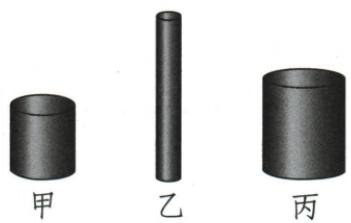
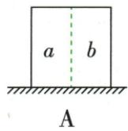
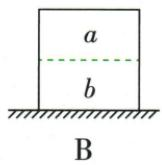
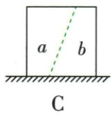
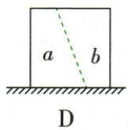

## 讲解

### 判据

均匀实心等截面柱竖放、仅重力时可用ρgh；斜切或形状变先回$\frac{F}{S}$。

### 流程

1. 检查均匀实心柱、水平面、无其他竖直力、实际接触为整个底面。
2. 从$F=G=mg$、$m=\rho V$、$V=Sh$逐次代$p=\frac{F}{S}$，得ρgh，S约掉需每一步条件成立。
3. 竖切剩同h柱且密度不变，质量与底面积同比减少，p不变。
4. 横切h减而底面积不变，p减；斜切一般非等截面柱，分别求F和S。
5. 等体积半块各G/2，比较剩底S最小者压强最大，不能沿用原最高高度。

## 例题

### 同材实心铁柱比较压强

> 来源ID Q08-02；第八章压强；51-100/full.md 第3174–3184行。原答案与解析定位：51-100/full.md 第3186–3188行。

例1 如图所示,三个材料相同,但粗细、长短都不相同的均匀实心铁质圆柱体竖直放在水平地面上,对地面的压强最小的是 ( )

A.甲铁柱

B.乙铁柱

C.丙铁柱

D.无法确定

**原资料答案与解析：**

解析 三个圆柱体的密度相同,而甲铁柱的高度最低,根据 $p=\rho gh$ 可知,甲铁柱对地面的压强最小。

答案 A

**展开解析（依据原详解补足理由与步骤）：**

竖直均匀实心圆柱在水平地面，仅由重力产生压力。$p=\frac{F}{S}$，$F=mg$，$m=\rho V$，$V=Sh$，依次代入得$p=\frac{mg}{S}=\frac{\rho Vg}{S}=\frac{\rho Shg}{S}=\rho gh$。同材ρ、当地g同，甲最低所以p最小A。B乙最高更大，C丙高度也大于甲，D条件足够可确定。粗细虽改质量与接触面积，两量同步抵消，不单凭粗柱更重判压强。

### 取走半块后的切割压强

> 来源ID Q08-03；第八章压强；51-100/full.md 第3195–3203行。原答案与解析定位：51-100/full.md 第3205–3207行。

例2 一个质量分布均匀的正方体,静止在水平地面上。沿图中虚线将其分割成体积相等的 a、b 两部分,并取走 a 部分。剩下的 b 部分(未倾倒)对水平地面产生的压强最大的是 ( )

**原资料答案与解析：**

解析 因为是质量分布均匀的正方体, a、b 两部分体积相等, 所以 a、b 两部分质量相等, 四个选项中, 将 a 部分取走后, 剩下的 b 部分对水平地面的压力都相等, 由 $p=\frac{F}{S}$ 可知, 压力一定时, 受力面积越小, 压强越大, 故选 D。

答案 D

**展开解析（依据原详解补足理由与步骤）：**

四图均质量均匀且a、b体积相等，取走a后剩b质量都原一半，地面压力同为G/2。A竖切底面积约原一半，B横切保原底，C斜切剩底更宽，D斜切剩底最小；同压力下D压强最大。A、B、C接触面积都比D大，不选。斜切后的非柱状b不能套原高度ρgh，须回$\frac{F}{S}$；题明确未倾倒。

## 易错

- 任何固体都ρgh：缺柱体及受力条件。
- 切一半面积改变便只看S：F可能同变。
