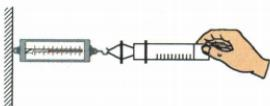

## 讲解

### 判据

已知标注容积与对应刻度长度，用$\frac{V}{l}$求S，再按拉力与压差；往返两式抵消摩擦。

### 流程

1. 测对应标注V的刻度段长l，$S=\frac{V}{l}$，不量整筒含空段。
2. 尽量排气密封、缓慢水平拉动，理想$p=\frac{F}{S}$。
3. 原模型拉出$F=F_{\text{大气}}+f$，退回$F'=F_{\text{大气}}-f$，说明摩擦方向变化。
4. 两式加：$F+F'=2F_{\text{大气}}$，除2得$F_{\text{大气}}=\frac{(F+F')}{2}$。
5. 再除$\frac{V}{l}$，$p=\frac{(F+F')l}{2V}$，统一单位。
6. 内气残留抵消外压使直接估计偏小；往返摩擦若不同或起动静摩擦差异，仍有模型误差。

## 例题

### 注射器粗测气压与摩擦修正

> 来源ID Q08-14；第八章压强；51-100/full.md 第3841–3848行。原答案与解析定位：51-100/full.md 第3850–3858行。

例如图是小明利用 $V = 2\mathrm{mL}$ 的注射器、弹簧测力计、刻度尺等器材估测大气压值的情况。

(1) 利用刻度尺测量出 \_\_\_\_ 的长度 l 为 10 cm, 即可算出活塞横截面积为 \_\_\_\_ cm²;  
(2) 把活塞推至注射器筒的底端, 用橡皮帽封住注射器小孔, 再水平向右缓慢拉动注射器筒, 当注射器的活塞开始滑动时, 记下弹簧测力计的示数 $F = 2.1 \mathrm{~N}$ , 据此可测得大气压值 $p =$ \_\_\_\_ Pa;  
(3)考虑到活塞与筒壁之间有摩擦,小明继续拉动一小段距离后,缓慢退回注射器筒,在活塞刚要到筒内底部时弹簧测力计示数为 $F'$ ,则大气压值 $p' =$ \_\_\_\_ (用题中出现的物理量符号表示);  
(4)实验时若筒内空气没有排尽,将导致测得的大气压值\_\_\_\_（选填“偏大”“偏小”或“不变”）。

**原资料答案与解析：**

解析（1）利用刻度尺测出注射器刻度部分的长度 $l$ ，可求出横截面积 $S = \frac{V}{l} = \frac{2\mathrm{cm}^3}{10\mathrm{cm}} = 0.2\mathrm{cm}^2$

(2) 大气压值 $p=\frac{F}{S}=\frac{2.1\ N}{0.2\times10^{-4}\ m^{2}}=1.05\times10^{5}\ Pa$ 。

(3)设活塞与筒壁之间的摩擦力为f,小明继续拉动一小段距离后,缓慢退回注射器筒,此时对活塞进行受力分析,弹簧测力计示数 $F'=F_{\text{大气}}-f$ ①,过程(2)中对活塞进行受力分析,弹簧测力计示数 $F=F_{\text{大气}}+f$ ②,由①②可得 $F_{\text{大气}}=\frac{F+F'}{2}$ ,大气压值 $p'=\frac{F_{\text{大气}}}{S}=\frac{F_{\text{大气}}l}{V}=\frac{(F+F')l}{2V}$ 。

(4)实验时若筒内空气没有排尽,则弹簧测力计示数偏小,导致测得的大气压值偏小。

答案（1）注射器刻度部分 0.2 (2) $1.05 \times 10^{5}$ (3) $\frac{(F + F')l}{2V}$ (4)偏小

**展开解析（依据原详解补足理由与步骤）：**

(1) 测有刻度且对应2mL的筒段长10cm，不是整支长度。$2\,\mathrm{mL}=2\,\mathrm{cm^{3}}$，圆柱容积$V=Sl$，故$S=\frac{V}{l}=\frac{2}{10}=0.2\,\mathrm{cm^{2}}=2\times 10^{-5}\,\mathrm{m^{2}}$。
(2) 忽略摩擦与内部气压，$p=\frac{F}{S}=\frac{2.1}{(2\times 10^{-5})}=1.05\times 10^{5}\,\mathrm{Pa}$。
(3) 原展开把两方向的摩擦看等大，缓慢拉动的力关系为$F=F_{\text{大气}}+f$，缓慢退回为$F'=F_{\text{大气}}-f$。把两式逐项相加：$F+F'=2F_{\text{大气}}+f-f=2F_{\text{大气}}$；两边除2，$F_{\text{大气}}=\frac{(F+F')}{2}$。再除$S=\frac{V}{l}$：$p'=\frac{(F+F')/2}{V/l}=\frac{(F+F')l}{2V}$。量需使用一致国际单位，不能直接把mL和cm代Pa而不换算。
(4) 未排尽空气有内压抵消部分外压，测得力偏小，直接F/S气压偏小。该改进估测仍要求缓慢、往返摩擦可近似等大以及合理密封，不把起动静摩擦当精确恒定滑动摩擦。

## 易错

- V为2mL却长量全筒：有效范围不对应。
- 往返力相减求气压：相加才抵消反向f。
