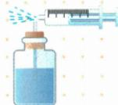
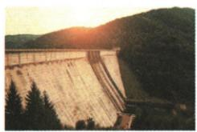
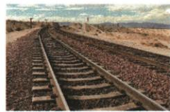
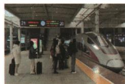

## 讲解

### 判据

同一装置两侧给流速或管道粗细，先判各侧压强，再判较大压强推向哪边。

### 流程

1. 以题给流动模型确认哪处速度大。
2. 对应快处压强较小，慢处较大，列两侧而非一句吸。
3. 较大压强一侧将物或液推向小压侧。
4. 粗细吹气管A粗较高压使A液下降、B细较低压使B上升。
5. 伞原模型上低下高形成向上压力差；喷雾管口低压水被另一侧较大压推升。
6. 区分静液深度、固体面积、大气内外差与流速关系，各实例按所问主要机制。

## 例题

### 自制喷雾器吸管水面上升

> 来源ID Q08-17；第八章压强；101-150/full.md 第51–58行。原答案与解析定位：101-150/full.md 第60–60行。

如图，小华利用自制喷雾器浇花。推动注射器的活塞时吸管内水面上升，这是因为吸管上方空气（）

A.流速大，压强大  
B. 流速大，压强小  
C.流速小，压强大  
D. 流速小，压强小

**原资料答案与解析：**

答案 B

**展开解析（依据原详解补足理由与步骤）：**

原资料只给B。推动活塞使空气在吸管上方高速流过，那里压强减小，瓶内液面受相对较大压力，压差把水向吸管内推高。B流速大压强小对；A流速大压强大错误；C、D都把上方高速气流说小，错误。所谓吸不是高速气流直接拉住水，而是两处压强差产生作用。

### 迎风雨伞向上变形

> 来源ID Q08-18；第八章压强；101-150/full.md 第62–69行。原答案与解析定位：101-150/full.md 第77–79行。

例1 如图所示,小红手撑雨伞走在路上。突然一阵大风迎面吹来,伞面被“吸”,发生严重变形。下列判断推理及其解释,正确的是()

A.伞面被向下“吸”，伞上方的空气流速小于下方  
B.伞面被向下“吸”，伞上方的空气流速大于下方  
C.伞面被向上“吸”，伞上方的空气流速大于下方  
D.伞面被向上“吸”,伞上方的空气流速小于下方

**原资料答案与解析：**

解析 伞上方空气流速大,压强小,伞下方空气流速小,压强大,会产生向上的压力差,伞面被向上“吸”,故选 C。

答案 C

**展开解析（依据原详解补足理由与步骤）：**

按原图与原题模型，伞上方流速比下方大，上方压强小、下方压强大，合成压力差向上，C正确。A虽说上方慢会给向下压差，但不符原情景；B上方快却说向下，方向关系错；D说向上却给上方慢，关系错。保留原C；形状本身不是所有迎角下流速关系的无条件证据，实际流速关系以本题简化为前提。

### 粗细管吹气与U管液面

> 来源ID Q08-19；第八章压强；101-150/full.md 第81–99行。原答案与解析定位：101-150/full.md 第101–103行。

例2 如图所示,将一根玻璃管制成粗细不同的两段,管的下方与一个装有部分水的连通器相通。当从管的一端吹气时,连通器两端A、B液面高度变化情况正确的是()

A.A 液面上升

B.A 液面下降

C.B 液面下降

D.A、B液面高度均不变

**原资料答案与解析：**

解析 粗管中的空气流速小,压强大;细管中的空气流速大,压强小,则 A 液面上方的气体压强大,B 液面上方的气体压强小,所以 A 液面下降,B 液面上升。

答案B

**展开解析（依据原详解补足理由与步骤）：**

A上方粗管空气速度较小压强较大，B上方细管流速大压强小，A较大压力把A液面向下压，B液面上升。A上升错、B下降对、C的B下降错、D不变错，选B。这个U管两端上方气压不同，不能套同大气压连通器液面必相平。

### 四种压强实例的原理

> 来源ID Q08-20；第八章压强；101-150/full.md 第123–161行。原答案与解析定位：101-150/full.md 第113–115行。

例（2024 山东东营中考）如图所示,下列四个实例中,能利用流体压强和流速关系的知识解释的是()

甲

乙

  
丙

丁

A. 甲图: 拦河大坝设计成下宽上窄的形状   
B.乙图:火车道路的铁轨下面铺放路枕  
C. 丙图: 用吸管吸饮料时, 饮料顺着吸管流进嘴里  
D. 丁图: 候车的乘客应站在安全线以外, 否则可能会被“吸”向行驶的列车

**原资料答案与解析：**

例 解析 拦河大坝设计成下宽上窄是因为在同一液体中,液体压强随深度的增加而增大,A 不符合题意;铁轨下面铺放路枕,是在压力一定时,通过增大受力面积来减小压强,B 不符合题意;用吸管吸饮料时,吸管内气压减小,小于外界大气压,在大气压的作用下饮料被压入吸管,C 不符合题意;候车的乘客应站在安全线以外,因为列车行驶时,靠近列车一侧空气流速大、压强小,远离列车一侧空气流速小、压强大,人如果离列车太近,有可能会被“吸”向列车,D 符合题意。

答案 D

**展开解析（依据原详解补足理由与步骤）：**

A大坝下宽上窄反映同液压随深度增加，不是流速关系。B轨下路枕增接触面积、压力相同时减固体压强，不是流体。C吸管先减少管内气压，外大气推液入管，题所问主要大气压应用，不用流速公式解释。D列车附近气流快、压强小，相对远侧压强大而可能把人推向车，符合流体压强流速关系，选D。原题安全线情境按材料保留，不扩写站台操作规则。

## 易错

- 低压自己拉物：实际是高压侧推的净作用。
- 所有液体流动实例都用流速：吸管题关键先内外气压差。
