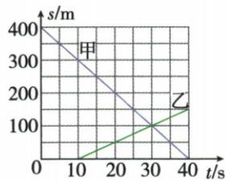

## 错法

相向运动图像在相遇时纵坐标为 100 m，就说甲、乙都已经走过 100 m，选原题 A。容易这样想，是因为看到纵轴写 $\frac{s}{m}$，就把它一概当作“各自从起点累计的路程”。

本题图中甲的纵坐标起始为 400 m，随后一路减小。甲的位置在变化，但累计已经走过的路程不会在这个过程中越来越少；这个 s 表示共同基准下的位置，提供的资料对轴量的称呼不够准确。

## 正解

保留原题“$s$—$t$ 图像”的称呼和原图，先说明此图实际的位置意义：甲从共同基准的 400 m 位置走到 100 m，路程为 300 m；乙从 0 m走到100 m，路程为100 m。两者在同一时刻到了共同的100 m位置，才是相遇。

若纵轴真的表示累计路程，那么读数才是从对应起点累计走过的距离；两条累计路程线相交只说明走得一样长，不能缺少起点、路线、方向条件就直接说相遇。

**原解析与纠正**：原解析已经用$400-100$计算甲走了300 m，答案C正确，保留不变。这里纠正的是“轴上s一律叫路程”的说明；full.md附在图后的自动读数表与配图不一致，未作为证据。不得为了迎合错误读数表改动原图或题目数值。

## 例题

### 相向运动图像

> 来源ID Q04-14；《初中知识清单·物理》2026版第四章第3节；51–100分段 full.md 第731–739行，原答案与解析第741–743行。题干定位为书内第43页、扫描第59页。

例2 如图是相向而行的甲、乙两物体的 $s$—$t$ 图像, 下列说法正确的是 ( )

A. 相遇时两物体通过的路程均为 $100 \, m$

B.0\~30 s 内甲、乙均做匀速直线运动

C. 甲的运动速度为 $10 \mathrm{~m} / \mathrm{s}$

D. 甲、乙是同时出发的

**原资料答案：** C。

**解析（沿原详解展开；缺少原详解时已注明）：**

**先核清纵坐标的含义**：原题仍保留“$s$—$t$ 图像”的称呼。图中甲的纵坐标从 400 m 降到 0，而原解析用 $400-100$ 计算甲实际走过的路程，因此这里的 s 实际表示相对于同一基准的位置坐标，不能当作从各自起点累计的路程。这个含义纠正不改变原图数值或原答案。

图上在 $t=30$ s 处，两线相交于 $s=100$ m；乙从 $t=10$ s 才开始移动。

- A 错：甲从位置 400 m 到位置 100 m，走了 $400-100=300$ m；乙从位置 0 到位置 100 m，走了 100 m，两者并非都走 100 m。
- B 错：乙在 0–10 s 的位置保持为 0，这一段静止；不能说乙在整个 0–30 s 都作匀速直线运动。
- C 对：甲的位置图线是一条直线，30 s 内走过 300 m；速度大小为：

$$v_{\text{甲}}=\frac{300\,\mathrm m}{30\,\mathrm s}=10\,\mathrm{m/s}.$$

- D 错：甲从 $t=0$ 开始运动，乙从 $t=10$ s 开始运动，出发相差 10 s。

原 full.md 图后的自动读数表写出 $t=30$ s 时两者为 150 m 等数值，与配图不符，未采用该表。交点表示相遇的依据是“同一时刻、同一位置基准”，不是任意两条图线相交都代表相遇。
