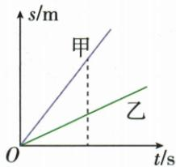

## 讲解

### 是什么

物体沿直线运动，并且速度保持不变，叫作匀速直线运动。直线路径与快慢不变两个条件都要满足。直线运动也可能越来越快或越来越慢，不能只看路径直就判匀速。

### 怎么来的

速度不变意味着单位时间通过的路程不变，所以在任何相等时间内，通过的路程都相等。设速度为 v，经过时间 t，相当于把每单位时间通过的路程重复 t 份，得到 $s=vt$。

若从所计路程的起点开始计时，路程—时间图中路程按相同比例增加，图线是过原点的斜直线；速度—时间图中每个时刻速度都相同，图线为水平直线。这两个“图线形状”解释的是不同纵轴，不能混认。

### 什么时候能用

题目明确“匀速直线运动”，或给出符合条件的全过程路程—时间图时，可把 $s=vt$ 用于各段。速度不变还意味着全程与任意一段的平均速度相同。

只发现两个等时段路程相同，不足以证明整个运动在每个时刻都匀速；定义要求任何等时段都符合。速度为零对应静止，不能因 $v$—$t$ 图线水平就忽略它位于零刻度的特殊情况。

本条只讨论本章的直线运动。原 OCR 分类图把“曲线运动”也连接到“匀速直线运动”，这个自动生成的连接没有采用；判断直接按定义。

## 例题

### 同向两车运动图像

> 来源ID Q04-16；《初中知识清单·物理》2026版第四章第3节；51–100分段 full.md 第817–833行，原答案与解析第807–809行。题干定位为书内第44页、扫描第60页。

例1（2024江苏宿迁中考）甲、乙两车同时、同地、向同一方向行驶，$s$—$t$图像如图所示,以下说法正确的是()

A. 甲车速度大于乙车速度  
B.乙车速度大于甲车速度  
C.以甲车为参照物,乙车是静止的  
D.以乙车为参照物,甲车是向后运动的

**原资料答案：** A。

**解析（沿原详解展开；缺少原详解时已注明）：**

题目给出两车同时、同地、同方向出发。图中横轴为时间，纵轴为从共同起点通过的路程；两条线都是过原点的斜直线。

在同一个时刻，作与纵轴平行的线，甲的路程比乙大，所以甲的速度较大，两车都作匀速直线运动。

- A 对：相同时间内，甲通过的路程较长，甲车速度较大。
- B 错：与图中同一时刻的路程大小关系相反。
- C 错：两车同向但快慢不同，相对位置一直变化，所以乙相对甲运动。
- D 错：甲更快，以乙为参照物，甲向前运动，不是向后。

原 full.md 的自动图像描述附有“>1.5”“>2.5”等数值，原图没有这些刻度，未采用。只依据原图可见的两条直线及大小关系判断。

## 易错

- **直线运动一定匀速**：必须再检查速度有没有改变。
- **$v$—$t$ 图水平一定在运动**：还要看纵坐标数值；若为零，则物体静止。
- **两段平均值相同就证明全过程匀速**：平均值没有显示每个瞬间的变化，不能倒推出定义的全部条件。
