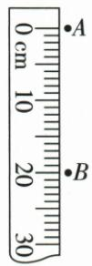

## 讲解

### 是什么

平均速度描述物体在某段路程或某段时间内的平均运动快慢，等于该过程总路程除以总时间。它是整个过程的概括；瞬时速度描述某个位置或时刻的快慢，两者不是同一类信息。

$$\bar v=\frac{s_{\text{总}}}{t_{\text{总}}}.$$

若一段被选定的旅程包含停车，停车时间仍属于这段总时间。若只问“行驶时的平均速度”，应按题目明确的过程范围处理，不能自行删停车时间。

### 怎么来的

各段路程可以相加，各段用时也可以相加。因此全程先求 $s_1+s_2$…和 $t_1+t_2$…，再把二者相除。各段速度不能不加条件直接相加取平均，因为快段与慢段所占时间可能不同。

本章给出两种特殊情形，理由如下。

**两段等时**：每段时间记为 $t$，路程由“速度×时间”分别写成 $v_1t$、$v_2t$。把两段路程相加、两段时间相加，再在分子提取共同因子 $t$。因为 $t>0$，分子分母可以约去这个共同因子：

$$\bar v=\frac{v_1t+v_2t}{t+t}=\frac{t(v_1+v_2)}{2t}=\frac{v_1+v_2}{2}.$$

只有“同样长的时间”这个条件成立时，才能直接平均两个速度。

**两段等路程**：每段路程记为 $s$。由“时间=路程/速度”得到用时分别为 $s/v_1$、$s/v_2$；总路程为 $2s$，总时间要先相加。为去掉分母中的小分式，把整个分式的分子、分母同时乘 $v_1v_2$，分母两项分别变为 $sv_2$ 与 $sv_1$；再提取共同因子 $s$，最后约去 $s>0$：

$$\bar v=\frac{2s}{s/v_1+s/v_2}=\frac{2sv_1v_2}{sv_2+sv_1}=\frac{2sv_1v_2}{s(v_1+v_2)}=\frac{2v_1v_2}{v_1+v_2}.$$

这里要求两段路程与时间完整对应、速度值为相应段的平均值且为正；不能把停车的零速直接代入这条等路程公式。

### 什么时候能用

变速过程、小车分段实验、列车时刻表、水滴下落等都先按总路程/总时间算。在匀速直线运动中，平均速度等于不变的速度；在变速运动中，它通常不能直接代表出发或到达瞬间的速度。

**原提醒的条件补充**：资料先写“平均速度不能用速度算术平均计算”，紧接着又给出等时两段可算术平均。应理解为“不能无条件直接平均”；等时情形是合法的特殊情况，不能把提醒背成绝对禁止。

## 例题

### 水滴平均速度

> 来源ID Q04-17；《初中知识清单·物理》2026版第四章第3节；51–100分段 full.md 第837–839行，原答案与解析第811–813行。题干定位为书内第44页、扫描第60页。

例2（2024 北京中考）如图所示为一个水滴下落过程的示意图, 水滴由 A 位置下落到 B 位置, A、B 之间的距离为 \_\_\_\_ cm, 所用的时间为 0.2 s, 依据公式 v=\_\_\_\_ 可计算出这个过程中水滴下落的平均速度为 \_\_\_\_ $\frac{cm}{s}$。

**原资料答案：** 20.0；$s/t$；100。

**解析（沿原详解展开；缺少原详解时已注明）：**

先从尺上分别读 A、B 两个位置，再求它们之间的长度。尺的分度值为 1 cm，按估读到下一位记录：A 在 0.0 cm，B 在 20.0 cm，因此 A、B 之间的距离为 $20.0-0.0=20.0\,\mathrm{cm}$。

题目给的是整个下落过程的用时 0.2 s，应用平均速度=这段路程/这段时间：

$$\bar v=\frac{s}{t}=\frac{20.0\,\mathrm{cm}}{0.2\,\mathrm s}=100\,\mathrm{cm/s}.$$

第二空填 $s/t$，第三空为 100。这里采用 cm 和 s，所得单位为 $\frac{cm}{s}$，正好符合题目要求。这个值描述 A 到 B 的平均快慢，不能据此认定水滴每一时刻都以 100 $\frac{cm}{s}$ 下落。

## 易错

- **把两段平均速度直接相加除二**：先查两段时间是否相同；没有等时条件，就按总路程与总时间。
- **只加行驶时间，删去过程内停车**：必须按所问过程的起止范围统计时间。
- **由全程平均值判断末速度**：平均值不能单独说明某个瞬间的快慢。
