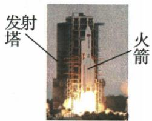

## 讲解

### 判据

题目一类给参照物问对象动不动，另一类说“静止”“不觉移动”反过来问选了哪个参照物。两类都使用同一个判据：所研究时间内，对象与标准之间的相对位置有没有改变。

### 流程

1. **标明研究对象。** 火箭题每个选项可能换对象，不能四项都只看火箭。
2. **标明参照物。** 看“以……为参照物”或“谁看见谁”；题目未说时，按通常地面情境判断，不把自己的观察地点偷偷作为标准。
3. **比较相对位置。** 改变就是相对运动；保持不变就是相对静止。两者在所研究时段内同向同速时可相对静止，只有在一起或看见它不动的直觉不够。
4. **如果反过来选参照物，先把描述变成条件。** “不觉船移”要求船与候选标准的相对位置不变，再逐个检查候选对象。
5. **检查有没有自己补条件。** 例如浮萍靠近船，并未说明它随船同步运动，不能据此判相对静止。

## 例题

### 火箭与发射塔

> 来源ID Q04-10；《初中知识清单·物理》2026版第四章第2节；51–100分段 full.md 第555–569行，原答案与解析第585–587行。题干定位为书内第41页、扫描第57页。

例1（2024 北京中考）图中所示为我国某型号的火箭发射时上升的情境。关于该发射过程,下列说法正确的是()

A.以发射塔为参照物,火箭是静止的  
B.以火箭为参照物,发射塔是静止的  
C.以地面为参照物,火箭是运动的  
D.以地面为参照物,发射塔是运动的

**原资料答案：** C。

**解析（沿原详解展开；缺少原详解时已注明）：**

火箭正在上升，发射塔固定在地面上。逐项比较研究对象相对所选参照物的位置有没有变化。

- A 错：以发射塔为参照物，火箭与塔的相对位置在变，所以火箭运动。
- B 错：以火箭为参照物，发射塔相对火箭的位置在变，表现为向下运动。
- C 对：以地面为参照物，火箭的位置在变，所以火箭运动。
- D 错：发射塔与地面的相对位置不变，所以塔相对地面静止。

A、C 的研究对象是火箭，B、D 的研究对象是发射塔。先读清研究对象，才能作比较。

### 不觉船移的参照物

> 来源ID Q04-11；《初中知识清单·物理》2026版第四章第2节；51–100分段 full.md 第573–581行，原答案与解析第589–591行。题干定位为书内第41页、扫描第57页。

例2（2024 湖北武汉中考）北宋文学家欧阳修在一首词中有这样的描写：“无风水面琉璃滑，不觉船移……”其中“不觉船移”所选的参照物可能是 （）

A. 船在水中的倒影

B. 船周围的浮萍

C. 被船惊飞的鸟

D. 船附近岸边的花草

**原资料答案：** A。

**解析（沿原详解展开；缺少原详解时已注明）：**

“不觉船移”表示船相对所选参照物静止，应找与船相对位置不变的对象。

- A 对：按本题理想化情境，船在水中的倒影随船一起变化，可作为与船相对静止的比较对象。
- B 错：题目没有给出浮萍与船同步运动的条件，不能认定它们相对静止。
- C 错：被惊飞的鸟在飞行，与船的相对位置改变。
- D 错：岸边花草相对地面静止，行船与花草的相对位置改变。

原答案为 A。本题采用平静水面、倒影随船的通常情境；不能把“浮萍在船旁边”当成“始终随船同行”。

## 易错

- **默认所有参照物都是地面**：火箭作为参照物时，发射塔相对它运动。
- **只看到速度一样，漏掉方向**：同向同快慢才支持本章的相对静止判断。
- **答案说“可能”就给对象补同步运动**：可能性也要符合题干所给条件，不能另造条件。
