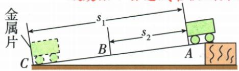
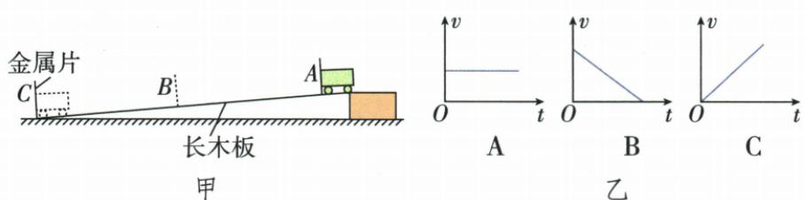

## 讲解

### 判据

斜面、小车、刻度尺、秒表组成的实验，利用测得的一段路程和该段时间求平均速度。小车越滑越快，因此所测值是一个过程的平均快慢，不能称作这段中每个时刻都相同的速度。

### 流程

1. **确定端点、路程和初始条件。** 小车从 A 点由静止开始，C 为所选终点、B 为中间位置。用同一车端经过两个标记的位置测路程，避免前一次看车头、后一次看车尾。
2. **选择适当坡度。** 太陡会使小车速度过大，用时太短不易计时；同时须保证小车能够正常滑动，不能把“较小”理解为越小越好。

3. **测全程与上半程对应的时间。** 全程读 $s_{AC}$、$t_{AC}$；上半程读 $s_{AB}$、$t_{AB}$。原资料采用把金属片移到中点后再次从 A 释放的方法，比较时须保持同样释放位置、由静止释放及同一斜面条件。
4. **下半程用差值还原同一运动。** 先从全程路程减去上半程路程，再从全程时间减去上半程时间：

$$s_{BC}=s_{AC}-s_{AB},\qquad t_{BC}=t_{AC}-t_{AB}.$$

5. **分别计算每一段平均速度。** $\bar v_{AC}=s_{AC}/t_{AC}$，$\bar v_{AB}=s_{AB}/t_{AB}$，$\bar v_{BC}=s_{BC}/t_{BC}$。每段路程只配自己的时间，不能把下半段路程配全程时间。
6. **检查计时偏差的方向。** 路程固定时，计时偏小会使 $s/t$ 偏大；计时偏大会使 $s/t$ 偏小。晚开始或早停止都让所记时间偏小。

该差值方法要求两次测量条件一致、代表同一种从 A 开始的过程。如果小车受额外推力、释放点改变或坡度改变，不能随意用两个不同过程的时间作差。

## 例题

### 斜面小车速度实验

> 来源ID Q04-18；《初中知识清单·物理》2026版第四章第4节；51–100分段 full.md 第886–892行，原答案与解析第901–908行。题干定位为书内第45页、扫描第61页。

例（2024 山东青岛中考节选）小明用图甲所示的实验装置,研究物体从斜面上滑下过程中速度的变化。

(1)实验中使斜面保持较小的坡度,是为了便于测量\_\_\_\_。   
(2)AC 段距离为 80 cm, B 为 AC 中点, 测得小车从 A 点运动到 B 点的时间为 1.4 s, 从 A 点运动到 C 点的时间为 2.0 s, 根据以上数据可以判断 $v_{AB}$ \_\_\_\_ $v_{BC}$ 。(选填“>”“<”或“=”)  
(3)为使测量更准确、数据更直观,用位置传感器进行实验,得到的$v$—$t$图像与图乙中\_\_\_\_相似。

**原资料答案：** (1) 时间；(2) <；(3) C。

**解析（沿原详解展开；缺少原详解时已注明）：**

**(1) 为什么让坡度较小？** 原资料第(1)问只给答案“时间”，没有单独解释，以下理由按实验原理补写：坡度较小时，小车滑下所用时间较长，开始、停止计时更容易操作，便于测量时间。填“时间”。仍须保证小车能够正常滑动，不能把“较小”理解为越小越好。

**(2) 先配对每段路程与该段时间。** $AC=80\,\mathrm{cm}$，B 是中点，所以 $AB=BC=80/2=40\,\mathrm{cm}$。AB 的时间为 1.4 s；AC 的时间为 2.0 s。BC 属于同一次从 A 开始的运动，所以 BC 的时间为 $2.0-1.4=0.6\,\mathrm s$。

两段路程相等，AB 用时更长，故 $\bar v_{AB}<\bar v_{BC}$。用平均速度公式计算可交叉核对：

$$\bar v_{AB}=\frac{40\,\mathrm{cm}}{1.4\,\mathrm s}\approx28.6\,\mathrm{cm/s},\qquad\bar v_{BC}=\frac{40\,\mathrm{cm}}{0.6\,\mathrm s}\approx66.7\,\mathrm{cm/s}.$$

**(3) 看纵轴，不看图线是否向右上就直接套结论。** 图乙是 $v$—$t$ 图：A 的速度不变，B 的速度减小，C 的速度增大。小车下滑过程中越来越快，与 C 相似。

原解析采用 C。这里判断的是所给三个图中的运动类型；仅凭两段平均速度数据，不能进一步证明真实小车在任意时刻都严格按直线规律增加速度。

测 BC 时不能从 B 点重新由静止释放，否则得到的是另一次不同的运动过程。

## 易错

- **从 B 点重新由静止释放来测原过程后半程**：进入 B 时原小车已有速度，另一次静止释放的初始状态不同。
- **全程平均速度直接平均两半程速度**：两半程路程相等而用时不同，仍应按总路程/总时间。
- **计时晚了却说速度偏小**：时间偏小作分母，所得平均速度偏大，先看公式再判断。
