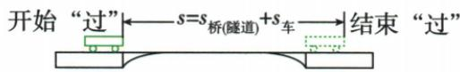

## 讲解

### 判据

题目里的车有不可忽略的长度，“完全穿过”与“全部在里面”描述两种不同起止事件。先画清或看原图中车头、车尾的位置，再决定路程相加还是相减，不能把桥长一律当作车行路程。

### 流程

1. **把整列车的位移转成车头的移动距离。** 本章列车沿直线匀速通过，车头和车尾都平移相同距离；选择同一个端点贯穿计算，避免开始看车头、结束又直接换成车尾坐标。
2. **完全通过：车头刚到入口→车尾刚离开出口。** 结束时车头已经在出口之外一个车长，所以车头通过“桥或隧道长＋车长”。

3. **全部在里面：车尾刚进入口→车头刚到出口。** 开始时车头已进入一个车长，余下可移动距离为“桥或隧道长−车长”。

4. **配对这一段的速度与用时。** 匀速时用 $s=vt$ 或 $t=s/v$，先统一单位。本例先借完全通过的时间求车长，再求全部在隧道中的时间。
5. **检查相减是否有意义。** 只有桥或隧道比车长，才有整列车都在其中的持续阶段；若车更长，不能拿负的路程算负时间。

时刻表题的全程平均速度另按总路程/总时间处理，包含起止之间的停站，不拿穿隧道时的恒定速度替代整段旅程的平均速度。

## 例题

### 列车时刻表与隧道

> 来源ID Q04-15；《初中知识清单·物理》2026版第四章第3节；51–100分段 full.md 第776–781行，原答案与解析第783–787行。题干定位为书内第44页、扫描第60页。

例3 如表是某列动车组的运行时刻表的一部分。

| 站点 | 上海 | 苏州 | 常州 | 南京 |
| --- | --- | --- | --- | --- |
| 到站时间 | 始发站 | 14:56 | 15:20 | 16:03 |
| 发车时间 | 14:33 | 14:58 | 15:22 | 16:05 |
| 里程/km | 0 | 81 |  | 300 |

(1)列车由上海驶往南京的平均速度为多少 $\mathrm{km / h}$ ?  
(2)列车要穿过一条隧道,若列车以72 $\mathrm{km/h}$的速度匀速行驶,用了2 min完全穿过长度为2000 m的隧道,则列车全部在隧道中的时间是多少s?

**原资料答案：** (1) 200 $\mathrm{km/h}$；(2) 80 s。

**解析（沿原详解展开；缺少原详解时已注明）：**

**(1) 先确定全过程起止时刻。** 上海发车为 14:33，南京到站为 16:03。把这段持续时间拆开：14:33 到 15:33 为 1 h，15:33 到 16:03 为 30 min，合计 1.5 h。里程表中南京 300 km、上海 0 km，总路程为 300 km。途中停车也包含在这一段时间内，因此：

$$\bar v=\frac{300\,\mathrm{km}}{1.5\,\mathrm h}=200\,\mathrm{km/h}.$$

**(2) 先由“完全穿过”求车长，再求“全部在隧道中”的时间。**

换算给定速度：72 $\frac{km}{h}=72\times \frac{1000}{3600}$ $\frac{m}{s}=20$ $\mathrm{m/s}$；2 $min=120$ s。

从车头刚进入到车尾刚离开，车头前进的路程包括隧道长和车长。由路程=速度×时间：

$$s_1=20\,\mathrm{m/s}\times120\,\mathrm s=2400\,\mathrm m.$$

隧道长 2000 m，所以车长为 $2400-2000=400$ m。

从车尾刚进入到车头刚离开，整列车都在隧道内。车头起始位置已经进入 400 m，还能前进 $2000-400=1600$ m。仍用题给的匀速 20 $\mathrm{m/s}$，时间为：

$$t_2=\frac{1600\,\mathrm m}{20\,\mathrm{m/s}}=80\,\mathrm s.$$

表中苏州、常州的停站时刻用来提醒全过程包含停车；不需要猜出原表未给的常州里程。

## 易错

- **完全通过只用隧道长**：还需让车尾出去，车头总移动包含一个车长。
- **全部在里面反而把车长相加**：这一阶段车头起始已经进入一个车长，应从隧道长中减去。
- **开始到站时刻混用**：全程平均速度按上海发车到南京到站，不能错用南京再次发车时刻。
