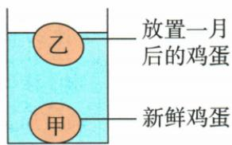

## 错法

甲沉底乙漂浮就断言甲浮力小；又看到加盐就说漂浮物的浮力一定变大。两句都忽略了比较对象和相同量。

## 正解

沉底说明自己的浮力小于自己的重力，并不能与另一个物体比较。等质量时才能共同用同一个G比较；等体积、同液体要比较实际排体积。一个不变重力的物体始终自由漂浮时，液体密度改变会使浸入体积调整，浮力仍等于G。

## 例题

### 鸡蛋浮沉条件的逐项判断

> 来源ID Q09-14；第九章浮力；101-150/full.md 第664–671行。原答案与解析定位：101-150/full.md 第707–709行。

例1（2024江苏南通中考）将新鲜度不同的甲、乙两鸡蛋放入水中，静止时的状态如图所示，下列说法正确的是 （）

A.若甲、乙体积相等,甲受到的浮力小  
B.若甲、乙质量相等,甲受到的浮力小  
C.向杯中加盐水后,乙受到的浮力变大  
D.向杯中加酒精后,乙受到的浮力变大

**原资料答案与解析：**

例1 解析 若甲、乙体积相等,由图可知, $V_{\text{排甲}}>V_{\text{排乙}}$ ,则 $F_{\text{浮甲}}>F_{\text{浮乙}}$ , A 错误; 乙漂浮, $F_{\text{浮乙}}=G_{\text{乙}}$ , 甲沉底, $F_{\text{浮甲}}<G_{\text{甲}}$ , 若甲、乙质量相等, 则 $F_{\text{浮甲}}<F_{\text{浮乙}}$ , B 正确; 向杯中加盐水后, 液体密度变大, 乙仍然漂浮, 乙受到的浮力不变, C 错误; 向杯中加酒精后, 液体密度变小, 乙可能漂浮、悬浮或沉底, 乙受到的浮力大小无法确定, D 错误。

# 答案 B

**展开解析（依据原详解补足理由与步骤）：**

图中甲沉底、乙漂浮。A错：如果体积相同，甲全部排水，乙部分排水，甲浮力反而更大。B对：如果质量相同，两蛋重力相同；甲有底部支持力，浮力小于重力，乙浮力等于重力。C错：乙重力不变，加盐提高液体密度后仍漂浮，排水体积自动减小，浮力仍等于重力。D错：加酒精使液体密度降低，乙若还漂浮或达到悬浮，浮力仍等于重力；若沉底则小于重力，不能推断变大。原资料说“大小无法确定”，这里进一步说明在这些静止状态中只可能保持或减小。
