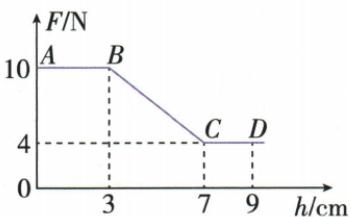
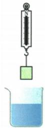
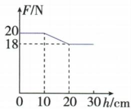

## 错法

看到物体下移，就把浮力也往大算；把“下降高度”直接代入液体压强。这混淆位置变化与浸入体积变化。

## 正解

先看是否全部浸没：同液体、同体积、全浸以后排开体积不变，浮力不变；下底压强仍随深度增大，上底压强也增大，压力差保持不变。刚浸没的深度从接触液面的拐点起算。

## 例题

### 下降图像求浮力与底面压强

> 来源ID Q09-01；第九章浮力；101-150/full.md 第244–261行。原答案与解析定位：101-150/full.md 第263–268行。

例 弹簧测力计下吊着一长方体物块,将物块从盛水的烧杯上方缓慢下降直至完全浸入水中,物块下降过程中,弹簧测力计示数 F 随下降高度 h 的变化关系如图所示,(忽略物块下降过程中液面高度的变化)求:

(1) 物块所受的重力；  
(2)物块受到的最大浮力；  
(3) 刚好浸没时, 物块下表面受到水的压强。(g 取 $10 \, N/kg, \rho_{\text{水}} = 1.0 \times 10^{3} \, kg/m^{3}$ )

**原资料答案与解析：**

解析（1）由图可知，AB段物块未浸入水中，弹簧测力计的示数等于物块所受的重力大小，则物块所受的重力 $G=F_{1}=10\ N$ 。

(2) CD 段物块完全浸入水中, 受到的浮力最大, 最大浮力 $F_{\text{浮}} = G - F_{2} = 10 \, N - 4 \, N = 6 \, N$ 。  
(3) B 点是物块下表面刚刚接触水面, C 点是物块上表面刚与液面相平。物块刚好浸没时下表面到水面的距离 $h = 7 \, cm - 3 \, cm = 4 \, cm = 0.04 \, m$ , 物块下表面受到水的压强 $p = \rho_{\text{水}} gh = 1.0 \times 10^{3} \, kg/m^{3} \times 10 \, N/kg \times 0.04 \, m = 400 \, Pa$ 。

答案 (1) $10 \mathrm{~N}$ (2) $6 \mathrm{~N}$ (3) $400 \mathrm{~Pa}$

**展开解析（依据原详解补足理由与步骤）：**

AB段未接触水，缓慢下降可按平衡看，$G=10\,\mathrm N$。CD段浸没，$F_{\text{浮}}=G-F=10-4=6\,\mathrm N$。B点下底刚到水面，C点上底到水面；液面不变时，物高为两点下降量之差：$H=(7-3)\,\mathrm{cm}=0.04\,\mathrm m$。刚浸没时下底深度就是H，$p=\rho gH=1000\times10\times0.04=400\,\mathrm{Pa}$，不能用从起点累计下降的7 cm当深度。

### 圆柱体下降图像的三问

> 来源ID Q09-03；第九章浮力；101-150/full.md 第278–296行。原答案与解析定位：101-150/full.md 第343–345行。

例2 (2024 山东枣庄中考)如图甲所示,使圆柱体缓慢下降,直至其全部浸入水中,整个过程中弹簧测力计示数 F 与圆柱体下降高度 h 变化关系的图像如图乙所示,则圆柱体受到的最大浮力是 \_\_\_\_ N;圆柱体刚好浸没时,下表面受到水的压强是 \_\_\_\_ Pa,圆柱体受到的浮力是 \_\_\_\_ N。(g 取 10 $\mathrm{N/kg}$,忽略圆柱体下降过程中液面高度的变化)

  
甲

乙

**原资料答案与解析：**

例2 解析 圆柱体浸入水中之前,不受浮力,弹簧测力计示数等于圆柱体所受重力大小,由图像可知,圆柱体的重力 $G=20$ N;当圆柱体浸没在水中时,所受浮力最大, $F_{浮max}=20\ N-18\ N=2\ N$ ;由图像可知,刚好浸没时,圆柱体下表面所处的深度 $h=20$ cm-10 $cm=10$ cm,则下表面受到水的压强 $p=\rho_{\text{水}}gh=1.0\times10^{3}\ kg/m^{3}\times10\ N/kg\times0.1\ m=1\ 000\ Pa$ 。

答案 2 1000 2

**展开解析（依据原详解补足理由与步骤）：**

未入水示数20 N给出重力。浸没平台示数18 N，由竖直平衡得$F_{\text{浮,max}}=20-18=2\,\mathrm N$。开始入水下降10 cm，刚浸没下降20 cm，物高及刚浸没下底深度为$20-10=10\,\mathrm{cm}=0.10\,\mathrm m$；$p=1000\times10\times0.10=1000\,\mathrm{Pa}$。此时已全浸没，浮力仍为2 N。下降高度是横坐标，不能直接当浸入深度。
