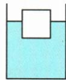

## 错法

方块全浸以后算容器底压力，只加水重20 N和方块重6 N得到26 N，漏了维持全浸所施的外力。

## 正解

全浸浮力10 N而重力6 N，需要外加向下4 N才能静止。水承受方块向下10 N，底部承担水重20 N和这10 N，共30 N。也可对水和方块整体看：20加6加4同样30 N。必须明确整体包含谁、外力有哪些。

## 例题

### 按住漂浮方块时容器底的压力

> 来源ID Q09-10；第九章浮力；101-150/full.md 第570–574行。原答案与解析定位：101-150/full.md 第576–578行。

例1 如图所示,盛有 $2 \, kg$ 水的柱形容器置于水平地面上,重为 $6 \, N$ 且不吸水的正方体物块在

水中静止时有 $\frac{3}{5}$ 的体积浸入水中,物块下表面与水面平行,则物块的密度为\_\_\_\_ $\mathrm{kg/m^{3}}$,物块下表面所受水的压力为\_\_\_\_ N。若物块在压力的作用下刚好浸没水中,不接触容器底,水不溢出,此时水对容器底部的压力为\_\_\_\_ N。(g 取 10 $\mathrm{N/kg}$, $\rho_{\text{水}} = 1.0 \times 10^{3} \text{ kg/m}^{3}$ )

**原资料答案与解析：**

解析 物块有 $\frac{3}{5}$ 的体积浸入水中, 则物块的密度 $\rho = \frac{3}{5} \rho_{\text{水}} = \frac{3}{5} \times 1.0 \times 10^{3} \mathrm{~kg} / \mathrm{m}^{3} = 0.6 \times 10^{3} \mathrm{~kg} / \mathrm{m}^{3}$ ; 物块在水中漂浮, 受力平衡, 受到的浮力 $F_{\text{浮}} = G = 6 \mathrm{~N}$ , 物块上表面不受水的压力, 根据浮力产生的原因 $F_{\text{浮}} = F_{\text{向上}} - F_{\text{向下}}$ 可知, 物块下表面所受水的压力 $F_{\text{向上}} = F_{\text{浮}} = 6 \mathrm{~N}$ ; 物块的质量 $m = \frac{G}{g} = \frac{6 \mathrm{~N}}{10 \mathrm{~N} / \mathrm{kg}} = 0.6 \mathrm{~kg}$ , 由 $\rho = \frac{m}{V}$ 可知, 物块的体积 $V = \frac{m}{\rho} = \frac{0.6 \mathrm{~kg}}{0.6 \times 10^{3} \mathrm{~kg} / \mathrm{m}^{3}} = 1 \times 10^{-3} \mathrm{~m}^{3}$ , 当物块刚好浸没在水中时, 由阿基米德原理可知, 受到的浮力 $F_{\text{浮}}' = \rho_{\text{水}} g V_{\text{排}} = \rho_{\text{水}} g V = 1.0 \times 10^{3} \mathrm{~kg} / \mathrm{m}^{3} \times 10 \mathrm{~N} / \mathrm{kg} \times 1 \times 10^{-3} \mathrm{~m}^{3} = 10 \mathrm{~N}$ , 力的作用是相互的, 水给物块的浮力为 $10 \mathrm{~N}$ , 则物块给水的压力 $F_{\text{压}}$ 也为 $10 \mathrm{~N}$ , 容器中水的重力 $G_{\text{水}} = m_{\text{水}} g = 2 \mathrm{~kg} \times 10 \mathrm{~N} / \mathrm{kg} = 20 \mathrm{~N}$ , 此时水对容器底部的压力 $F_{\text{压}}' = F_{\text{压}} + G_{\text{水}} = 10 \mathrm{~N} + 20 \mathrm{~N} = 30 \mathrm{~N}$ 。

答案 $0.6 \times 10^{3}$ 6 30

**展开解析（依据原详解补足理由与步骤）：**

漂浮时$\rho_{\text{水}}g(3V/5)=\rho_{\text{物}}gV$，两边同除gV得$\rho_{\text{物}}=(3/5)\rho_{\text{水}}=600\,\mathrm{kg/m^3}$。方块上底露出水面，下底水的向上压力就是浮力，等于重力6 N。质量$6/10=0.6\,\mathrm{kg}$，体积$0.6/600=0.001\,\mathrm{m^3}$。全部浸没浮力$1000\times10\times0.001=10\,\mathrm N$。保持静止必须另加向下4 N，水受到方块向下的液体作用力为10 N。柱形容器竖直侧壁不承担竖直水压力，水重$2\times10=20\,\mathrm N$，故水对底压力$20+10=30\,\mathrm N$。若只把水重20和物重6相加，会漏掉外加的4 N。
