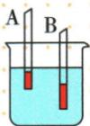

## 讲解

### 是什么

密度计通过固定重力的仪器在液体中漂浮，根据浸入深度测液体密度。液体密度越大，同一支仪器浸入越浅；杆上刻度上小下大，通常不均匀。

### 怎么来的

漂浮平衡给出$\rho_{\text{液}}gV_{\text{排}}=G$，所以$V_{\text{排}}=G/(\rho_{\text{液}}g)$。重力固定，较密液体只需较小排体积便能托住仪器。均匀杆的浸入体积与长度相关，而密度与排体积是反比例关系，因此等密度差不对应等长度差。

### 什么时候能用

必须自由漂浮、不碰壁、不触底，液体密度在测量范围内且仪器稳定直立。比较两支自制密度计时，先查重力是否相同，不能把同一支的“浮力恒定”套给两支。

## 例题

### 自制密度计的四个比较

> 来源ID Q09-09；第九章浮力；101-150/full.md 第555–562行。原答案与解析定位：101-150/full.md 第564–564行。

小明同学分别在底端封闭的两支相同吸管中装入不同质量的细沙，制成了 A、B 两支密度计，将这两支密度计放入同一个盛有水的烧杯中，静止后如图所示。下列说法正确的是（）

A. 密度计 A 所受浮力较小  
B. 密度计 B 所受重力较小  
C.两密度计底部所受水的压强相等   
D.两密度计在水面处的刻度值不同

**原资料答案与解析：**

答案A

**展开解析（依据原详解补足理由与步骤）：**

两吸管外形相同，图中A浸入浅、B深，因此水中A排开体积小，A浮力小，A对。两支都漂浮，各自重力等于各自浮力，故B重力更大，B错。B底更深，按$p=\rho gh$压强更大，C错。它们都在同一杯水中，水面处应该标同一个水的密度值，即使该刻度位置在管上的高度不同，D仍错。原资料只给A，以上逐项理由属于规范补写。

### 浮力秤求铁块质量与未知液体密度

> 来源ID Q09-15；第九章浮力；101-150/full.md 第684–703行。原答案与解析定位：101-150/full.md 第711–715行。

例2（2024山东聊城中考）我国的智能船舶“明远”号矿砂船最大载货量为40万吨，这么大的货船通过国际港口时，工作人员通常是通过读取货船浸入海水中的深度来测量载货量。物理小组根据这个原理，利用圆柱形玻璃杯制作出可测量物体质量的“浮力秤”。如图甲所示，玻璃杯底面积为 $80\ cm^{2}$ ，质量为200 g，将未知质量的铁块放入玻璃杯中，静止时玻璃杯浸入水中的深度为5.5 cm。 $\rho_{\text{水}}=1.0\times10^{3}\ kg/m^{3}$ ，g取10 $\mathrm{N/kg}$。

(1) 求玻璃杯底面所受水的压强和压力；  
(2)求铁块的质量;   
(3) 此装置还可以作为密度计来测量未知液体的密度。如图乙所示, 将空玻璃杯放入待测液体中, 静止时浸入液体中的深度为 2 cm, 求待测液体的密度。

甲

  
乙

**原资料答案与解析：**

例2 解析（1）玻璃杯底面所受水的压强 $p = \rho_{\text{水}} gh = 1.0 \times 10^{3} \, kg/m^{3} \times 10 \, N/kg \times 0.055 \, m = 550 \, Pa$ ; 由 $p = \frac{F}{S}$ 可知玻璃杯底面所受水的压力 $F = pS = 550 \, Pa \times 80 \times 10^{-4} \, m^{2} = 4.4 \, N$ 。

(2) 玻璃杯受到水的浮力 $F_{\text{浮}} = F = 4.4 \, N$ ，由图甲可知，装有铁块的玻璃杯在水中处于漂浮状态，玻璃杯和铁块的总重力 $G_{\text{总}} = F_{\text{浮}} = 4.4 \, N$ ，则铁块的重力 $G_{\text{铁}} = G_{\text{总}} - G_{\text{杯}} = 4.4 \, N - 0.2 \, kg \times 10 \, N/kg = 2.4 \, N$ ，铁块的质量 $m_{\text{铁}} = \frac{G}{g} = \frac{2.4 \, N}{10 \, N/kg} = 0.24 \, kg$ 。

(3) 将空玻璃杯放入待测液体中，空玻璃杯漂浮，则玻璃杯受到的浮力 $F_{\text{浮}}' = G_{\text{杯}} = 2 \, N$ ; 玻璃杯排开待测液体的体积 $V_{\text{排}} = 80 \, cm^{2} \times 2 \, cm = 160 \, cm^{3}$ ，由阿基米德原理可知待测液体的密度 $\rho = \frac{F_{\text{浮}}'}{g V_{\text{排}}} = \frac{2 \, N}{10 \, N/kg \times 160 \times 10^{-6} \, m^{3}} = 1.25 \times 10^{3} \, kg/m^{3}$ 。

**展开解析（依据原详解补足理由与步骤）：**

底面深度$5.5\,\mathrm{cm}=0.055\,\mathrm m$，压强$1000\times10\times0.055=550\,\mathrm{Pa}$。底面积$80\,\mathrm{cm^2}=0.008\,\mathrm{m^2}$，底面向上压力$550\times0.008=4.4\,\mathrm N$；杯竖直侧壁水压力水平方向，故这也是杯的浮力。杯和铁一起漂浮，总重力4.4 N；空杯重力$0.2\times10=2\,\mathrm N$，铁重$4.4-2=2.4\,\mathrm N$，铁质量$2.4/10=0.24\,\mathrm{kg}$。乙中只放空杯，浮力为2 N，排液体积$80\times2=160\,\mathrm{cm^3}=160\times10^{-6}\,\mathrm{m^3}$，$\rho=2/(10\times160\times10^{-6})=1250\,\mathrm{kg/m^3}$。不能把甲总质量全部算成铁块质量。

## 易错

水面处读的是液体密度值；不同仪器同一液体读值相同，不要求管上位置相同。
