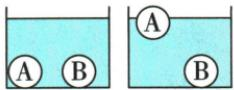

## 讲解

### 是什么

只考虑重力和浮力时，从静止释放，浮力大于重力会向上加速，小于重力会向下加速。漂浮是在液面处静止，悬浮是全部浸没且静止，两者都满足$F_{\text{浮}}=G$。沉底静止还受支持力，$F_{\text{浮}}+N=G$。

### 怎么来的

漂浮时随着上升，浸入体积减小，浮力减小，直到与重力平衡。悬浮时全部浸没且两力已相等，不需要底部支持。沉底不是“没有浮力”，而是浮力不足，容器底补上支持力。均匀实心物体用$G=\rho_{\text{物}}gV$与浮力式比较，可得到相应的密度判据。

### 什么时候能用

密度比较采用物体整体平均密度，空心物体不能只用材料密度。上浮和下沉的方向描述不自动说明当时合力方向：运动物体可能减速；本章判据指从静止释放、无其他力的模型。正常沉底还须液体能进入接触处，密封情况另论。

## 例题

### 两球在两种液体中的浮力和底部压力

> 来源ID Q09-12；第九章浮力；101-150/full.md 第604–612行。原答案与解析定位：101-150/full.md 第614–619行。

例3 相同的容器中分别盛有甲、乙两种不同的液体,把体积相同的 A、B 两个实心小球放入甲液体中,两球沉底;把两小球放入乙液体中,两小球静止时,小球 A 漂浮,小球 B 沉底。回答下列问题。

(1)甲液体中两实心小球所受浮力 $F_{\text{甲A}}$ \_\_\_\_ $F_{\text{甲B}}$ ; 乙液体中两实心小球所受浮力 $F_{\text{乙A}}$ \_\_\_\_ $F_{\text{乙B}}$ 。

  
甲

(2)根据小球 A 在两液体中的状态可知, $\rho_{\text{甲}}$ \_\_\_\_ $\rho_{\text{乙}}$ 。  
(3)甲液体中小球 B 对容器底的压力\_\_\_\_乙液体中小球 B 对容器底的压力;甲液体中小球 A 对容器底的压力\_\_\_\_小球 B 对容器底的压力。

**原资料答案与解析：**

解析（1）不同物体放入同一液体中， $V_{\text{排}}$ 越大，所受浮力越大，实心小球A、B的体积相同，在甲液体中两球都沉底， $V_{排A}=V_{排B}$ ，故 $F_{甲A}=F_{甲B}$ ；在乙液体中，小球A漂浮，小球B沉底， $V_{排A}'<V_{排B}'$ ，故 $F_{乙A}<F_{乙B}$ 。

(2) 小球 A 在甲液体中沉底, $\rho_{\text{甲}}<\rho_{A}$ , 小球 A 在乙液体中漂浮, $\rho_{\text{乙}}>\rho_{A}$ , 故 $\rho_{\text{甲}}<\rho_{\text{乙}}$ 。  
(3) 因为 $\rho_{\text{甲}} < \rho_{\text{乙}}$ , 小球 B 在两种液体中都沉底, 排开液体的体积相同, 由 $F_{\text{浮}} = \rho_{\text{液}} g V_{\text{排}}$ 可知小球 B 在乙液体中受到的浮力较大, 根据受力平衡可知小球 B 对容器底的压力等于重力减浮力, 则甲液体中小球 B 对容器底的压力大于乙液体中小球 B 对容器底的压力; 在乙液体中, 小球 A 漂浮, 小球 B 沉底, 则 $\rho_{\mathrm{A}} < \rho_{\mathrm{B}}$ , 两球体积相等, 故 $m_{\mathrm{A}} < m_{\mathrm{B}}, G_{\mathrm{A}} < G_{\mathrm{B}}$ , 根据受力平衡可知, 两小球在甲液体中对容器底的压力等于重力减浮力, 故甲液体中小球 A 对容器底的压力小于小球 B 对容器底的压力。

答案 (1) = < (2) < (3) > <

**展开解析（依据原详解补足理由与步骤）：**

甲中两球都浸没，等体积排开同一种液体，浮力相等。乙中A部分浸入、B全部浸没，A排开体积小，故浮力小。A在甲沉底而在乙漂浮，表明$\rho_{\text{甲}}<\rho_A<\rho_{\text{乙}}$。同一个B的重力不变，在乙液中浮力较大，所以底部支持力$N=G_B-F_{\text{浮}}$较小；B给底部的压力也较小。乙中A浮B沉表明$\rho_A<\rho_B$，又等体积，所以$G_A<G_B$；甲中两球浮力相同，故A给底的压力小于B。以上按液体能够进入球与底之间的通常题设处理；密封平底接触不能直接套用。

### 鸡蛋浮沉条件的逐项判断

> 来源ID Q09-14；第九章浮力；101-150/full.md 第664–671行。原答案与解析定位：101-150/full.md 第707–709行。

例1（2024江苏南通中考）将新鲜度不同的甲、乙两鸡蛋放入水中，静止时的状态如图所示，下列说法正确的是 （）

A.若甲、乙体积相等,甲受到的浮力小  
B.若甲、乙质量相等,甲受到的浮力小  
C.向杯中加盐水后,乙受到的浮力变大  
D.向杯中加酒精后,乙受到的浮力变大

**原资料答案与解析：**

例1 解析 若甲、乙体积相等,由图可知, $V_{\text{排甲}}>V_{\text{排乙}}$ ,则 $F_{\text{浮甲}}>F_{\text{浮乙}}$ , A 错误; 乙漂浮, $F_{\text{浮乙}}=G_{\text{乙}}$ , 甲沉底, $F_{\text{浮甲}}<G_{\text{甲}}$ , 若甲、乙质量相等, 则 $F_{\text{浮甲}}<F_{\text{浮乙}}$ , B 正确; 向杯中加盐水后, 液体密度变大, 乙仍然漂浮, 乙受到的浮力不变, C 错误; 向杯中加酒精后, 液体密度变小, 乙可能漂浮、悬浮或沉底, 乙受到的浮力大小无法确定, D 错误。

# 答案 B

**展开解析（依据原详解补足理由与步骤）：**

图中甲沉底、乙漂浮。A错：如果体积相同，甲全部排水，乙部分排水，甲浮力反而更大。B对：如果质量相同，两蛋重力相同；甲有底部支持力，浮力小于重力，乙浮力等于重力。C错：乙重力不变，加盐提高液体密度后仍漂浮，排水体积自动减小，浮力仍等于重力。D错：加酒精使液体密度降低，乙若还漂浮或达到悬浮，浮力仍等于重力；若沉底则小于重力，不能推断变大。原资料说“大小无法确定”，这里进一步说明在这些静止状态中只可能保持或减小。

## 易错

“漂浮”不等于“悬浮”；只见正在下沉不能断言浮力一定小于重力。
