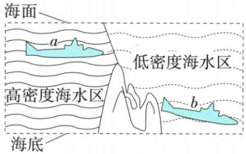
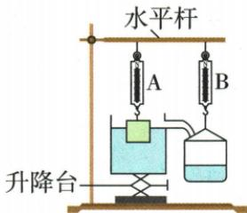

## 讲解

### 是什么

浮力等于物体排开液体的重力：$F_{\text{浮}}=G_{\text{排}}=m_{\text{排}}g=\rho_{\text{液}}gV_{\text{排}}$。密度用千克每立方米、体积用立方米、g用牛每千克，结果是牛。排开体积是浸入液体的体积，漂浮时一般小于物体总体积。

### 怎么来的

对浸没的柱体，从上下水压力差出发：$F_{\text{浮}}=\rho g(h_{\text{下}}-h_{\text{上}})S=\rho gHS$，而HS正是排开体积。不同形状也可用实验比较称重法的浮力与收集到的排水重力验证；Q09-08展示这种验证思路。

### 什么时候能用

液体静止、物体受液体正常包围时使用。液体均匀时可用一个密度；跨密度层不能把任意一层密度直接乘总排体积。物体全部浸没且体积不变时排体积不随继续下沉而增大；部分浸入时不能把总V代入。

## 例题

### 潜水艇驶入低密度海水区

> 来源ID Q09-06；第九章浮力；101-150/full.md 第482–503行。原答案与解析定位：101-150/full.md 第470–472行。

例1（2024 广东广州中考）潜水艇从海水高密度区驶入低密度区，急剧下降的过程称为“掉深”。如图，某潜水艇从 a 处驶入低密度海水区，“掉深”到 b 处。与 a 处相比，潜水艇在 b 处（）

A. 受到浮力大小变小

B. 受到浮力大小变大

C. 排开液体重力不变

D. 排开液体重力变大

**原资料答案与解析：**

例1 解析 根据阿基米德原理，有 $F_{\text{浮}}=\rho_{\text{液}}gV_{\text{排}}$ ，潜水艇从海水高密度区驶入低密度区，g、 $V_{\text{排}}$ 不变， $\rho_{\text{液}}$ 变小，则 $F_{浮a}>F_{浮b}$ ，排开液体重力变小，B、C、D 错误，A 正确。

答案A

**展开解析（依据原详解补足理由与步骤）：**

在题目采用的近似中，潜艇全部浸没、外体积不变，g不变。$F_{\text{浮}}=\rho_{\text{液}}gV_{\text{排}}$中只有液体密度降低，故浮力变小，A对、B错。排开液体的重力等于浮力，也变小，C的“不变”、D的“变大”都错。“位置更深”不能覆盖液体密度的变化；实际潜艇变形、主动调舱等不在这道理想比较中。

### 人体对石头的压强与在水中的浮力

> 来源ID Q09-07；第九章浮力；101-150/full.md 第505–508行。原答案与解析定位：101-150/full.md 第474–476行。

例2（2024 江苏徐州中考）一个人体重为 600 N，站在岸边的鹅卵石上，双脚与鹅卵石的接触面积为 $0.02 \, m^{2}$ 。当他站在水中时，排开水的体积为 $0.05 \, m^{3}$ ，g 取 10 $\mathrm{N/kg}$。求：

(1)人对鹅卵石的压强；  
(2)站在水中时,人受到的浮力。

**原资料答案与解析：**

例2 解析（1）人对鹅卵石的压强 $p = \frac{F}{S} = \frac{G}{S} = \frac{600 \, \text{N}}{0.02 \, \text{m}^2} = 3 \times 10^{4} \, \text{Pa}$ 。

(2)站在水中时,人受到的浮力 $F_{\text{浮}}=\rho_{\text{水}}gV_{\text{排}}=1.0\times10^{3}\ kg/m^{3}\times10\ N/kg\times0.05\ m^{3}=500\ N$ 。

**展开解析（依据原详解补足理由与步骤）：**

岸上静止时人对石头的总压力等于重力600 N，双脚总接触面积已经给为0.02平方米；$p=F/S=600/0.02=30000\,\mathrm{Pa}$。站入水中排开体积0.05立方米，$F_{\text{浮}}=\rho_{\text{水}}gV_{\text{排}}=1000\times10\times0.05=500\,\mathrm N$。第二问只求浮力，不必用第一问足底面积。若另外求水中石头支持力，应由支持力加浮力等于重力再求，不能仍取600 N。

### 双测力计验证阿基米德原理

> 来源ID Q09-08；第九章浮力；101-150/full.md 第512–528行。原答案与解析定位：101-150/full.md 第478–478行。

例3 (2024 山东德州中考) 小强用如图所示的实验装置验证阿基米德原理, 通过调节升降台让金属块浸入盛满水的溢水杯中(金属块始终未与容器底接触), 溢出的水会流入右侧空桶中, 下列说法正确的是()

A.金属块浸入水中越深,水对溢水杯底部的压力越大  
B.金属块浸没在水中的深度越深,弹簧测力计A的示数越小  
C.金属块从接触水面至浸入水中某一位置,弹簧测力计 A 和 B 的变化量 $\Delta F_{A} = \Delta F_{B}$   
D. 若实验前溢水杯中未装满水, 对实验结果没有影响

**原资料答案与解析：**

例3 解析 金属块浸入水中的过程中, 溢水杯中水的深度不变, 所以水对溢水杯底部的压强不变, 压力也不变, 故 A 错误; 金属块所受浮力与浸没的深度无关, 弹簧测力计 A 的示数 = $G_{\text{金}} - F_{\text{浮}}$ , 大小不变, 故 B 错误; 由阿基米德原理可知, 金属块从接触水面至浸入水中某一位置, 弹簧测力计 A 和 B 示数的变化量 $\Delta F_{A} = \Delta F_{B}$ , 故 C 正确; 若实验前溢水杯中未装满水, 物体受到的浮力不变, 但溢出的水将减少, 对实验结果有影响, 故 D 错误。答案 C

**展开解析（依据原详解补足理由与步骤）：**

A错：溢水杯开始装满，水面由溢水口维持，杯底水深和底面积不变，水对底的压力不变。B错：“浸没”以后排开体积不再增加，同一种水中浮力不变，A表的拉力不变。C对：金属缓慢入水，A表示数减少量等于增加的浮力；收集全部排水时B表增加量等于排水重力，阿基米德原理给出二者相等。D错：初始没装满，先排开的部分水用于升高杯内液面，没有流入收集桶，测得排水重力偏小。这里比较变化量，需要扣除金属初重和空桶重，而不能直接比较两表示数。

## 易错

公式中的密度是液体的；物体密度用于质量或浮沉判断，不能代替液体密度。
