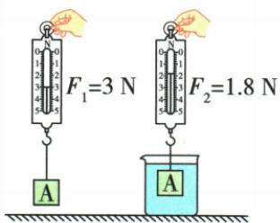
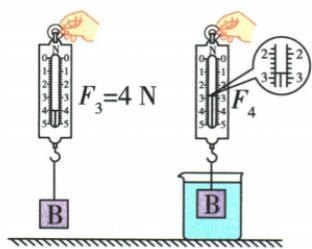

## 讲解

### 判据

要比较某一因素，选择成对实验，只让该因素改变，同时控制液体密度和排开体积等其余条件。实际测的是两次空气与水中示数之差。

### 流程

1. 说清待检验因素。2. 固定其他量：检验物体密度时，用等体积不同材料并全部浸没同一种水。3. 每件物体先测重力，再测液中拉力。4. 分别求浮力，不直接比较拉力。5. 把结论写成有控制条件的初步结论；增加重复测量可提高可靠性，不把一次结果推广到所有浮沉状态。

## 例题

### 物体密度是否影响浮力的控制变量实验

> 来源ID Q09-04；第九章浮力；101-150/full.md 第300–335行。原答案与解析定位：101-150/full.md 第347–349行。

例3（2024 山西中考）小明发现木头在水中是漂浮的，而铁块在水中会下沉，他猜想浮力的大小与浸在液体中的物体的密度有关。为此他进行了如下探究，请你帮助他完成实验。

甲

乙

# 实验思路：

(1)选取体积相同、\_\_\_\_不同的物体 A 和 B 分别浸没在水中,测出其所受浮力并进行比较。

# 实验过程：

(2) 按照实验思路依次进行如图所示的操作, 从甲图中可知物体 A 所受的浮力为 \_\_\_\_ N; 观察乙图可知物体 B 在水中受到的拉力为 \_\_\_\_ N, 并计算出物体 B 所受的浮力。

# 实验结论：

(3)分析实验数据,可得出初步结论:\_\_\_\_。

**原资料答案与解析：**

例3 解析（1）要想探究浮力的大小与浸在液体中的物体的密度是否有关，应当选用体积相同、密度不同的物体A和B，然后浸没在水中，测出其所受浮力并进行比较。（2）由甲图可知，物体A所受的浮力 $F_{A浮}=F_{1}-F_{2}=3N-1.8N=1.2N$ ，由乙图可知，弹簧测力计的分度值为0.2N，示数为2.8N，因此物体B在水中受到的拉力为2.8N；根据称重法，由乙图可知物体B所受的浮力 $F_{B浮}=F_{3}-F_{4}=4N-2.8N=1.2N$ 。(3)比较物体A和B受到的浮力大小可知，浮力大小与浸在液体中的物体的密度无关。

答案（1）密度 (2)1.2 2.8 (3)浮力的大小与浸在液体中的物体的密度无关

**展开解析（依据原详解补足理由与步骤）：**

要检验物体密度，就改变物体材料、保持体积相同，并在同一水中全部浸没，使液体密度和排水体积相同。甲的浮力$3-1.8=1.2\,\mathrm N$。乙放大刻度一小格0.2 N，拉力2.8 N，因此乙浮力$4-2.8=1.2\,\mathrm N$。两次浮力相同，支持“在液体密度与排开体积相同的条件下，浮力与物体密度无关”。这不是说任意不同物体漂浮时的浮力都相等；漂浮时各自浮力等于各自重力。

## 易错

两物体重力不同，拉力不同不说明浮力不同；同总体积只有全部浸没时才保证同排体积。
