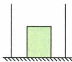
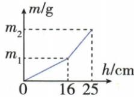

## 讲解

### 判据

直立轻柱体先置底部，随注水开始漂浮，注水质量对水深的斜率会变；拐点处的水深就是开始漂浮时的浸入深度。

### 流程

1. 底部仍接触时，水占用截面积为容器底面积减物体底面积。2. 刚脱底浮力等于重力，由拐点浸深求G。3. 漂浮后物体随水面升高，浸深固定，新增水层的体积为容器面积乘水面增量。4. 末态总水量用液面以下几何容积减排开体积。5. 指定表面压强用该表面到液面的深度。

## 例题

### 注水拐点与漂浮圆柱体

> 来源ID Q09-13；第九章浮力；101-150/full.md 第633–638；644–648行。原答案与解析定位：101-150/full.md 第640–642行；101-150/full.md 第650–652行。

例4 (2024 山东枣庄中考) 将一底面积为 $200 \mathrm{~cm}^{2}$ 的圆柱形容器放置于水平面上, 容器内放一个底面积 $50 \mathrm{~cm}^{2}$ 、高 $20 \mathrm{~cm}$ 的圆柱体, 如图甲所示, 缓慢向容器中注水到一定深度时圆柱体漂浮, 继续注水到 $25 \mathrm{~cm}$ 时停止, 在整个注水过程中, 圆柱体始终处于直立状态, 其注水质量 $m$ 与容器中水的深度 $h$ 的关系图像如图乙所示 ( $\rho_{\text {水}} = 1.0 \times 10^{3} \mathrm{~kg} / \mathrm{m}^{3}, g$ 取 $10 \mathrm{~N} / \mathrm{kg}$ ), 则以下说法正确的是 ( )

A. 当圆柱体漂浮时,露出水面的高度为 $9 \, cm$   
B. 圆柱体的密度为 $0.64 \times 10^{3} \mathrm{~kg} / \mathrm{m}^{3}$   
C. 注水停止时, 水对圆柱体底部的压强为 2500 Pa  
D. 向容器内注水的总质量是 4200 g

  
甲

  
乙

**原资料答案与解析：**

解析 由图乙可知,注入水的深度在 16 cm 时,图像出现拐点,且此后

注入相同深度的水时水的质量增大,而圆柱体高是20 cm,所以当注入水的深度 $h_{1}=16\ cm$ 时,圆柱体恰好处于漂浮状态,此时圆柱体露出水面的高度为20 cm-16 $cm=4$ cm,故A错误;当圆柱体刚好漂浮时,圆柱体受到的浮力 $F_{\text{浮}}=\rho_{\text{水}}gV_{\text{排}}=\rho_{\text{水}}gS_{\text{柱}}h_{1}=1.0\times10^{3}\ kg/m^{3}\times10\ N/kg\times50\times10^{-4}\ m^{2}\times0.16\ m=8\ N,G_{\text{柱}}=$

$F_{\text{浮}}=8\ N$ ，则圆柱体的密度 $\rho_{\text{柱}}=\frac{m_{\text{柱}}}{V_{\text{柱}}}=\frac{G_{\text{柱}}}{V_{\text{柱}}g}=\frac{8\ N}{50\times10^{-4}\ m^{2}\times0.2\ m\times10\ N/kg}=0.8\times10^{3}\ kg/m^{3}$ ，故B错误；注水停止时，圆柱体处于漂浮状态，浸入水中的深度不变，则水对圆柱体底部的压强 $p=\rho_{\text{水}}gh_{1}=1.0\times10^{3}\ kg/m^{3}\times10\ N/kg\times0.16\ m=1\ 600\ Pa$ ，故C错误；向容器内注入水的体积 $V_{\text{水}}=V_{\text{总}}-V_{\text{排}}=S_{\text{容}}h_{2}-S_{\text{柱}}h_{1}=200\ cm^{2}\times25\ cm-50\ cm^{2}\times16\ cm=4\ 200\ cm^{3}$ ，注入水的质量 $m_{\text{水}}=\rho_{\text{水}}V_{\text{水}}=1.0\ g/cm^{3}\times4\ 200\ cm^{3}=4\ 200\ g$ ，故D正确。

答案 D

**展开解析（依据原详解补足理由与步骤）：**

图像在水深16 cm处斜率增加，表示圆柱刚脱离底部开始漂浮；此前水填入容器与柱体之间，此后柱随水面升高、保持浸入16 cm。A错：露出高度$20-16=4\,\mathrm{cm}$，末态柱底距容器底9 cm不是露出9 cm。B错：浮力$1000\times10\times50\times10^{-4}\times0.16=8\,\mathrm N$，质量$8/10=0.8\,\mathrm{kg}$，总体积$50\times20=1000\,\mathrm{cm^3}=0.001\,\mathrm{m^3}$，密度$0.8/0.001=800\,\mathrm{kg/m^3}$。C错：柱底距自由液面仍16 cm，压强1600 Pa；25 cm是容器底深度。D对：到25 cm水面以下总几何容积$200\times25=5000\,\mathrm{cm^3}$，减柱体排水量$50\times16=800\,\mathrm{cm^3}$，水量4200立方厘米，质量4200 g。

## 易错

柱底到容器底距离、柱底到水面深度、露出高度是三个不同量。
