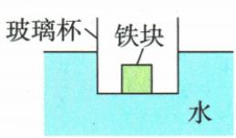
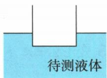

## 讲解

### 判据

题目同时问物体密度、浮力与容器底压力时，分开分析物块和水；若人为按住物体，外力会加入总竖直受力。

### 流程

1. 漂浮时用浸入比例求平均密度。2. 从重力求质量，再用密度求总体积。3. 新状态用排体积求浮力。4. 物体给水的竖直作用与水给物体的浮力等大反向。5. 竖直柱形容器侧壁无竖直水压力时，水给底压力为水重加物体给水的向下作用力。复杂形状容器改用液深和$pS$，不直接套总重。

## 例题

### 按住漂浮方块时容器底的压力

> 来源ID Q09-10；第九章浮力；101-150/full.md 第570–574行。原答案与解析定位：101-150/full.md 第576–578行。

例1 如图所示,盛有 $2 \, kg$ 水的柱形容器置于水平地面上,重为 $6 \, N$ 且不吸水的正方体物块在

水中静止时有 $\frac{3}{5}$ 的体积浸入水中,物块下表面与水面平行,则物块的密度为\_\_\_\_ $\mathrm{kg/m^{3}}$,物块下表面所受水的压力为\_\_\_\_ N。若物块在压力的作用下刚好浸没水中,不接触容器底,水不溢出,此时水对容器底部的压力为\_\_\_\_ N。(g 取 10 $\mathrm{N/kg}$, $\rho_{\text{水}} = 1.0 \times 10^{3} \text{ kg/m}^{3}$ )

**原资料答案与解析：**

解析 物块有 $\frac{3}{5}$ 的体积浸入水中, 则物块的密度 $\rho = \frac{3}{5} \rho_{\text{水}} = \frac{3}{5} \times 1.0 \times 10^{3} \mathrm{~kg} / \mathrm{m}^{3} = 0.6 \times 10^{3} \mathrm{~kg} / \mathrm{m}^{3}$ ; 物块在水中漂浮, 受力平衡, 受到的浮力 $F_{\text{浮}} = G = 6 \mathrm{~N}$ , 物块上表面不受水的压力, 根据浮力产生的原因 $F_{\text{浮}} = F_{\text{向上}} - F_{\text{向下}}$ 可知, 物块下表面所受水的压力 $F_{\text{向上}} = F_{\text{浮}} = 6 \mathrm{~N}$ ; 物块的质量 $m = \frac{G}{g} = \frac{6 \mathrm{~N}}{10 \mathrm{~N} / \mathrm{kg}} = 0.6 \mathrm{~kg}$ , 由 $\rho = \frac{m}{V}$ 可知, 物块的体积 $V = \frac{m}{\rho} = \frac{0.6 \mathrm{~kg}}{0.6 \times 10^{3} \mathrm{~kg} / \mathrm{m}^{3}} = 1 \times 10^{-3} \mathrm{~m}^{3}$ , 当物块刚好浸没在水中时, 由阿基米德原理可知, 受到的浮力 $F_{\text{浮}}' = \rho_{\text{水}} g V_{\text{排}} = \rho_{\text{水}} g V = 1.0 \times 10^{3} \mathrm{~kg} / \mathrm{m}^{3} \times 10 \mathrm{~N} / \mathrm{kg} \times 1 \times 10^{-3} \mathrm{~m}^{3} = 10 \mathrm{~N}$ , 力的作用是相互的, 水给物块的浮力为 $10 \mathrm{~N}$ , 则物块给水的压力 $F_{\text{压}}$ 也为 $10 \mathrm{~N}$ , 容器中水的重力 $G_{\text{水}} = m_{\text{水}} g = 2 \mathrm{~kg} \times 10 \mathrm{~N} / \mathrm{kg} = 20 \mathrm{~N}$ , 此时水对容器底部的压力 $F_{\text{压}}' = F_{\text{压}} + G_{\text{水}} = 10 \mathrm{~N} + 20 \mathrm{~N} = 30 \mathrm{~N}$ 。

答案 $0.6 \times 10^{3}$ 6 30

**展开解析（依据原详解补足理由与步骤）：**

漂浮时$\rho_{\text{水}}g(3V/5)=\rho_{\text{物}}gV$，两边同除gV得$\rho_{\text{物}}=(3/5)\rho_{\text{水}}=600\,\mathrm{kg/m^3}$。方块上底露出水面，下底水的向上压力就是浮力，等于重力6 N。质量$6/10=0.6\,\mathrm{kg}$，体积$0.6/600=0.001\,\mathrm{m^3}$。全部浸没浮力$1000\times10\times0.001=10\,\mathrm N$。保持静止必须另加向下4 N，水受到方块向下的液体作用力为10 N。柱形容器竖直侧壁不承担竖直水压力，水重$2\times10=20\,\mathrm N$，故水对底压力$20+10=30\,\mathrm N$。若只把水重20和物重6相加，会漏掉外加的4 N。

### 浮力秤求铁块质量与未知液体密度

> 来源ID Q09-15；第九章浮力；101-150/full.md 第684–703行。原答案与解析定位：101-150/full.md 第711–715行。

例2（2024山东聊城中考）我国的智能船舶“明远”号矿砂船最大载货量为40万吨，这么大的货船通过国际港口时，工作人员通常是通过读取货船浸入海水中的深度来测量载货量。物理小组根据这个原理，利用圆柱形玻璃杯制作出可测量物体质量的“浮力秤”。如图甲所示，玻璃杯底面积为 $80\ cm^{2}$ ，质量为200 g，将未知质量的铁块放入玻璃杯中，静止时玻璃杯浸入水中的深度为5.5 cm。 $\rho_{\text{水}}=1.0\times10^{3}\ kg/m^{3}$ ，g取10 $\mathrm{N/kg}$。

(1) 求玻璃杯底面所受水的压强和压力；  
(2)求铁块的质量;   
(3) 此装置还可以作为密度计来测量未知液体的密度。如图乙所示, 将空玻璃杯放入待测液体中, 静止时浸入液体中的深度为 2 cm, 求待测液体的密度。

甲

  
乙

**原资料答案与解析：**

例2 解析（1）玻璃杯底面所受水的压强 $p = \rho_{\text{水}} gh = 1.0 \times 10^{3} \, kg/m^{3} \times 10 \, N/kg \times 0.055 \, m = 550 \, Pa$ ; 由 $p = \frac{F}{S}$ 可知玻璃杯底面所受水的压力 $F = pS = 550 \, Pa \times 80 \times 10^{-4} \, m^{2} = 4.4 \, N$ 。

(2) 玻璃杯受到水的浮力 $F_{\text{浮}} = F = 4.4 \, N$ ，由图甲可知，装有铁块的玻璃杯在水中处于漂浮状态，玻璃杯和铁块的总重力 $G_{\text{总}} = F_{\text{浮}} = 4.4 \, N$ ，则铁块的重力 $G_{\text{铁}} = G_{\text{总}} - G_{\text{杯}} = 4.4 \, N - 0.2 \, kg \times 10 \, N/kg = 2.4 \, N$ ，铁块的质量 $m_{\text{铁}} = \frac{G}{g} = \frac{2.4 \, N}{10 \, N/kg} = 0.24 \, kg$ 。

(3) 将空玻璃杯放入待测液体中，空玻璃杯漂浮，则玻璃杯受到的浮力 $F_{\text{浮}}' = G_{\text{杯}} = 2 \, N$ ; 玻璃杯排开待测液体的体积 $V_{\text{排}} = 80 \, cm^{2} \times 2 \, cm = 160 \, cm^{3}$ ，由阿基米德原理可知待测液体的密度 $\rho = \frac{F_{\text{浮}}'}{g V_{\text{排}}} = \frac{2 \, N}{10 \, N/kg \times 160 \times 10^{-6} \, m^{3}} = 1.25 \times 10^{3} \, kg/m^{3}$ 。

**展开解析（依据原详解补足理由与步骤）：**

底面深度$5.5\,\mathrm{cm}=0.055\,\mathrm m$，压强$1000\times10\times0.055=550\,\mathrm{Pa}$。底面积$80\,\mathrm{cm^2}=0.008\,\mathrm{m^2}$，底面向上压力$550\times0.008=4.4\,\mathrm N$；杯竖直侧壁水压力水平方向，故这也是杯的浮力。杯和铁一起漂浮，总重力4.4 N；空杯重力$0.2\times10=2\,\mathrm N$，铁重$4.4-2=2.4\,\mathrm N$，铁质量$2.4/10=0.24\,\mathrm{kg}$。乙中只放空杯，浮力为2 N，排液体积$80\times2=160\,\mathrm{cm^3}=160\times10^{-6}\,\mathrm{m^3}$，$\rho=2/(10\times160\times10^{-6})=1250\,\mathrm{kg/m^3}$。不能把甲总质量全部算成铁块质量。

## 易错

外加压力不能遗漏；水对物体的压力差与物体对水的合力对应，不额外重复加浮力。
