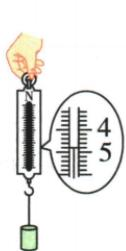
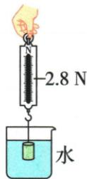
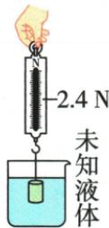

## 讲解

### 判据

同一物体分别在空气、已知密度液体、未知液体中称重，空气数据求质量，已知液体中的浮力求体积，再转入未知液体求密度。

### 流程

1. 用$G/g$求物体质量。2. 用空气重力减液中拉力求浮力。3. 全部浸没时，用$V=F_{\text{浮}}/(\rho g)$求物体总体积。4. 用$m/V$求物体密度。5. 同一物体全浸未知液体，排体积不变；先求新浮力，再用$\rho=F_{\text{浮}}/(gV)$。

## 例题

### 称重法同时求金属与液体密度

> 来源ID Q09-05；第九章浮力；101-150/full.md 第451–451；455–462行。原答案与解析定位：101-150/full.md 第453–453行；101-150/full.md 第464–464行。

例 如图是小聪同学进行浮力相关实验的情境。由图可知,金属块的重力是\_\_\_\_N,金属块在水中受到的浮力是\_\_\_\_N,金属块的密度是\_\_\_\_kg/m³,未知液体的密度是\_\_\_\_kg/m³。(g取10 $\mathrm{N/kg}$, $\rho_{\text{水}}=1.0\times10^{3}$ kg/m³)

  
甲

  
乙

  
丙

**原资料答案与解析：**

解析 由图甲、乙可知,金属块的重力为 $G_{\text{金}}=4.8\ N$ ;金属块浸没在水中,受到的浮力为 $F_{\text{浮}}=4.8\ N-2.8\ N=2\ N$ ;金属块的质量 $m_{\text{金}}=\frac{G_{\text{金}}}{g}=$ $\frac{4.8 \mathrm{~N}}{10 \mathrm{~N} / \mathrm{kg}} = 0.48 \mathrm{~kg}$ , 由阿基米德原理可知, 金属块的体积 $V_{\text {金}} = V_{\text {排水}} = \frac{F_{\text {浮}}}{\rho_{\text {水}} g} = \frac{2 \mathrm{~N}}{1.0 \times 10^{3} \mathrm{~kg} / \mathrm{m}^{3} \times 10 \mathrm{~N} / \mathrm{kg}} = 2 \times$ $10^{-4} \mathrm{~m}^{3}$ , 则金属块的密度 $\rho_{\text {金}} = \frac{m_{\text {金}}}{V_{\text {金}}} = \frac{0.48 \mathrm{~kg}}{2 \times 10^{-4} \mathrm{~m}^{3}} = 2.4 \times 10^{3} \mathrm{~kg} / \mathrm{m}^{3}$ ; 由图甲、丙可知, 金属块浸没在未知液体中时, 受到的浮力 $F_{\text {浮}}' = 4.8 \mathrm{~N} - 2.4 \mathrm{~N} = 2.4 \mathrm{~N}$ , 排开液体的体积 $V_{\text {排液}} = V_{\text {金}}$ , 由阿基米德原理可知, 未知液体的密度 $\rho_{\text {液}} = \frac{F_{\text {浮}}'}{V_{\text {排液}} g} = \frac{2.4 \mathrm{~N}}{2 \times 10^{-4} \mathrm{~m}^{3} \times 10 \mathrm{~N} / \mathrm{kg}} = 1.2 \times 10^{3} \mathrm{~kg} / \mathrm{m}^{3}$ 。

答案 4.8 2 $2.4 \times 10^{3}$ $1.2 \times 10^{3}$

**展开解析（依据原详解补足理由与步骤）：**

空气读数4.8 N，$m=G/g=4.8/10=0.48\,\mathrm{kg}$。水中拉力2.8 N，浮力$4.8-2.8=2\,\mathrm N$。全部浸没，$V_{\text{物}}=V_{\text{排}}=F_{\text{浮}}/(\rho_{\text{水}}g)=2/(1000\times10)=2\times10^{-4}\,\mathrm{m^3}$。金属密度$0.48/(2\times10^{-4})=2400\,\mathrm{kg/m^3}$。未知液体中浮力$4.8-2.4=2.4\,\mathrm N$；同一金属全部浸没，体积仍为上述值，$\rho_{\text{液}}=2.4/(10\times2\times10^{-4})=1200\,\mathrm{kg/m^3}$。不能把液中拉力当浮力。

## 易错

每次减的是同一空气重力；改变液体后只要没有吸液、体积改变或气泡，才共用体积。
