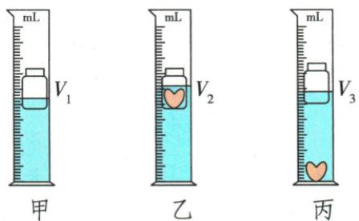

## 讲解

### 判据

无法直接称矿石质量，但能让装矿石的瓶漂浮，并测三次液面读数时，甲乙差提供矿石重力，甲丙差提供矿石体积。

### 流程

1. 记录空瓶漂浮基准V1。2. 矿石入瓶，瓶仍漂浮，读V2；增加的浮力平衡矿石重力，所以$m=\rho_{\text{水}}(V_2-V_1)$。3. 取矿石入水全部浸没，瓶恢复原来状态，读V3；矿石体积$V_3-V_1$。4. 两者相除求密度，核对量纲。

## 例题

### 利用空瓶漂浮与矿石沉入测密度

> 来源ID Q09-11；第九章浮力；101-150/full.md 第584–590行。原答案与解析定位：101-150/full.md 第592–594行。

例2 如图所示,某实验小组测量矿石的密度。

(1) 将空瓶放入盛有适量水的量筒内, 稳定后水面位置为 $V_{1}$ , 如图甲所示;  
(2) 将小矿石放入瓶中, 稳定后水面位置为 $V_{2}$ , 如图乙所示;  
(3) 将小矿石从瓶中取出放入量筒内, 稳定后水面位置为 $V_{3}$ , 如图丙所示。由图可得小矿石的质量 m = \_\_\_\_ , 小矿石的密度 $\rho=$ \_\_\_\_  。(两空均用已知量的字母表示, $\rho_{\text{水}}$ 已知)

**原资料答案与解析：**

解析 由图可知, 小矿石的重力 $G = \Delta F_{\text{浮}} = \rho_{\text{水}} g (V_{2} - V_{1})$ , 小矿石的质量 $m = \frac{G}{g} = \frac{\rho_{\text{水}} g (V_{2} - V_{1})}{g} = \rho_{\text{水}} (V_{2} - V_{1})$ , 小矿石的体积 $V = V_{3} - V_{1}$ , 小矿石的密度 $\rho = \frac{m}{V} = \frac{\rho_{\text{水}} (V_{2} - V_{1})}{V_{3} - V_{1}}$ 。

答案 $\rho_{\text{水}}(V_{2}-V_{1})$ $\frac{\rho_{\text{水}}(V_{2}-V_{1})}{V_{3}-V_{1}}$

**展开解析（依据原详解补足理由与步骤）：**

比较甲乙，空瓶和原有水都相同，增加的排水体积$V_2-V_1$所产生的浮力恰好托住矿石新增重力；$mg=\rho_{\text{水}}g(V_2-V_1)$，同除g得$m=\rho_{\text{水}}(V_2-V_1)$。比较甲丙，空瓶又恢复空瓶漂浮状态，增加体积只来自全部浸没的矿石，所以$V_{\text{石}}=V_3-V_1$。再用$\rho_{\text{石}}=m/V_{\text{石}}$得到原式。操作要求没有水损失、瓶中不进水、矿石不吸水且完全浸入；读数量筒要平视。三个读数包含原有水，不能直接把V2当矿石体积或排水增量。

## 易错

瓶进水或取矿石带走水会破坏基准；未完全浸入不能用液面差作总体积。
