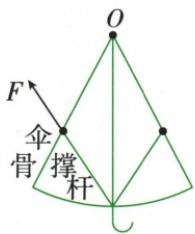
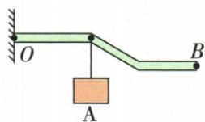
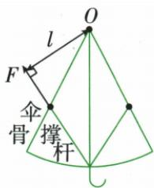
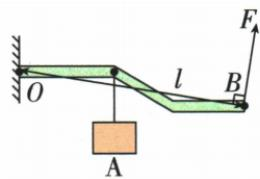

## 错法

看见OA、OB长度就直接代入，不查力方向，导致倾斜姿态求力仍得原值。

## 正解

先延长作用线，再作支点到直线的垂线。手力垂直身体时OB是动力臂；重力竖直时倾斜OA的水平投影才是重力臂。两边分别核对，不统一用杆长。

## 例题

### 雨伞力臂和最小动力作图

> 来源ID Q11-01；第十一章简单机械；101-150/full.md 第1533–1562行。原答案与解析定位：101-150/full.md 第1564–1596行。

例1 (1)如图甲所示,请画出撑开雨伞时,撑杆对伞骨的作用力F的力臂l。

甲

乙

(2)如图乙所示,请画出提起物体A的最小力F的示意图及其力臂l。

**原资料答案与解析：**

解析（1）①找点：支点为 $O$ ；②画线：力 $F$ 的作用线图中已画出；③过 $O$ 点向力 $F$ 的作用线作垂线，垂线段的长度即力 $F$ 的力臂 $l$ ；④标出垂直符号、力臂符号，如答案图所示。

(2)①杠杆上离支点最远的点为 B; ②连接 OB, OB 的长度就是最长的动力臂, 标出力臂的符号; ③过 B 点作动力臂的垂线即最小动力的作用线; ④阻力的作用效果使杠杆向下转动, 要使杠杆平衡则动力方向向上, 据此可画出最小的动力 F, 如答案图所示。

答案 (1)如图所示

(2)如图所示

**展开解析（依据原详解补足理由与步骤）：**

甲先找伞骨转轴O，沿已给F延长作用线；从O向该直线作垂线，垂线段标l并标直角，不能连接O与受力点便称力臂。乙阻力位置和大小固定，要使动力小就使动力臂最大；选离O最远的B，连OB，过B画垂直OB的力。根据阻力使杠杆顺时针转，动力须使其逆时针转，箭头指向答案图所示上方。直杆或弯杆都取支点到作用线的最短距离。

### 两种俯卧撑姿态的杠杆模型

> 来源ID Q11-02；第十一章简单机械；101-150/full.md 第1602–1621行。原答案与解析定位：101-150/full.md 第1623–1659行。

例2 俯卧撑是一项常见的健身项目,采用不同的方式做俯卧撑,健身效果通常不同。图甲所示的是小京在水平地面上做俯卧撑保持静止时的情境,他的身体与地面平行,可抽象成如图乙所示的杠杆模型,地面对脚的力作用在 O 点,对手的力作用在 B 点,小京的重心在 A 点。已知小京重 750 N,OA 长为 1 m, OB 长为 1.5 m。

  
甲

  
乙

丙

(1) 图乙中, 地面对手的力 $F_{1}$ 与身体垂直, 求 $F_{1}$ 的大小。  
(2) 图丙所示的是小京手扶栏杆做俯卧撑保持静止时的情境,此时他的身体姿态与图甲相同,只是身体与水平地面成一定角度,栏杆对手的力 $F_{2}$ 与他的身体垂直,且仍作用在 B 点。分析并说明 $F_{2}$ 与 $F_{1}$ 的大小关系。

**原资料答案与解析：**

解析（1）如图1所示， $O$ 为支点，重力的力臂为 $l_{OA}, F_1$ 的力臂为 $l_{OB}$ ，依据杠杆的平衡条件 $F_1 l_{OB} = G l_{OA}$ ，可得 $F_1 = \frac{G l_{OA}}{l_{OB}} = \frac{750 \mathrm{~N} \times 1 \mathrm{~m}}{1.5 \mathrm{~m}} = 500 \mathrm{~N}$ 。

图 1

图2

(2) 小京手扶栏杆时抽象成的杠杆模型如图 2 所示, O 为支点, 重力的力臂为 $l_{OA}'$ , $F_{2}$ 的力臂为 $l_{OB}'$ , 依据杠杆的平衡条件 $F_{2}l_{OB}' = Gl_{OA}'$ 可得 $F_{2} = \frac{Gl_{OA}'}{l_{OB}'}$ , 由图 1 和图 2 可知 $l_{OA}' < l_{OA}, l_{OB}' = l_{OB}$ , 因此, $F_{2} < F_{1}$ 。

答案 (1)500 N (2) 见解析

**展开解析（依据原详解补足理由与步骤）：**

水平姿态以脚接触处O为支点，手支持力和重力均垂直身体，力臂分别为1.5米和1米。$F_1\times1.5=750\times1$，两边除1.5得$F_1=500\,\mathrm N$。倾斜姿态手力仍与身体垂直，动力臂OB仍1.5米；重力仍竖直，重力臂变为OA的水平投影，比原1米短。因此同样重力的转动效果变小，所需手力也变小，$F_2<F_1$。并未改变OA长度，改变的是它到重力作用线的垂直距离。
