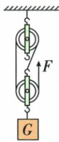
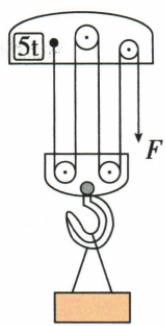

## 错法

把拉力F乘负载高度h，漏掉自由端比负载多走的路程，总功被低估，效率甚至超过100%。

## 正解

拉力作用在自由端，应该用s；有用功针对重物才用h。数有效n后$s=nh$，总功为Fnh。有摩擦时按实际F计算，不能直接改成物重加轮重。

## 例题

### 建筑材料滑轮组的动轮重与效率

> 来源ID Q11-12；第十一章简单机械；101-150/full.md 第1993–1995行。原答案与解析定位：101-150/full.md 第2003–2005行。

例2（2024 山东菏泽中考节选）用如图所示的滑轮组将重 540 N 的建筑材料从地面拉到四楼，建筑材料上升 10 m，绳端拉力为 200 N（不计绳重和滑轮与绳之间的摩擦）。则动滑轮重 \_\_\_\_ N，此过程该滑轮组的机械效率为 \_\_\_\_。

**原资料答案与解析：**

例2 解析 由图可知 $n=3$，不计绳重和摩擦时 $F=\frac{1}{n}(G+G_{\text{动}})$ ，所以动滑轮的重力 $G_{\text{动}}=nF-G=3\times200\ N-540\ N=60\ N$ ；滑轮组的机械效率 $\eta=\frac{W_{\text{有用}}}{W_{\text{总}}}=\frac{Gh}{Fs}=\frac{Gh}{Fnh}=\frac{G}{nF}=\frac{540\ N}{3\times200\ N}=90\%$ 。

答案 60 90%

**展开解析（依据原详解补足理由与步骤）：**

原图承重3股。匀速且不计绳重摩擦，$3F=G+G_{\text{动}}$，所以$G_{\text{动}}=3\times200-540=60\,\mathrm N$。有用功$Gh=540\times10=5400\,\mathrm J$，自由端路程$3\times10=30\,\mathrm m$，总功$Fs=200\times30=6000\,\mathrm J$，效率$5400/6000=90\%$。剩余600 J用于提升动轮，而不是必然全部摩擦损失。

### 起重机满载效率与动轮重

> 来源ID Q11-15；第十一章简单机械；101-150/full.md 第2217–2233行。原答案与解析定位：101-150/full.md 第2187–2189行；101-150/full.md 第2279–2279行。

例2（2024江苏苏州中考）某起重机的滑轮组结构示意如图所示，其最大载重为5t。起重机将3600kg的钢板匀速提升到10m高的桥墩上，滑轮组的机械效率为80%。不计钢丝绳的重力和摩擦，g取$10\,\mathrm{N/kg}$。求：

(1)克服钢板重力做的功 $W_{\text{有用}}$ ;

(2)钢丝绳的拉力 F;

(3)滑轮组满载时的机械效率(保留一位小数)。

**原资料答案与解析：**

例2 解析（1）有用功 $W_{\text{有用}} = Gh = mgh = 3600 \, kg \times 10 \, N/kg \times 10 \, m = 3.6 \times 10^{5} \, J$ 。

(2) 总功 $W_{\text{总}} = \frac{W_{\text{有用}}}{\eta} = \frac{3.6 \times 10^{5} \, J}{80\%} =$ $4.5 \times 10^{5} \, J$ ，拉力 $F = \frac{W_{\text{总}}}{s} = \frac{W_{\text{总}}}{4h} =$ $\frac{4.5\times10^{5}\mathrm{J}}{4\times10\mathrm{m}}=1.125\times10^{4}\mathrm{N}$ 。

(3) 额外功 $W_{\text{额外}} = W_{\text{总}} - W_{\text{有用}} = 4.5 \times 10^{5} \mathrm{~J} - 3.6 \times 10^{5} \mathrm{~J} = 9 \times 10^{4} \mathrm{~J}$ ; 动滑轮重 $G_{\text{动}} = \frac{W_{\text{额外}}}{h} = \frac{9 \times 10^{4} \mathrm{~J}}{10 \mathrm{~m}} = 9 \times 10^{3} \mathrm{~N}$ ; 满载时机械效率 $\eta_{\text{最大}} = \frac{W'_{\text{有用}}}{W'_{\text{有用}} + W'_{\text{额外}}} = \frac{G'}{G' + G_{\text{动}}} = \frac{5 \times 10^{4} \mathrm{~N}}{5 \times 10^{4} \mathrm{~N} + 9 \times 10^{3} \mathrm{~N}} \approx 84.7 \%$ 。

**展开解析（依据原详解补足理由与步骤）：**

钢板重$3600\times10=36000\,\mathrm N$，有用功$36000\times10=360000\,\mathrm J$。80%效率意味着总功$360000/0.80=450000\,\mathrm J$。原图4股承重，自由端40米，拉力$450000/40=11250\,\mathrm N$。不计绳重摩擦，额外功只用于提升动轮：$450000-360000=90000\,\mathrm J$，动轮重$90000/10=9000\,\mathrm N$。满载5吨为5000千克，重50000 N，效率$50000/(50000+9000)\approx84.7\%$。不能把原80%视为机械永久不变的常数。
