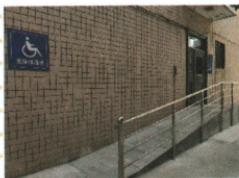

## 讲解

### 是什么

斜面用沿坡较长的路径完成竖直提升，在典型模型下可省力但费距离。支持力垂直坡面，沿坡移动时支持力不做功。

### 怎么来的

理想无摩擦匀速提升，输入功$Fs$等于有用功$Gh$，因此$F=Gh/s$。因为坡长s大于竖直高度h，所需拉力小于G。存在摩擦时输入还包括摩擦功，所以省力程度减弱，是否省力还须结合摩擦大小。

### 什么时候能用

公式中的h是竖直升高，s是沿坡路程。斜面太粗糙时不一定仍比竖直提省力；不能将“省功”作为使用斜面的目的。本条计算假定坡固定、力沿坡、物体匀速且额外功来源明确。

## 例题

### 无障碍通道是否省功

> 来源ID Q11-07；第十一章简单机械；101-150/full.md 第1850–1859行。原答案与解析定位：101-150/full.md 第1860–1860行。

如图所示是无障碍通道，该通道相当于简单机械中的\_\_\_\_，使用该专用通道是为了\_\_\_\_（选填“省力”或“省功”）。当人坐着轮椅沿着通道向上运动时，轮椅受到的支持力对轮椅\_\_\_\_（选填“做功”或“不做功”）。

**原资料答案与解析：**

答案 斜面 省力 不做功

**展开解析（依据原详解补足理由与步骤）：**

通道是斜面，借较长路径换取较小提升力，第一空“斜面”、第二空“省力”。理想无摩擦时提升同样高度仍需相同有用功，有摩擦总功还增加，不叫省功。支持力垂直斜面，轮椅沿斜面移动，支持力与位移垂直，第三空“不做功”。原资料只有三个答案，理由为规范补写。

### 斜面上的功功率摩擦力与效率

> 来源ID Q11-13；第十一章简单机械；101-150/full.md 第2141–2159行。原答案与解析定位：101-150/full.md 第2161–2163行。

例 如图所示,固定的斜面长 $s=2$ m,高 $h=0.5$ m,沿斜面向上用 50 N 的拉力在 4 s 内把一个重 60 N 的物体从斜面底端匀速拉到顶端,这一过程中 ( )

A. 对物体做的有用功为 $120 \mathrm{~J}$

B.物体受的摩擦力为 $50\mathrm{N}$

C.拉力做功的功率为 $25\mathrm{W}$

D.斜面的机械效率为 $70\%$

**原资料答案与解析：**

解析 对物体做的有用功 $W_{\text{有用}} = Gh = 60 \, \text{N} \times 0.5 \, \text{m} = 30 \, \text{J}$ ，故 A 错误；拉力做的总功 $W_{\text{总}} = Fs = 50 \, \text{N} \times 2 \, \text{m} = 100 \, \text{J}$ ，克服摩擦力做功 $W_{\text{额外}} = W_{\text{总}} - W_{\text{有用}} = 100 \, \text{J} - 30 \, \text{J} = 70 \, \text{J}$ ，由 $W_{\text{额外}} = fs$ 得物体受到的摩擦力 $f = \frac{W_{\text{额外}}}{s} = \frac{70 \, \text{J}}{2 \, \text{m}} = 35 \, \text{N}$ ，故 B 错误；拉力做功的功率 $P = \frac{W_{\text{总}}}{t} = \frac{100 \, \text{J}}{4 \, \text{s}} = 25 \, \text{W}$ ，故 C 正确；斜面的机械效率 $\eta = \frac{W_{\text{有用}}}{W_{\text{总}}} = \frac{30 \, \text{J}}{100 \, \text{J}} = 30\%$ ，故 D 错误。

答案 C

**展开解析（依据原详解补足理由与步骤）：**

提升重物的有用功用竖直高度：$W_{\text{有用}}=60\times0.5=30\,\mathrm J$，A的120 J错。总功沿斜面$W_{\text{总}}=50\times2=100\,\mathrm J$；额外功$100-30=70\,\mathrm J$，若全部为摩擦功，$f=70/2=35\,\mathrm N$，B的50 N错。$P=100/4=25\,\mathrm W$，C对。效率$30/100=30\%$，D把额外功占比70%误作有用功占比。斜面上即使匀速，拉力还要克服重力的沿斜面作用，不等于摩擦力。

## 易错

沿坡匀速不代表拉力等于摩擦力，还要克服重力沿坡作用。
