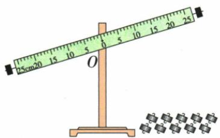
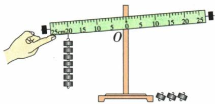

## 讲解

### 是什么

两力主要转动作用相反、杠杆平衡时，$F_1l_1=F_2l_2$。力用牛、两个力臂用相同长度单位即可；式两边量纲相同。

### 怎么来的

实验把水平杠杆挂不同钩码并改变位置，比较每边力乘力臂，发现两边相等时能保持平衡。式说明增大一边力臂可减少那边所需力，反求$F_1=F_2l_2/l_1$是两边同除$l_1$。

### 什么时候能用

杠杆自重不能忽略时，还要计它对支点的转动作用。典型实验先空杆调平、自重作用已有抵消；倾斜静止也能平衡，但必须重新画真实力臂。缓慢转动题按每位置转动效果平衡，不把“匀速转动”直接说成所有力合力为零。

## 例题

### 两种俯卧撑姿态的杠杆模型

> 来源ID Q11-02；第十一章简单机械；101-150/full.md 第1602–1621行。原答案与解析定位：101-150/full.md 第1623–1659行。

例2 俯卧撑是一项常见的健身项目,采用不同的方式做俯卧撑,健身效果通常不同。图甲所示的是小京在水平地面上做俯卧撑保持静止时的情境,他的身体与地面平行,可抽象成如图乙所示的杠杆模型,地面对脚的力作用在 O 点,对手的力作用在 B 点,小京的重心在 A 点。已知小京重 750 N,OA 长为 1 m, OB 长为 1.5 m。

  
甲

  
乙

丙

(1) 图乙中, 地面对手的力 $F_{1}$ 与身体垂直, 求 $F_{1}$ 的大小。  
(2) 图丙所示的是小京手扶栏杆做俯卧撑保持静止时的情境,此时他的身体姿态与图甲相同,只是身体与水平地面成一定角度,栏杆对手的力 $F_{2}$ 与他的身体垂直,且仍作用在 B 点。分析并说明 $F_{2}$ 与 $F_{1}$ 的大小关系。

**原资料答案与解析：**

解析（1）如图1所示， $O$ 为支点，重力的力臂为 $l_{OA}, F_1$ 的力臂为 $l_{OB}$ ，依据杠杆的平衡条件 $F_1 l_{OB} = G l_{OA}$ ，可得 $F_1 = \frac{G l_{OA}}{l_{OB}} = \frac{750 \mathrm{~N} \times 1 \mathrm{~m}}{1.5 \mathrm{~m}} = 500 \mathrm{~N}$ 。

图 1

图2

(2) 小京手扶栏杆时抽象成的杠杆模型如图 2 所示, O 为支点, 重力的力臂为 $l_{OA}'$ , $F_{2}$ 的力臂为 $l_{OB}'$ , 依据杠杆的平衡条件 $F_{2}l_{OB}' = Gl_{OA}'$ 可得 $F_{2} = \frac{Gl_{OA}'}{l_{OB}'}$ , 由图 1 和图 2 可知 $l_{OA}' < l_{OA}, l_{OB}' = l_{OB}$ , 因此, $F_{2} < F_{1}$ 。

答案 (1)500 N (2) 见解析

**展开解析（依据原详解补足理由与步骤）：**

水平姿态以脚接触处O为支点，手支持力和重力均垂直身体，力臂分别为1.5米和1米。$F_1\times1.5=750\times1$，两边除1.5得$F_1=500\,\mathrm N$。倾斜姿态手力仍与身体垂直，动力臂OB仍1.5米；重力仍竖直，重力臂变为OA的水平投影，比原1米短。因此同样重力的转动效果变小，所需手力也变小，$F_2<F_1$。并未改变OA长度，改变的是它到重力作用线的垂直距离。

### 自制杆秤的称量与增量

> 来源ID Q11-05；第十一章简单机械；101-150/full.md 第1751–1764行。原答案与解析定位：101-150/full.md 第1723–1723行；101-150/full.md 第1810–1812行。

例2（2024 重庆中考）小兰自制了一把杆秤，由秤盘、提纽、秤杆以及 200 g 的秤砣构成，如图所示。当不挂秤砣、秤盘中不放重物时，提起提纽,杆秤在空中恰好能水平平衡。已知 AO 间距离为 10 cm。当放入重物,将秤砣移至距 O 点 30 cm 的 B 处时,秤杆水平平衡,则重物质量为 \_\_\_\_ g;往秤盘中再增加 20 g 的物体,秤砣需要从 B 处移动 \_\_\_\_ cm 才能维持秤杆水平平衡。

**原资料答案与解析：**

例2 解析 由题可知 $m_{\text{物}}gOA=m_{\text{秤砣}}gOB$ ，重物质量 $m_{\text{物}}=\frac{OB}{OA}\times m_{\text{秤砣}}=\frac{30\ cm}{10\ cm}\times200\ g=600\ g$ ; 往秤

盘中再增加 20 g 的物体, 假设秤杆水平平衡时秤砣移到了 C 点, 则有 $m_{\text{物}}'gOA = m_{\text{秤砣}}gOC$ , 则 C 点到支点的距离为 $OC = \frac{m_{\text{物}}'}{m_{\text{秤砣}}} \times OA = \frac{600\ g + 20\ g}{200\ g} \times 10\ cm = 31\ cm$ , 则秤砣需要从 B 处移 1 cm 才能维持秤杆水平平衡。

答案 600 1

**展开解析（依据原详解补足理由与步骤）：**

题设空秤不挂秤砣时已平衡，秤盘与秤杆自重的转动作用已有抵消。加重物和秤砣后，$m_{\text{物}}g\times10=m_{\text{砣}}g\times30$，同除g和10得$m_{\text{物}}=200\times30/10=600\,\mathrm g$。增加20克后新质量620克，$620\times10=200\times OC$，所以$OC=31\,\mathrm{cm}$；从原B的30厘米向远离O方向移动1厘米。增量也可用$20\times10=200\times\Delta l$直接求1厘米，必须说明方向。

### 杠杆调平与有限钩码实验

> 来源ID Q11-06；第十一章简单机械；101-150/full.md 第1767–1808行。原答案与解析定位：101-150/full.md 第1814–1824行。

例3（2024湖南中考）小明和小洁一起做“探究杠杆的平衡条件”实验，实验室提供了如下图所示杠杆（支点为 $O$ ）、支架、10个钩码（每个重 $0.5\mathrm{N}$ ）。

甲

乙

(1)如图甲所示,实验开始前,应向\_\_\_\_端调节螺母,使杠杆在水平位置平衡;挂上钩码后,每次都要让杠杆在水平位置平衡,这样做是为了便于直接读取\_\_\_\_。

(2) 小明取 2 个钩码, 挂在支点左侧某处, 再取 4 个钩码挂在支点的 \_\_\_\_ 侧进行实验, 使杠杆在水平位置平衡后, 记录下数据。

(3) 完成三次实验后分析数据,他们得出了杠杆的平衡条件。下表主要呈现了第 3 次实验数据。

| 实验次数 | 动力 $F_1/N$ | 动力臂 $l_1/cm$ | 阻力 $F_2/N$ | 阻力臂 $l_2/cm$ |
| --- | --- | --- | --- | --- |
| 1 | ... | ... | ... | ... |
| 2 | ... | ... | ... | ... |
| 3 | 2.5 | 20.0 | 2.0 | 25.0 |

小明在第3次实验的基础上,在支点左侧20.0 cm处继续加钩码直到 $F_{1}$ 为3.5 N,如图乙所示,但发现此时用剩下的3个钩码无法让杠杆再次在水平位置平衡。小洁想利用现有器材帮助小明完成 $F_{1}$ 为3.5 N的第4次实验,她应该通过\_\_\_\_,

使杠杆再次在水平位置平衡(请结合具体数据进行说明,可保留一位小数)。

**原资料答案与解析：**

例3 解析（1）杠杆调平时，平衡螺母向高的一侧调节，使杠杆在水平位置平衡；挂上钩码后，也让杠杆在水平位置平衡，则钩码对杠杆的力与杠杆垂直，即支点到悬挂点的距离等于力臂，便于直接读取力臂大小。

(2)杠杆受到的动力与阻力的作用效果应相反,即一个力使杠杆顺时针旋转,另一个力使杠杆逆时针旋转。

(3) 满足杠杆平衡条件 $F_{1}l_{1}=F_{2}l_{2}$ 即可, 3 个钩码不一定要全部使用。

答案 (1) 右 力臂大小

(2) 右

(3) 将 7 个钩码 (总重 3.5 N) 挂在支点左侧 10 cm 处, 剩余 3 个钩码 (总重 1.5 N) 挂在支点右侧 23.3 cm 处, 使得 $F_{1}l_{1}=F_{2}l_{2}$ (答案不唯一)

**展开解析（依据原详解补足理由与步骤）：**

图甲右端高，实验前把平衡螺母向右调。水平杠杆受到竖直挂力时，支点到挂点距离等于力臂，便于直接读数。左侧向下挂2个，另一侧应在右侧挂4个，才产生相反转动作用。第4次左侧3.5 N若仍在20厘米处，需要右侧1.5 N力臂$3.5\times20/1.5\approx46.7\,\mathrm{cm}$，超出图上可用长度。可把7个左钩码移到10厘米，3个右钩码移到$3.5\times10/1.5\approx23.3\,\mathrm{cm}$，两边力乘臂近似相等。原答不是唯一解，使用现有钩码且长度可达、相反转动即可；不应靠再调螺母凑平衡。

## 易错

杆倾斜了不代表一定失衡；公式用力臂不是杆长。
