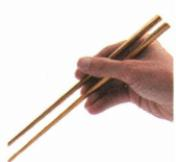
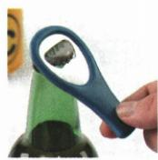
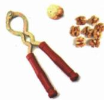
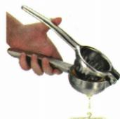

## 讲解

### 是什么

动力臂大于阻力臂时动力小于阻力，是省力杠杆；动力臂小于阻力臂是费力杠杆；相等则等臂。分类按当前实际力臂，不只按工具名称。

### 怎么来的

从平衡式$F_1=F_2l_2/l_1$可见，较长动力臂使动力减小。同一转角下远离支点的点移动更远，所以省力通常费距离，费力通常省距离。简单机械在理想情况下也不省功。

### 什么时候能用

日常开瓶器、钳等应先识别支点和受力部位；剪刀切不同物体或改变手位置，使用方式可能不同。费力杠杆并非无用，筷子等可换得较快、较大的端部移动。

## 例题

### 赛艇桨与四种工具的杠杆分类

> 来源ID Q11-04；第十一章简单机械；101-150/full.md 第1727–1747行。原答案与解析定位：101-150/full.md 第1719–1721行。

例1 (2024 山东临沂中考)2023 年 9 月 24 日,中国组合邹佳琪/邱秀萍在赛艇女子轻量级双人双桨决赛中夺冠,斩获杭州亚运会首金。如图所示,赛艇的桨可视为杠杆,下列工具正常使用时,与桨属于同类杠杆的是()

  
A.筷子

  
B.瓶起子

  
C.核桃夹

  
D.榨汁器

**原资料答案与解析：**

例1 解析 赛艇的桨在使用过程中是费力杠杆。筷子是费力杠杆，A符合题意；瓶起子是省力杠杆，B不符合题意；核桃夹是省力杠杆，C不符合题意；榨汁器是省力杠杆，D不符合题意。

答案 A

**展开解析（依据原详解补足理由与步骤）：**

正常划桨以桨架为支点，手到支点的动力臂比水阻力的有效阻力臂短，是费力杠杆。A筷子以手握端附近为支点，手施力点在夹物端之前，动力臂短，属于同类。B瓶起子动力端较远，动力臂长，省力；C核桃夹果实阻力点接近支点，手柄长，省力；D榨汁器同样手柄动力臂较长，省力。故A。工具用途帮助定位，最终仍以实际力臂为判据。

## 易错

用途可以帮助猜测分类，但应由力臂验证。
