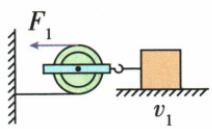
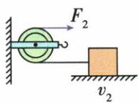
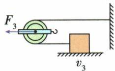

## 讲解

### 判据

拉力作用于绳端还是轮轴决定力的关系；水平物体需要克服摩擦，不能直接套竖直G除n。

### 流程

1. 先研究水平物体，匀速时绳拉力与摩擦力平衡。2. 对动轮单独画力，看两股绳分别向哪里拉。3. 拉绳端时每股是F，拉轮轴时外力要平衡两股张力之和。4. 定轮只传递张力方向。5. 比较力之前确认压力和接触面相同、摩擦模型一致。

## 例题

### 水平滑轮的普通与反向使用

> 来源ID Q11-10；第十一章简单机械；101-150/full.md 第1958–1975行。原答案与解析定位：101-150/full.md 第1977–1979行。

例3 如图甲、乙、丙所示,不计绳重、滑轮重及滑轮与绳之间的摩擦,用三个同样的滑轮分别拉同一物体,使物体沿同一水平面做匀速直线运动,速度分别为 $v_{1}$ 、 $v_{2}$ 、 $v_{3}$ ( $v_{1}<v_{2}<v_{3}$ ),所用的拉力分别为 $F_{1}$ 、 $F_{2}$ 、 $F_{3}$ ,则 $F_{1}$ 、 $F_{2}$ 、 $F_{3}$ 大小关系是()

  
甲

  
乙

  
丙

A. $F_{1}<F_{3}<F_{2}$

B. $F_{1} < F_{2} < F_{3}$

C. $F_{1} < F_{2} = F_{3}$

D.无法判断

**原资料答案与解析：**

解析 用三个同样的滑轮分别拉同一物体,使物体沿同一水平面做匀速直线运动,根据影响滑动摩擦力大小的因素可知,物体受到水平面的摩擦力f大小相等;图甲中滑轮为动滑轮,力 $F_{1}$ 作用在绳端,可省一半的力,根据二力平衡,此时拉力 $F_{1}=\frac{f}{2}$ ;图乙中滑轮为定滑轮,不能省力,根据二力平衡,此时拉力 $F_{2}=f$ ;图丙中滑轮为动滑轮,力 $F_{3}$ 作用在动滑轮的轴上,对滑轮进行受力分析,滑轮受到向左的拉力 $F_{3}$ 、两段绳子向右的拉力2f,由二力平衡可知此时的拉力 $F_{3}=2f$ ,故 $F_{1}<F_{2}<F_{3}$ 。

答案 B

**展开解析（依据原详解补足理由与步骤）：**

同物体同水平面，压力与接触条件相同，按本章滑动摩擦模型f相同，不因速度不同而自动改变。甲绳端拉，两股绳支持运动物体，$2F_1=f$，所以$F_1=f/2$。乙固定轮只改方向，$F_2=f$。丙直接拉轮轴，物体端绳张力等于f，轮上两股同向张力总计2f，故$F_3=2f$。所以$F_1<F_2<F_3$，B对；A把后两项倒置，C误认为轮轴拉法也与固定轮等力，D忽略了题给的理想条件。

## 易错

速度大小不同在本题模型中不改变滑动摩擦，但不能无条件用于真实速度相关阻力。
