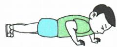
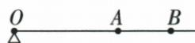
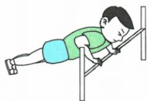
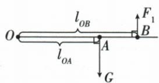
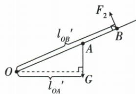
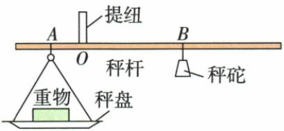

## 讲解

### 判据

俯卧撑或杆秤看似不同，先抽出支点、力和力臂；空载已平衡条件可用于消掉本身的转动作用。

### 流程

1. 找可以绕转的支点。2. 把重力、支持或悬挂力画在实际作用位置。3. 画力臂，垂直施力时才用点到支点距离。4. 两侧转动作用相反，列力乘臂相等求未知。5. 姿态改变后重新画力臂；数量增加时可用新旧两式或增量式。

## 例题

### 两种俯卧撑姿态的杠杆模型

> 来源ID Q11-02；第十一章简单机械；101-150/full.md 第1602–1621行。原答案与解析定位：101-150/full.md 第1623–1659行。

例2 俯卧撑是一项常见的健身项目,采用不同的方式做俯卧撑,健身效果通常不同。图甲所示的是小京在水平地面上做俯卧撑保持静止时的情境,他的身体与地面平行,可抽象成如图乙所示的杠杆模型,地面对脚的力作用在 O 点,对手的力作用在 B 点,小京的重心在 A 点。已知小京重 750 N,OA 长为 1 m, OB 长为 1.5 m。

  
甲

  
乙

丙

(1) 图乙中, 地面对手的力 $F_{1}$ 与身体垂直, 求 $F_{1}$ 的大小。  
(2) 图丙所示的是小京手扶栏杆做俯卧撑保持静止时的情境,此时他的身体姿态与图甲相同,只是身体与水平地面成一定角度,栏杆对手的力 $F_{2}$ 与他的身体垂直,且仍作用在 B 点。分析并说明 $F_{2}$ 与 $F_{1}$ 的大小关系。

**原资料答案与解析：**

解析（1）如图1所示， $O$ 为支点，重力的力臂为 $l_{OA}, F_1$ 的力臂为 $l_{OB}$ ，依据杠杆的平衡条件 $F_1 l_{OB} = G l_{OA}$ ，可得 $F_1 = \frac{G l_{OA}}{l_{OB}} = \frac{750 \mathrm{~N} \times 1 \mathrm{~m}}{1.5 \mathrm{~m}} = 500 \mathrm{~N}$ 。

图 1

图2

(2) 小京手扶栏杆时抽象成的杠杆模型如图 2 所示, O 为支点, 重力的力臂为 $l_{OA}'$ , $F_{2}$ 的力臂为 $l_{OB}'$ , 依据杠杆的平衡条件 $F_{2}l_{OB}' = Gl_{OA}'$ 可得 $F_{2} = \frac{Gl_{OA}'}{l_{OB}'}$ , 由图 1 和图 2 可知 $l_{OA}' < l_{OA}, l_{OB}' = l_{OB}$ , 因此, $F_{2} < F_{1}$ 。

答案 (1)500 N (2) 见解析

**展开解析（依据原详解补足理由与步骤）：**

水平姿态以脚接触处O为支点，手支持力和重力均垂直身体，力臂分别为1.5米和1米。$F_1\times1.5=750\times1$，两边除1.5得$F_1=500\,\mathrm N$。倾斜姿态手力仍与身体垂直，动力臂OB仍1.5米；重力仍竖直，重力臂变为OA的水平投影，比原1米短。因此同样重力的转动效果变小，所需手力也变小，$F_2<F_1$。并未改变OA长度，改变的是它到重力作用线的垂直距离。

### 自制杆秤的称量与增量

> 来源ID Q11-05；第十一章简单机械；101-150/full.md 第1751–1764行。原答案与解析定位：101-150/full.md 第1723–1723行；101-150/full.md 第1810–1812行。

例2（2024 重庆中考）小兰自制了一把杆秤，由秤盘、提纽、秤杆以及 200 g 的秤砣构成，如图所示。当不挂秤砣、秤盘中不放重物时，提起提纽,杆秤在空中恰好能水平平衡。已知 AO 间距离为 10 cm。当放入重物,将秤砣移至距 O 点 30 cm 的 B 处时,秤杆水平平衡,则重物质量为 \_\_\_\_ g;往秤盘中再增加 20 g 的物体,秤砣需要从 B 处移动 \_\_\_\_ cm 才能维持秤杆水平平衡。

**原资料答案与解析：**

例2 解析 由题可知 $m_{\text{物}}gOA=m_{\text{秤砣}}gOB$ ，重物质量 $m_{\text{物}}=\frac{OB}{OA}\times m_{\text{秤砣}}=\frac{30\ cm}{10\ cm}\times200\ g=600\ g$ ; 往秤

盘中再增加 20 g 的物体, 假设秤杆水平平衡时秤砣移到了 C 点, 则有 $m_{\text{物}}'gOA = m_{\text{秤砣}}gOC$ , 则 C 点到支点的距离为 $OC = \frac{m_{\text{物}}'}{m_{\text{秤砣}}} \times OA = \frac{600\ g + 20\ g}{200\ g} \times 10\ cm = 31\ cm$ , 则秤砣需要从 B 处移 1 cm 才能维持秤杆水平平衡。

答案 600 1

**展开解析（依据原详解补足理由与步骤）：**

题设空秤不挂秤砣时已平衡，秤盘与秤杆自重的转动作用已有抵消。加重物和秤砣后，$m_{\text{物}}g\times10=m_{\text{砣}}g\times30$，同除g和10得$m_{\text{物}}=200\times30/10=600\,\mathrm g$。增加20克后新质量620克，$620\times10=200\times OC$，所以$OC=31\,\mathrm{cm}$；从原B的30厘米向远离O方向移动1厘米。增量也可用$20\times10=200\times\Delta l$直接求1厘米，必须说明方向。

## 易错

重力作用线始终竖直，不随身体倾斜；空秤未调平时不能自动忽略自重。
