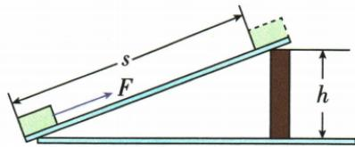

## 讲解

### 判据

斜面上匀速拉动，h给提升的有用功，s给拉力总功。两者之差在只有摩擦耗散时给摩擦功。

### 流程

1. 有用功Gh、总功Fs，分清竖直高和坡长。2. 总减有用得到额外。3. 额外全为摩擦功时，用$f=(Fs-Gh)/s$。4. 总功除过程时间给拉力功率，有用除总功给效率。5. 对各选项逐项检查是否混淆总、有用、额外。

## 例题

### 斜面上的功功率摩擦力与效率

> 来源ID Q11-13；第十一章简单机械；101-150/full.md 第2141–2159行。原答案与解析定位：101-150/full.md 第2161–2163行。

例 如图所示,固定的斜面长 $s=2$ m,高 $h=0.5$ m,沿斜面向上用 50 N 的拉力在 4 s 内把一个重 60 N 的物体从斜面底端匀速拉到顶端,这一过程中 ( )

A. 对物体做的有用功为 $120 \mathrm{~J}$

B.物体受的摩擦力为 $50\mathrm{N}$

C.拉力做功的功率为 $25\mathrm{W}$

D.斜面的机械效率为 $70\%$

**原资料答案与解析：**

解析 对物体做的有用功 $W_{\text{有用}} = Gh = 60 \, \text{N} \times 0.5 \, \text{m} = 30 \, \text{J}$ ，故 A 错误；拉力做的总功 $W_{\text{总}} = Fs = 50 \, \text{N} \times 2 \, \text{m} = 100 \, \text{J}$ ，克服摩擦力做功 $W_{\text{额外}} = W_{\text{总}} - W_{\text{有用}} = 100 \, \text{J} - 30 \, \text{J} = 70 \, \text{J}$ ，由 $W_{\text{额外}} = fs$ 得物体受到的摩擦力 $f = \frac{W_{\text{额外}}}{s} = \frac{70 \, \text{J}}{2 \, \text{m}} = 35 \, \text{N}$ ，故 B 错误；拉力做功的功率 $P = \frac{W_{\text{总}}}{t} = \frac{100 \, \text{J}}{4 \, \text{s}} = 25 \, \text{W}$ ，故 C 正确；斜面的机械效率 $\eta = \frac{W_{\text{有用}}}{W_{\text{总}}} = \frac{30 \, \text{J}}{100 \, \text{J}} = 30\%$ ，故 D 错误。

答案 C

**展开解析（依据原详解补足理由与步骤）：**

提升重物的有用功用竖直高度：$W_{\text{有用}}=60\times0.5=30\,\mathrm J$，A的120 J错。总功沿斜面$W_{\text{总}}=50\times2=100\,\mathrm J$；额外功$100-30=70\,\mathrm J$，若全部为摩擦功，$f=70/2=35\,\mathrm N$，B的50 N错。$P=100/4=25\,\mathrm W$，C对。效率$30/100=30\%$，D把额外功占比70%误作有用功占比。斜面上即使匀速，拉力还要克服重力的沿斜面作用，不等于摩擦力。

## 易错

斜面匀速拉力不等于摩擦力，重力在沿坡方向也有作用。
