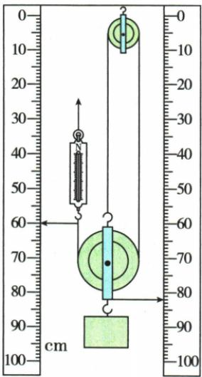

## 讲解

### 判据

表中G、h与F、s要来自同一次实验。比较因素时只取其余条件相同的组；同h与s比例可省掉长度，但不可省掉条件。

### 流程

1. 匀速竖直拉，移动中读F。2. 同时读钩码和绳端起止位置，作差得到h、s。3. 算Gh、Fs及比值；计功时长度统一米。4. 比物重用同装置同h的组，比高度用同G同F的组。5. 提高效率从减动轮重、减摩擦或在安全载重内增负载考虑；增加速度不直接提高比值。

## 例题

### 测量滑轮组效率的四次实验

> 来源ID Q11-16；第十一章简单机械；101-150/full.md 第2236–2277行。原答案与解析定位：101-150/full.md 第2281–2293行。

例3（2023 湖南湘潭中考）用如图所示装置测量滑轮组的机械效率，部分实验数据如表。

| 实验次数 | 钩码重力 $\frac{G}{N}$ | 钩码上升高度 $\frac{h}{cm}$ | 拉力 $\frac{F}{N}$ | 绳子自由端移动距离 $\frac{s}{cm}$ | 机械效率 η |
| --- | --- | --- | --- | --- | --- |
| 1 | 2.0 | 5 | 1.0 | 15 | 66.7% |
| 2 | 4.0 | 5 | 1.8 | 15 | 74.1% |
| 3 | 4.0 | 10 | 1.8 | 30 | 74.1% |
| 4 | 6.0 | 5 | 2.5 | 15 |  |

(1)实验过程中,缓慢竖直拉动弹簧测力计,使钩码向上做\_\_\_\_运动。第1次实验时,钩码上升的时间为3 s,此过程中,绳子自由端上升的速度为\_\_\_\_m/s。  
(2)第4次实验时所做的有用功为\_\_\_\_J,滑轮组的机械效率是\_\_\_\_%。  
(3)分析1、2、4次实验的数据可知,使用同一滑轮组提升重物时,重物重力越\_\_\_\_(选填“大”或“小”),滑轮组的机械效率越高;分析2、3次实验的数据可知,滑轮组的机械效率与钩码上升的高度\_\_\_\_(选填“有关”或“无关”)。  
(4)用滑轮组提升重物时,下列选项中也可提高机械效率的是\_\_\_\_。

A. 换用更轻的动滑轮

B.加快提升物体的速度

**原资料答案与解析：**

例3 解析（1）实验过程中，应使钩码做匀速直线运动；绳子自由端上升的速度 $v=\frac{s}{t}=\frac{15\ cm}{3\ s}=\frac{0.15\ m}{3\ s}=0.05\ m/s$ 。

(2) 第 4 次实验时所做的有用功 $W_{\text{有用}}=Gh=6.0\ N\times0.05\ m=0.3\ J;$ 总功 $W_{\text{总}} = Fs = 2.5 \, N \times 0.15 \, m = 0.375 \, J,$

滑轮组的机械效率 $\eta=\frac{W_{\text{有用}}}{W_{\text{总}}}=$ $\frac{0.3\ J}{0.375\ J}=80\%$ .

(4) 换用更轻的动滑轮, 所做的额外功更少, 机械效率更高, A 符合题意; 加快提升物体的速度, 机械效率不变, B 不符合题意。

答案（1）匀速直线 0.05

(2)0.3 80   
(3) 大 无关  
(4) A

**展开解析（依据原详解补足理由与步骤）：**

匀速直线提升才能稳定读移动时拉力。首次绳端走15厘米而非钩码的5厘米，速度$0.15/3=0.05\,\mathrm{m/s}$。第4次有用功$6.0\times0.05=0.30\,\mathrm J$，总功$2.5\times0.15=0.375\,\mathrm J$，效率$0.30/0.375=80\%$。1、2、4次同高度改变物重，物重从2到4到6 N，效率依次66.7%、74.1%、80%，支持物重越大效率越高。2、3次同物重拉力，h和s同时加倍，效率相同，支持本实验范围内与高度无关。A换轻动轮可减额外功，正确；B加快速度本身不改变本模型有用功与总功比例，不是提高效率的方法。

## 易错

静止读数不能必然代表移动时拉力；所谓偏大偏小需要具体摩擦与加速度条件。
