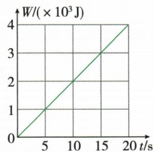

## 讲解

### 判据

先问提升谁或克服什么阻力，再给对应有用功；总输入取拉力和拉力端路程，不先猜额外功来自哪里。

### 流程

1. 按目标求有用功，提升物体用Gh。2. 从实际拉力路程求Fs，或由功时间图读总功。3. 相减求额外功。4. 有用除总功求效率。5. 需要动轮重且题设没有其他耗散时，额外功除提升高度；满载重新计算物重和比例。

## 例题

### 建筑材料滑轮组的动轮重与效率

> 来源ID Q11-12；第十一章简单机械；101-150/full.md 第1993–1995行。原答案与解析定位：101-150/full.md 第2003–2005行。

例2（2024 山东菏泽中考节选）用如图所示的滑轮组将重 540 N 的建筑材料从地面拉到四楼，建筑材料上升 10 m，绳端拉力为 200 N（不计绳重和滑轮与绳之间的摩擦）。则动滑轮重 \_\_\_\_ N，此过程该滑轮组的机械效率为 \_\_\_\_。

**原资料答案与解析：**

例2 解析 由图可知 $n=3$，不计绳重和摩擦时 $F=\frac{1}{n}(G+G_{\text{动}})$ ，所以动滑轮的重力 $G_{\text{动}}=nF-G=3\times200\ N-540\ N=60\ N$ ；滑轮组的机械效率 $\eta=\frac{W_{\text{有用}}}{W_{\text{总}}}=\frac{Gh}{Fs}=\frac{Gh}{Fnh}=\frac{G}{nF}=\frac{540\ N}{3\times200\ N}=90\%$ 。

答案 60 90%

**展开解析（依据原详解补足理由与步骤）：**

原图承重3股。匀速且不计绳重摩擦，$3F=G+G_{\text{动}}$，所以$G_{\text{动}}=3\times200-540=60\,\mathrm N$。有用功$Gh=540\times10=5400\,\mathrm J$，自由端路程$3\times10=30\,\mathrm m$，总功$Fs=200\times30=6000\,\mathrm J$，效率$5400/6000=90\%$。剩余600 J用于提升动轮，而不是必然全部摩擦损失。

### 功时间图像求滑轮组机械效率

> 来源ID Q11-14；第十一章简单机械；101-150/full.md 第2193–2215行。原答案与解析定位：101-150/full.md 第2183–2185行。

例1（2024 北京中考）(多选)用某滑轮组提升重物时,绳子自由端拉力做功随时间变化的关系如图所示,在 20 s 内绳子自由端竖直匀速移动 16 m,重物竖直匀速上升 4 m。已知动滑轮总重 100 N,提升的物体重 800 N。关于该过程,下列说法正确的是()

A. 绳子自由端拉力的功率为 $200 \mathrm{~W}$

B.额外功为 $400\mathrm{J}$

C.绳子自由端拉力的大小为 $250\mathrm{N}$

D. 滑轮组的机械效率约为 88.9%

**原资料答案与解析：**

例1 解析 绳子自由端拉力的功率 $P=\frac{W_{\text{总}}}{t}=\frac{4\times10^{3}J}{20s}=200W$ 。在 20 s 内，有用功 $W_{\text{有用}}=G_{\text{物}}h=800N\times4m=3200J$ ；由图可知，绳子自由端拉力做的总功 $W_{\text{总}}=4\times10^{3}J=4000J$ ，则额外功 $W_{\text{额外}}=W_{\text{总}}-W_{\text{有用}}=4000J-3200J=800J$ 。由 $W_{\text{总}}=Fs$ 可知，绳子自由端的拉力 $F=\frac{W_{\text{总}}}{s}=\frac{4\times10^{3}J}{16m}=250N$ 。滑轮组的机械效率 $\eta=\frac{W_{\text{有用}}}{W_{\text{总}}}=\frac{3200J}{4000J}=80\%$ 。

答案 AC

**展开解析（依据原详解补足理由与步骤）：**

20秒图读总功4000 J，功率$4000/20=200\,\mathrm W$，A对。有用功$800\times4=3200\,\mathrm J$，额外功$4000-3200=800\,\mathrm J$，B的400 J只算动轮提升功，漏其他耗散。拉力$F=W_{\text{总}}/s=4000/16=250\,\mathrm N$，C对。效率$3200/4000=80\%$，D约88.9%来自误用忽略摩擦时的$800/(800+100)$；本题给的总功显示额外功不只动轮提升400 J。正确选AC。

### 起重机满载效率与动轮重

> 来源ID Q11-15；第十一章简单机械；101-150/full.md 第2217–2233行。原答案与解析定位：101-150/full.md 第2187–2189行；101-150/full.md 第2279–2279行。

例2（2024江苏苏州中考）某起重机的滑轮组结构示意如图所示，其最大载重为5t。起重机将3600kg的钢板匀速提升到10m高的桥墩上，滑轮组的机械效率为80%。不计钢丝绳的重力和摩擦，g取$10\,\mathrm{N/kg}$。求：

(1)克服钢板重力做的功 $W_{\text{有用}}$ ;

(2)钢丝绳的拉力 F;

(3)滑轮组满载时的机械效率(保留一位小数)。

**原资料答案与解析：**

例2 解析（1）有用功 $W_{\text{有用}} = Gh = mgh = 3600 \, kg \times 10 \, N/kg \times 10 \, m = 3.6 \times 10^{5} \, J$ 。

(2) 总功 $W_{\text{总}} = \frac{W_{\text{有用}}}{\eta} = \frac{3.6 \times 10^{5} \, J}{80\%} =$ $4.5 \times 10^{5} \, J$ ，拉力 $F = \frac{W_{\text{总}}}{s} = \frac{W_{\text{总}}}{4h} =$ $\frac{4.5\times10^{5}\mathrm{J}}{4\times10\mathrm{m}}=1.125\times10^{4}\mathrm{N}$ 。

(3) 额外功 $W_{\text{额外}} = W_{\text{总}} - W_{\text{有用}} = 4.5 \times 10^{5} \mathrm{~J} - 3.6 \times 10^{5} \mathrm{~J} = 9 \times 10^{4} \mathrm{~J}$ ; 动滑轮重 $G_{\text{动}} = \frac{W_{\text{额外}}}{h} = \frac{9 \times 10^{4} \mathrm{~J}}{10 \mathrm{~m}} = 9 \times 10^{3} \mathrm{~N}$ ; 满载时机械效率 $\eta_{\text{最大}} = \frac{W'_{\text{有用}}}{W'_{\text{有用}} + W'_{\text{额外}}} = \frac{G'}{G' + G_{\text{动}}} = \frac{5 \times 10^{4} \mathrm{~N}}{5 \times 10^{4} \mathrm{~N} + 9 \times 10^{3} \mathrm{~N}} \approx 84.7 \%$ 。

**展开解析（依据原详解补足理由与步骤）：**

钢板重$3600\times10=36000\,\mathrm N$，有用功$36000\times10=360000\,\mathrm J$。80%效率意味着总功$360000/0.80=450000\,\mathrm J$。原图4股承重，自由端40米，拉力$450000/40=11250\,\mathrm N$。不计绳重摩擦，额外功只用于提升动轮：$450000-360000=90000\,\mathrm J$，动轮重$90000/10=9000\,\mathrm N$。满载5吨为5000千克，重50000 N，效率$50000/(50000+9000)\approx84.7\%$。不能把原80%视为机械永久不变的常数。

## 易错

题中有实际总功时不忽略额外摩擦；满载效率不能直接沿用较小负载的值。
