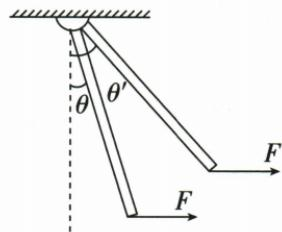
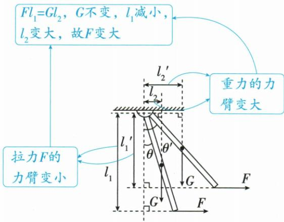

## 讲解

### 判据

力大小或施力点不变而杠杆角度变化时，分别画多个位置真实力臂，用$F=Gl_G/l_F$检查分子与分母趋势。

### 流程

1. 标出不变量如重力和杆长。2. 保持力方向的真实约束，重新画垂直力臂。3. 比较阻力乘阻力臂与动力臂的变化。4. 两者若相反变化可明确趋势，若同时变化不能只凭一项下结论；必要时用图示几何继续判断。

## 例题

### 水平拉硬棒时的动态力臂

> 来源ID Q11-03；第十一章简单机械；101-150/full.md 第1669–1674；1678–1687行。原答案与解析定位：101-150/full.md 第1689–1708行。

例3 如图所示,在水平力 F 的作用下,硬棒沿逆时针方向匀速转动,在棒与竖直方向的夹角由 $\theta$ 增大到 $\theta'$ 的过程中 ()

A. 拉力 F 变小, F 的力臂变小  
B. 拉力 F 变大, F 的力臂变大  
C. 重力 G 不变, G 的力臂变大  
D. 重力 G 不变, G 的力臂变小

**原资料答案与解析：**

# 答案 C

**展开解析（依据原详解补足理由与步骤）：**

角度在图示锐角范围内增大，棒质心重力不变，支点到重力作用线的水平距离增大，故C对、D错。水平拉力的力臂是支点到该水平作用线的竖直距离，逐渐减小；由$Fl_F=Gl_G$，分子$Gl_G$变大、分母$l_F$变小，F变大。A说F变小错误；B虽说F变大，但力臂变大错误。不能按棒长未变就说力臂未变。

## 易错

杆长不变不能推出力臂不变；只看一个力臂变化容易误判。
