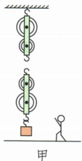
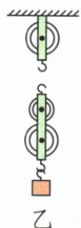
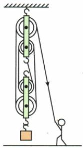
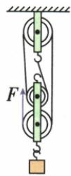

## 讲解

### 判据

先查有没有限定自由端拉力方向；站地面向下拉优先保证方向，再选择可实现的最多承重股。

### 流程

1. 识别固定轮与动轮。2. 指定方向时从自由端倒推各轮，轮槽不能重复穿绳。3. 无方向限制时可按实际组数选择固定头，尽量多形成承重股。4. 画完重新隔离动轮数n，核查绳头、自由端、交叉与方向。5. 奇动偶定只作为常见竖直组合的辅助，不替代图形核对。

## 例题

### 指定向下拉与不限方向的最省力绕绳

> 来源ID Q11-09；第十一章简单机械；101-150/full.md 第1922–1934行。原答案与解析定位：101-150/full.md 第1936–1950行。

例2 (1) 在图甲中, 用笔画线代替绳子, 画出站在地面上的人将物体提起时, 滑轮组最省力的绳子绕法。

(2) 在图乙中画出提升重物时最省力的绕绳方法。

**原资料答案与解析：**

解析（1）人站在地上拉绳，限定绳端拉力方向，采用“倒绕法”，如答案图所示。（2）图乙中定滑轮和动滑轮个数不同，则最省力的绕绳方法是从数量少的定滑轮挂钩端开始绕，如答案图所示。

答案 (1) 如图所示

(2)如图所示

**展开解析（依据原详解补足理由与步骤）：**

甲人站地面，要求自由端向下拉。沿答案从定滑轮端固定后在两动两定轮之间交替绕，最后由定轮下引，人可以向下拉，承重4股；不能为了增加一股而让自由端向上、违背题意。乙一只定轮两只动轮、不限制方向，固定端接定轮挂钩，交替绕动轮与定轮，再把自由端从下方动轮向上引，形成4股承重。每个轮槽一股绳，检查有无绳交叉和空绕。两个题的具体图比口诀优先。

## 易错

不能为了“最省力”画出与人施力方向矛盾的自由端。
