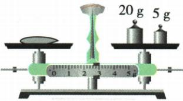

## 讲解

### 是什么

托盘天平通过两侧平衡比较质量。称前游码归零，平衡螺母调平；称量左物右码，平衡时物质量等于砝码和游码示值之和，游码读左侧。

### 怎么来的

空盘调平把仪器自身不平衡修正为基准。加物后通过砝码和游码恢复平衡是在比较物质量；若再动螺母就改了基准，所以两阶段工具不能混用。指针偏左，称前螺母向右；称量时右侧应加码或游码右移。

### 什么时候能用

水平桌面、量程以内，砝码用镊子由大到小试加，移动天平后重调。液体需容器承载并用质量差求净质量，不能直接倒盘内。游码读左边并看标尺分度值，读数带g。

## 例题

### 称量途中指针偏左

> 来源ID Q05-02；第五章质量与密度；51-100/full.md 第941–946行。原答案与解析定位：51-100/full.md 第946–946行；51-100/full.md 第980–982行。

小明在用已经调节好的天平测物体质量过程中，增、减砝码后，发现指针指在分度盘中央刻度线左边一点，这时他应该（）

A. 将游码向右移动直至横梁重新水平平衡   
B. 将右端平衡螺母向左旋进一些  
C. 把天平右盘的砝码减少一些  
D. 将右端平衡螺母向右旋出一些

**原资料答案与解析：**

解析 测量过程中，只能通过加、减砝码和移动游码使横梁恢复水平平衡。平衡, 故 B、D 错误; 指针偏向分度盘左侧, 可通过向右移动游码或者向右盘增加砝码使横梁恢复水平平衡, 故 A 正确, C 错误。

答案A

**展开解析（依据原详解补足理由与步骤）：**

天平已调好，处于称量阶段，不能再调平衡螺母。指针偏左说明左物一侧较重，需要右盘增砝码或把游码向右移。题说增减砝码后只偏左一点，A右移游码正确；B、D再动平衡螺母均错；C减砝码使右盘更轻，偏差增大。选A。原OCR把解析开头接在D后面，正文按两部分分开，原逐字证据保留。

### 天平调节与152g读数

> 来源ID Q05-06；第五章质量与密度；51-100/full.md 第1067–1069行。原答案与解析定位：51-100/full.md 第1048–1050行。

例2 (2024 重庆中考) 小明将天平放在水平桌面上测量一物体的质量。在游码调零后, 发现指针偏左, 应将平衡螺母向\_\_\_\_移动, 使横梁水平平衡。放上物体, 通过加减砝码及移动游码, 使横梁再次水平平衡时, 天平如图所示, 则物体的质量为\_\_\_\_g。

**原资料答案与解析：**

例2 解析 指针偏向分度盘的左侧,要使横梁在水平位置平衡,应将平衡螺母往右调;标尺上的分度值是 0.2 g, 物体的质量为 $100 \, g + 50 \, g + 2 \, g = 152 \, g$ 。

答案 右 152

**展开解析（依据原详解补足理由与步骤）：**

调零阶段游码先归零，指针偏左时平衡螺母向右调。测量平衡后，原图砝码100g与50g，游码左侧对2g，每小格0.2g。物质量=$100+50+2=152\,\mathrm{g}$。第一空右，第二空152；两次平衡分别用螺母调零、用砝码和游码称量，不混用。

### 原附录天平读数示例

> 来源ID Q23-04；附录1常考测量仪器；201-233/full.md 第2047–2055行。原答案与解析定位：201-233/full.md 第2047–2055行。

| 仪器 | 读数步骤 | 注意事项 |
| --- | --- | --- |
| 天平 | 确定标尺分度值→确定砝码的质量→确定游码所对刻度值→相加
①确定标尺分度值:0.2 g
②确定砝码的质量:20 g+5 $g=25$ g
③确定游码所对刻度值:2 g+0.2 $g\times 3=2.6$ g
④物体的质量:25 g+2.6 $g=27.6$ g | ①天平放水平,游码归零
②测量前调节平衡螺母使横梁在水平位置平衡:“左偏右调,右偏左调”
③测量过程中不能调节平衡螺母
④测量时“左物右码”
⑤标尺读数时应读游码左侧对应的刻度值 |

**原资料答案与解析：**

原表给出的读数、步骤与注意事项见上表；未另给独立问答题。

**展开解析（依据原详解补足理由与步骤）：**

原图“左物右码”、横梁平衡。标尺每1 g分5格，分度值0.2 g；游码左边缘到2.6 g，计算$2+3\times0.2=2.6\,\mathrm g$。右盘砝码$20+5=25\,\mathrm g$，物体质量$m=25+2.6=27.6\,\mathrm g$。测量时调的是砝码和游码，不能移动平衡螺母来凑平衡；游码看左侧，不看尖端中央或右边缘。

## 易错

- 称量中调螺母：破坏原空盘基准。
- 游码读右侧：原标尺按左侧刻度。
