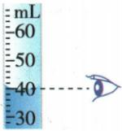

## 讲解

### 是什么

量筒测液体体积，常以mL标度。$1\,\mathrm{mL}=1\,\mathrm{cm^{3}}=10^{-6}\,\mathrm{m^{3}}$，$1\,\mathrm{L}=1000\,\mathrm{mL}$。水平放置看量程分度，凹液面读最低处、凸液面读最高处，视线相平。

### 怎么来的

液面高度对刻度给液体体积；固体完全浸没排开的液体体积等于固体被浸没体积，所以排液前后差可测不规则固体。不完全浸没只能得浸入部分体积。

### 什么时候能用

固体须不溶、不吸液且无气泡，完全浸没不溢液；空心球排液外体积还须液体不进内腔。浮起物需辅助压入或沉锤且两次辅助物排液相同。原章无单独量筒视线选择题，使用匹配的钢球排液例题而不编读数题。

## 例题

### 空心钢球及注煤油质量

> 来源ID Q05-16；第五章质量与密度；51-100/full.md 第1475–1479行。原答案与解析定位：51-100/full.md 第1481–1485行。

例2 将一钢球放入盛有 100 mL 水的量筒中, 水面上升到 160 mL 处, 又用天平称出该球质量为 237 g。 （$\rho_{\text{钢}}=7.9\times10^3\,\mathrm{kg/m^3}$，$\rho_{\text{煤油}}=0.8\times10^3\,\mathrm{kg/m^3}$）

(1)求钢球是空心的还是实心的?

(2)若为空心的,在空心部分注满煤油,那么钢球的总质量为多少?

**原资料答案与解析：**

解析（1）假设钢球是实心的，则钢球的体积 $V_{\text{钢}}=\frac{m_{\text{球}}}{\rho_{\text{钢}}}=\frac{237\ g}{7.9\ g/cm^{3}}=30\ cm^{3}$ ，因为 $V_{\text{球}}=60\ cm^{3}$ ， $V_{\text{钢}}<V_{\text{球}}$ ，所以钢球是空心的。

(2) 空心部分的体积 $V_{\text{空}} = V_{\text{球}} - V_{\text{钢}} = 60 \, cm^{3} - 30 \, cm^{3} = 30 \, cm^{3}$ ，空心部分注满煤油时，煤油的质量 $m_{\text{煤油}} = \rho_{\text{煤油}} \times V_{\text{空}} = 0.8 \, g/cm^{3} \times 30 \, cm^{3} = 24 \, g$ ，钢球的总质量 $m = m_{\text{煤油}} + m_{\text{球}} = 24 \, g + 237 \, g = 261 \, g$ 。

答案 (1) 钢球是空心的 (2) 261 g

**展开解析（依据原详解补足理由与步骤）：**

(1) 水量100mL升至160mL，完全浸没且水不进内腔，钢球外体积$160-100=60\,\mathrm{cm^{3}}$。钢密度$7.9\,\mathrm{g/cm^{3}}$，237g钢材料体积$\frac{237}{7.9}=30\,\mathrm{cm^{3}}$，小于外体积60cm³，故空心。
(2) 空腔体积$60-30=30\,\mathrm{cm^{3}}$。煤油密度$0.8\,\mathrm{g/cm^{3}}$，装满内腔的煤油质量$0.8\times 30=24\,\mathrm{g}$；总质量$237+24=261\,\mathrm{g}$。不要把整个60cm³当煤油体积。
原式煤油下标断裂，规范正文按同一题给$0.8\times 10^{3}\,\mathrm{kg/m^{3}}$恢复，原证据保留；未擅改数值。

### 原附录量筒读数示例

> 来源ID Q23-05；附录1常考测量仪器；201-233/full.md 第2055–2055行。原答案与解析定位：201-233/full.md 第2055–2055行。

| 仪器 | 读数步骤 | 注意事项 |
| --- | --- | --- |
| 量筒 | 确定分度值→确定示数1确定分度值:2mL2确定量筒的示数:40mL | 1量筒要平稳地放置在水平桌面上2读数时,视线要与量筒中液柱的凸液面顶部或凹液面底部相平 |

**原资料答案与解析：**

原表给出的读数、步骤与注意事项见上表；未另给独立问答题。

**展开解析（依据原详解补足理由与步骤）：**

原图30至40 mL有5等格，分度值2 mL。液面下凹，读最低处，视线与最低处同高得到40 mL。不能读两边较高液面或向下俯视；此图是液体总体积，若用排液测固体必须有前后两个体积再相减，不能把40 mL直接当固体体积。

## 易错

- 用后总示数作固体V：应相减。
- 俯视读数正确：按液面相平，避免视差。
