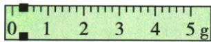
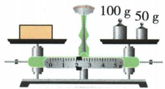

## 讲解

### 判据

先分调零或称量；读数前核左物右码与初游码零位，特殊读数从两侧平衡关系修正。

### 流程

1. 调零阶段游码归零，偏左螺母右调、偏右左调。
2. 称量阶段仅砝码与游码调平；左侧重需增加右侧作用。
3. 左物右码标准m物=m砝+m游；记录分度、左侧刻度和单位。
4. 初游码未归零却已调平，实际质量$m=\text{标准读数}-\text{初游码示值}$，因为初作用已被空盘平衡抵消。
5. 若右物左码，平衡给m砝=m物+m游，故m物=m砝−m游；本章无此独立例题，条件依据原讲解登记。
6. 正常操作仍用规范归零及左物右码，不把修正式当推荐操作。

## 例题

### 称量途中指针偏左

> 来源ID Q05-02；第五章质量与密度；51-100/full.md 第941–946行。原答案与解析定位：51-100/full.md 第946–946行；51-100/full.md 第980–982行。

小明在用已经调节好的天平测物体质量过程中，增、减砝码后，发现指针指在分度盘中央刻度线左边一点，这时他应该（）

A. 将游码向右移动直至横梁重新水平平衡   
B. 将右端平衡螺母向左旋进一些  
C. 把天平右盘的砝码减少一些  
D. 将右端平衡螺母向右旋出一些

**原资料答案与解析：**

解析 测量过程中，只能通过加、减砝码和移动游码使横梁恢复水平平衡。平衡, 故 B、D 错误; 指针偏向分度盘左侧, 可通过向右移动游码或者向右盘增加砝码使横梁恢复水平平衡, 故 A 正确, C 错误。

答案A

**展开解析（依据原详解补足理由与步骤）：**

天平已调好，处于称量阶段，不能再调平衡螺母。指针偏左说明左物一侧较重，需要右盘增砝码或把游码向右移。题说增减砝码后只偏左一点，A右移游码正确；B、D再动平衡螺母均错；C减砝码使右盘更轻，偏差增大。选A。原OCR把解析开头接在D后面，正文按两部分分开，原逐字证据保留。

### 游码未归零的修正

> 来源ID Q05-04；第五章质量与密度；51-100/full.md 第1012–1022行。原答案与解析定位：51-100/full.md 第1024–1026行。

例2 小明在做用托盘天平测物体质量的实验时,首先调节天平的平衡螺母使横梁水平平衡,但是他没有注意到游码处于如图所示位置。他测得的物体质量为 52.4 g,则该物体的实际质量是 ( )

A.52.4 g

B.52.2 g

C.52.6 g

D. 必须重新测量

**原资料答案与解析：**

解析 测量前调节天平横梁在水平位置平衡时,忘记将游码归零,由图可知,游码初始位置为 0.2 g,所以该物体的实际质量 $m=52.4\ g-0.2\ g=52.2\ g$ 。

答案 B

**展开解析（依据原详解补足理由与步骤）：**

原图每小格0.2g，游码左侧初始为0.2g。该位置已参与空盘调平，后来标准读数52.4g包含这一初始基准，实际质量=$52.4-0.2=52.2\,\mathrm{g}$，选B。A未扣初值；C把应扣量相加；D称必须重测过于绝对，已知初值且原题天平可正常平衡，能修正。日常测量仍应正确归零。

### 天平调节与152g读数

> 来源ID Q05-06；第五章质量与密度；51-100/full.md 第1067–1069行。原答案与解析定位：51-100/full.md 第1048–1050行。

例2 (2024 重庆中考) 小明将天平放在水平桌面上测量一物体的质量。在游码调零后, 发现指针偏左, 应将平衡螺母向\_\_\_\_移动, 使横梁水平平衡。放上物体, 通过加减砝码及移动游码, 使横梁再次水平平衡时, 天平如图所示, 则物体的质量为\_\_\_\_g。

**原资料答案与解析：**

例2 解析 指针偏向分度盘的左侧,要使横梁在水平位置平衡,应将平衡螺母往右调;标尺上的分度值是 0.2 g, 物体的质量为 $100 \, g + 50 \, g + 2 \, g = 152 \, g$ 。

答案 右 152

**展开解析（依据原详解补足理由与步骤）：**

调零阶段游码先归零，指针偏左时平衡螺母向右调。测量平衡后，原图砝码100g与50g，游码左侧对2g，每小格0.2g。物质量=$100+50+2=152\,\mathrm{g}$。第一空右，第二空152；两次平衡分别用螺母调零、用砝码和游码称量，不混用。

## 易错

- 初偏移再加一次：实际应减已参与调平的初示值。
- 称量动螺母：调零与称量区别不能省。
