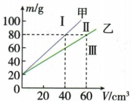

## 讲解

### 判据

m-V直线不过原点先问纵轴是否含容器，斜率可给密度但单点$\frac{m}{V}$未必可用。

### 流程

1. 读轴名称单位及$V=0$纵截距。
2. 若m为总质量，写$m_{\text{总}}=m_{\text{容}}+\rho V$；截距是m容。
3. 两点法$\rho =\frac{(m_{2}-m_{1})}{(V_{2}-V_{1})}$，相同容器质量相减抵消。
4. 或单点先减m容再除V，不能用总质量直接除。
5. 同图同轴尺度下，直线越陡密度越大；若横纵轴互换需重新用质量/体积，不机械看陡。
6. 对新密度直线从同一容器截距起，按斜率大小判区域。

## 例题

### 总质量体积图中的容器截距

> 来源ID Q05-07；第五章质量与密度；51-100/full.md 第1161–1168行。原答案与解析定位：51-100/full.md 第1180–1182行。

例1 (2024 四川南充中考) 小洋研究液体密度时, 用两个完全相同的容器分别装入甲、乙两种液体, 并绘制出总质量 m 与液体体积 V 的关系如图所示, 由图像可知 ( )

A. 容器的质量 20 kg  
B. 甲液体密度是 $2.0 \mathrm{~g} / \mathrm{cm}^{3}$   
C.乙液体密度是 $1.2\mathrm{g / cm^3}$   
D. 密度为 $0.8 \mathrm{~g} / \mathrm{cm}^{3}$ 的液体的 $m - V$ 图像应位于Ⅲ区域

**原资料答案与解析：**

解析 由图可知, 当 $V=0$ 时, 容器的质量 $m_{\text{容}}=20\ g$ , 故 A 错误; 当 $m_{\text{甲}}=m_{\text{乙}}=80\ g-20\ g=60\ g$ 时, $V_{\text{甲}}=40\ cm^{3}$ , $V_{\text{乙}}=60\ cm^{3}$ , 由 $\rho=\frac{m}{V}$ 可得, $\rho_{\text{甲}}=\frac{m_{\text{甲}}}{V_{\text{甲}}}=\frac{60\ g}{40\ cm^{3}}=1.5\ g/cm^{3}$ , $\rho_{\text{乙}}=\frac{m_{\text{乙}}}{V_{\text{乙}}}=\frac{60\ g}{60\ cm^{3}}=1\ g/cm^{3}$ , 故 B、C 错误; 因为 $\rho_{\text{甲}}>\rho_{\text{乙}}>\rho_{\text{液}}$ , 所以该液体的 m-V 图像应该位于Ⅲ区域, 离 m 轴最远, 故 D 正确。

答案 D

**展开解析（依据原详解补足理由与步骤）：**

纵轴$\frac{m}{g}$为液体与容器总质量，$V=0$处20g才是容器质量，A写20kg错。总质量80g时，两液实际质量均$80-20=60\,\mathrm{g}$；甲体积40cm³，密度$\frac{60}{40}=1.5\,\mathrm{g/cm^{3}}$，B写2.0错；乙体积60cm³，密度$\frac{60}{60}=1.0\,\mathrm{g/cm^{3}}$，C写1.2错。
$0.8\,\mathrm{g/cm^{3}}$比甲乙小，在相同总质量对应更大体积，其直线由同一20g截距出发，比乙更平缓，位于Ⅲ区，D对。选D。不能拿总质量80直接除液体体积。

## 易错

- 非原点线用m总/V：漏容器截距。
- 图像陡都代表ρ大：要看轴和比例。
