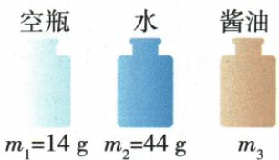
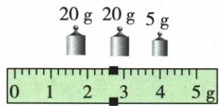
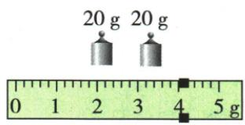
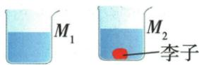

## 讲解

### 判据

烧杯倒液称前后质量、量筒测倒出体积，先确认m与V对应同一份，残留引起哪一量偏差。

### 流程

1. 标准方法称烧杯和液体m₁，倒一部分到量筒读V，再称剩余总m₂。
2. 倒出质量$m=m_{1}-m_{2}$，与量筒内V为同一份，$\rho =\frac{(m_{1}-m_{2})}{V}$。
3. 先称全部液体再倒量筒，杯残留使V偏小而所用m仍全量，ρ偏大。
4. 先在量筒读V再倒杯称质量，量筒残留使m偏小而V仍原量，ρ偏小。
5. 无量筒则同瓶同满度装水与液体，水质量求容积，再求液ρ。
6. 标记法回补到同液面时看最终净体积，不能把任何带液都机械判误差。

## 例题

### 无量筒测酱油密度

> 来源ID Q05-12；第五章质量与密度；51-100/full.md 第1317–1348行。原答案与解析定位：51-100/full.md 第1350–1352行。

例 小刚同学想测酱油的密度,但家里只有天平、空瓶,没有量筒。他思考后按照自己设计的实验步骤进行了测量,测量内容及顺序如图甲所示, $\rho_{\text{水}}=1.0\times10^{3}\ kg/m^{3}$ 。

甲

乙

(1)他第三次测得的质量如图乙所示,其结果 $m_{3}=$ \_\_\_\_ g;

(2)由三次测量结果可知,水的质量 $m_{\text{水}}=$ \_\_\_\_ g, 酱油的体积 $V_{\text{酱油}}=$ \_\_\_\_ cm $^{3}$ ;  
(3)根据小刚测量的数据,酱油的密度 $\rho_{\text{酱油}}=$ \_\_\_\_ $\frac{kg}{m}$ $^{3}$ 。

**原资料答案与解析：**

解析（1）由图乙可知， $m_{3}=m_{\text{码}}+m_{\text{游示}}=45\ g+2.6\ g=47.6\ g$ 。(2)水的质量 $m_{\text{水}}=m_{2}-m_{1}=44\ g-14\ g=30\ g$ ；酱油的体积 $V_{\text{酱油}}=V_{\text{瓶}}=V_{\text{水}}=\frac{m_{\text{水}}}{\rho_{\text{水}}}=\frac{30\ g}{1\ g/cm^{3}}=30\ cm^{3}$ 。(3)由图甲可知，酱油的质量 $m_{\text{酱油}}=m_{3}-m_{1}=47.6\ g-14\ g=33.6\ g$ ，则酱油的密度 $\rho_{\text{酱油}}=\frac{m_{\text{酱油}}}{V_{\text{酱油}}}=\frac{33.6\ g}{30\ cm^{3}}=1.12\ g/cm^{3}=1.12\times10^{3}\ kg/m^{3}$ 。

答案 (1)47.6 (2)30 30 (3) $1.12 \times 10^{3}$

**展开解析（依据原详解补足理由与步骤）：**

(1) 原图砝码$20+20+5=45\,\mathrm{g}$，游码左侧2.6g，每小格0.2g，第三次总质量47.6g。
(2) 空瓶14g、满水44g，水质量$44-14=30\,\mathrm{g}$。水密度$1\,\mathrm{g/cm^{3}}$，体积30cm³。同瓶装满酱油，酱油体积也30cm³。
(3) 酱油质量$47.6-14=33.6\,\mathrm{g}$，密度$\frac{33.6}{30}=1.12\,\mathrm{g/cm^{3}}$。按$1\,\mathrm{g/cm^{3}}=10^{3}\,\mathrm{kg/m^{3}}$换成$1.12\times 10^{3}\,\mathrm{kg/m^{3}}$。所有液体质量均须扣空瓶，装满且瓶容积不变才有等体积。

### 李子排液与凉茶等体积测量

> 来源ID Q05-13；第五章质量与密度；51-100/full.md 第1360–1384行。原答案与解析定位：51-100/full.md 第1390–1397行。

例（2024 广东中考）小明摘来李子，用天平、量筒和水测量李子的密度。

(1)调节天平时,应先将游码移至标尺的\_\_\_\_处,然后调节平衡螺母,使天平平衡。   
(2)用天平测量李子的质量,当天平平衡时,右盘中的砝码和标尺上游码的位置如图甲所示,李子的质量为\_\_\_\_g;用量筒和水测得李子的体积为 $40\ cm^{3}$ ,则李子的密度为\_\_\_\_g/cm³。

甲

(3) 完成上述实验后, 在不用量筒的情况下, 小明利用天平、烧杯和该李子测量凉茶的密度, 实验步骤如下:

①在烧杯中加入适量的凉茶,如图乙所示,并在烧杯上标记此时液面的位置 $M_{1}$ , 测得凉茶和烧杯的总质量为 240 g。  
②将李子放入凉茶中,李子沉底,如图丙所示,在烧杯上标记此时液面的位置 $M_{2}$ 。

  
乙 丙

③取出李子,然后向烧杯中加凉茶,使液面上升至位置\_\_\_\_,测得此时凉茶和烧杯的总质量为282 g。根据实验数据,可得凉茶的密度为\_\_\_\_ $\mathrm{g/cm^{3}}$。从烧杯中拿出李子时会带出一些凉茶,这对凉茶密度的测量结果\_\_\_\_(选填“有”或“无”)影响,原因是\_\_\_\_。

**原资料答案与解析：**

例 解析（2）李子的质量等于砝码的质量加上游码所对应的刻度值，即 $m=40\ g+4\ g=44\ g$ ; 李子的密度 $\rho=\frac{m}{V}=\frac{44\ g}{40\ cm^{3}}=1.1\ g/cm^{3}$ 。

(3) 李子沉底后, 液面位置为 $M_{2}$ , 则取出李子后, 应加凉茶使液面升至 $M_{2}$ 处, 李子浸没在凉茶中, 排开的凉茶体积等于李子的体积 $40 \, cm^{3}$ , 体积为 $40 \, cm^{3}$ 的凉茶质量为 $282 \, g - 240 \, g = 42 \, g$ , 则凉茶的密度 $\rho_{\text{茶}} = \frac{m_{\text{茶}}}{V_{\text{茶}}} = \frac{42 \, g}{40 \, cm^{3}} = 1.05 \, g/cm^{3}$ 。

答案 (1) 零刻度线

(2)44 1.1  
(3)③ $M_{2}$ 1.05 无 取出李子前已标记液面位置 $M_{2}$ ，再次加入凉茶至 $M_{2}$ 位置，减少的凉茶会得到补充

**展开解析（依据原详解补足理由与步骤）：**

(1) 调天平先把游码归到零刻度线。
(2) 原图两20g砝码加游码4g，李子质量44g；给体积40cm³，李子密度$\frac{44}{40}=1.1\,\mathrm{g/cm^{3}}$。
(3) 李子完全浸没且沉底，M₁到M₂液体区域体积差等于李子体积40cm³。取李子后补凉茶到原M₂，最终全为凉茶，两次总质量差$282-240=42\,\mathrm{g}$就是净增加的40cm³凉茶质量，密度$\frac{42}{40}=1.05\,\mathrm{g/cm^{3}}$。
取李子带走一些茶并不改最终液面标记：后来补至同M₂，损失被补回，最终净体积差仍40cm³，所以填M₂、1.05、无，理由必须指出按原标记补足。

## 易错

- 所有残留都说ρ偏小：判断影响分子还是分母。
- 李子带液必影响：按同标记回补会补回。
