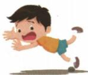
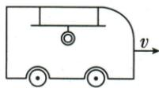
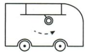
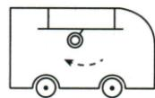
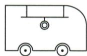
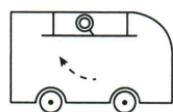

## 错法

绊脚或急刹说受到向前惯性力，把物的性质追加为受力箭头。

## 正解

脚或连接处受外力先变状态，上身或拉环因惯性趋于保持原向前状态，因此产生相对偏转。写原状态、哪处改变、保持结果，使用具有惯性或由于惯性。

## 例题

### 脚被绊住向前跌倒

> 来源ID Q07-01；第七章运动和力；51-100/full.md 第2343–2345行。原答案与解析定位：51-100/full.md 第2347–2349行。

例 小刚同学放学回家的路上,脚被路边的石块绊了一下,向前跌倒,如图所示。请你用惯性的知识解释这一现象。

**原资料答案与解析：**

解析 ①本题研究对象是小刚同学；②小刚原来的运动状态是整体向前运动；③当他的脚被绊住，即脚的运动状态突然变为静止；④由于惯性，小刚的上半身还会保持原来的运动状态，所以会向前跌倒。

答案 小刚同学正常行走时,整个身体向前运动。当脚被路边的石块绊了一下后,脚停止向前运动,而小刚的上半身由于具有惯性,继续向前运动,所以会向前跌倒。

**展开解析（依据原详解补足理由与步骤）：**

原来整个身体向前运动，脚被石块作用迅速停止；上身没有同时停止，因具有惯性继续向前，所以相对脚向前倾倒。研究对象必须分脚和上身，不能说惯性是一股向前推力，也不能把脚停止解释成全部身体同时静止。

### 向右行驶公交车刹车拉环

> 来源ID Q07-05；第七章运动和力；51-100/full.md 第2415–2430行。原答案与解析定位：51-100/full.md 第2394–2396行。

例4（2024 山西中考）如图所示,一辆公交车正在水平路面匀速向右行驶,遇到突发情况紧急刹车时,下列能正确表示车内拉环情形的是（）

  
公交车

  
A

  
B

  
C

  
D

**原资料答案与解析：**

例4 解析 刹车前公交车和车内的拉环一起向右做匀速直线运动,刹车后,公交车减速,拉环与公交车的连接处随公交车一起减速,拉环由于惯性会继续向右运动,因此会出现A所示情形。

答案 A

**展开解析（依据原详解补足理由与步骤）：**

原来车与拉环向右匀速。刹车时顶端连接处随车减速，拉环本体因惯性仍趋向原向右运动，相对车向前偏，原图A显示向右摆。A对；B向左偏对应相反状态改变而非这次刹车；C仍竖直没有体现刹车初时相对运动；D向左且抬起也不符合原向右保持趋势。选A，方向按原图行驶箭头定。
