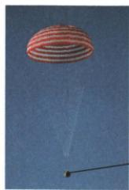

## 讲解

### 是什么

一个力单独作用与几个力共同作用效果相同，称这几个力的合力。对同一物体同线二力，同向大小相加，反向大小相减取绝对值，方向随较大者；等大反向合力零。

### 怎么来的

可选择一个正方向，用带方向的数值相加：同向贡献叠加，反向抵消一部分。上升球重力与阻力都向下，同向合3.2N，不能根据速度向上改重力方向。合力是等效替代，不是另外真实新增一力。

### 什么时候能用

先确认同体及同一直线，非共线不能直接加减大小。合力零没有非零方向；研究返回舱只用舱重力，不混入伞的重力。一般多力平衡先按同线分方向合并。

## 例题

### 返回舱匀速下落受力

> 来源ID Q07-18；第七章运动和力；51-100/full.md 第3001–3019行。原答案与解析定位：51-100/full.md 第3037–3039行。

例（2024 湖北武汉中考）2024 年 4 月 30 日，神舟十七号载人飞船返回舱在东风着陆场成功着陆。如图所示，返回舱在落地前的某段时间内沿竖直方向匀速下落，若降落伞和返回舱受到的重力分别为 $G_{1}$ 和 $G_{2}$ ，降落伞对返回舱的拉力为 F，空气对返回舱的阻力为 f，则下列关系式正确的是（）

返回舱

A. $f + F = G_{1} + G_{2}$

B. $f+F=G_{2}$

C. $F = G_{1} + G_{2} + f$

D. $F = G_{2} + f$

**原资料答案与解析：**

例 解析 返回舱沿竖直方向匀速下落,所以受力平衡,返回舱受到竖直向上的拉力 F、阻力 f 和竖直向下的重力 $G_{2}$ , 故 $f + F = G_{2}$ , B 正确。

答案 B

**展开解析（依据原详解补足理由与步骤）：**

只选返回舱为对象：受向下重力G₂、伞向上拉力F、空气向上阻力f。匀速直线需两方向合力平衡，因此$F+f=G_{2}$，B正确。A把伞重力G₁也算到舱上错误；C既加G₁又把向上的f当需被向上F平衡的下向量，错；D把阻力移到重力一侧相加，方向错。不能在同一个式子里混用单舱受力与伞舱整体受力。

### 上升排球的重力阻力合成

> 来源ID Q07-19；第七章运动和力；51-100/full.md 第3027–3027行。原答案与解析定位：51-100/full.md 第3029–3031行。

一排球的重力为 2.7 N，在竖直上升的过程中，某时刻所受空气阻力大小为 0.5 N，方向竖直向下，此时排球所受合力大小为 \_\_\_\_ N；方向 \_\_\_\_ 。

**原资料答案与解析：**

解析 排球所受重力的方向竖直向下,与所受空气阻力的方向相同,故该排球所受合力大小为 $2.7 \, N + 0.5 \, N = 3.2 \, N$ ; 方向竖直向下。

答案3.2 竖直向下

**展开解析（依据原详解补足理由与步骤）：**

排球运动向上，但重力2.7N和空气阻力0.5N均向下，合力同向相加：$2.7+0.5=3.2\,\mathrm{N}$，方向竖直向下。它仍可暂时向上运动而逐渐减速，合力方向不必等于速度方向；两个力不是反向，不能相减。

## 易错

- 力大小总相加：先查方向。
- 原力外再加合力：它是替代，不是新作用。
