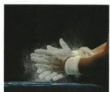
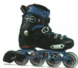
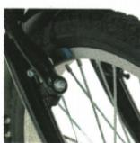
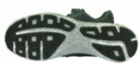

## 讲解

### 是什么

摩擦有用或有害看用途。抓握、刹车、防滑通常需增大，转动顺畅常需减小；原资料方法包括改变压力、粗糙、滑动滚动及接触分离。

### 怎么来的

同条件下压力或粗糙增大可增摩；滚动轴承把滑动换滚动通常减小阻碍。润滑、气垫等让直接固体接触减少也可减摩，不能把所有摩擦统一消除。

### 什么时候能用

具体材料花纹、防滑粉等按原题情境，不断言任何粉都是润滑。比较方法要其他条件近似一致；滚动摩擦较小为本章通常装置，不当任意滚动系统精确关系。

## 例题

### 自行车哪项减小摩擦

> 来源ID Q07-12；第七章运动和力；51-100/full.md 第2723–2728行。原答案与解析定位：51-100/full.md 第2730–2730行。

下列关于自行车的实例，为了减小摩擦的是（）

A.车把上套了有花纹的橡胶套   
B.遇到紧急情况时用力捏刹车闸   
C. 自行车轮胎上刻有花纹  
D.车轮的轴承中装有滚珠

**原资料答案与解析：**

答案 D

**展开解析（依据原详解补足理由与步骤）：**

A花纹橡胶套增加抓握摩擦，错；B用力捏闸增大接触压力以增摩，错；C胎纹增粗糙或接触抓地效果，按题增摩，错；D轴承滚珠变滑动为滚动以减摩，对。原答案D。目的先看要防打滑还是要转动顺畅，不把摩擦一律叫有害。

### 四种增减摩擦实例

> 来源ID Q07-16；第七章运动和力；51-100/full.md 第2856–2871；2897–2899行。原答案与解析定位：51-100/full.md 第2879–2881行。

例2 (2024 四川乐山中考)以下四种实例中,可以减小摩擦的是.( )

  
甲

  
乙

  
丙

  
丁

A. 图甲体操运动员上器械前会在手上涂防滑粉  
B.图乙轮滑鞋装有滚轮

C. 图丙自行车刹车时捏紧车闸

D. 图丁运动鞋底有凹凸的花纹

**原资料答案与解析：**

例2 解析 图甲、图丁都是通过增大接触面的粗糙程度来增大摩擦；图乙是变滑动为滚动来减小摩擦；图丙是通过增大压力来增大摩擦；故 B 符合题意。

答案B

**展开解析（依据原详解补足理由与步骤）：**

A防滑粉按本题增加手器械间摩擦，不符合减小。B轮滑鞋滚轮变滑动为滚动，减小，正确。C捏紧车闸增压力增摩，错误。D凹凸鞋纹按原题增接触粗糙、增摩，错误。选B，保留四原图，不凭材料表面是否有粉就笼统判润滑。

## 易错

- 花纹减摩因为有空隙：原题作用为增摩防滑。
- 所有摩擦都坏：先看目的。
