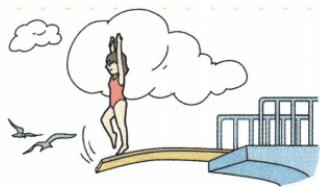

## 讲解

### 是什么

受力形变、撤去作用可恢复原形的为弹性形变；不能自动恢复为塑性形变。弹力是物体因弹性形变而产生的力，接触及挤压或拉伸产生弹性形变两条件需同时具备。

### 怎么来的

变形物趋向恢复原状，会对接触物作用，如跳板恢复推运动员。支持力压力常属于弹力，方向垂直相应接触面；绳的拉力沿绳、弹簧力沿其轴，不把原表“总与接触面垂直”泛化所有拉力。

### 什么时候能用

限弹性范围，超过弹性限度可能不能恢复。仅接触但无挤压拉伸不保证有弹力，形变难看见也可存在。作用点通常接触处，方向判断从形变恢复与对象开始。

## 例题

### 跳板支持力和压力

> 来源ID Q06-05；第六章力；51-100/full.md 第1730–1732行。原答案与解析定位：51-100/full.md 第1740–1740行。

如图所示，在跳水比赛中，运动员所受到的支持力的施力物体是\_\_\_\_，跳板所受的压力实质是\_\_\_\_力。

**原资料答案与解析：**

答案 跳板 弹

**展开解析（依据原详解补足理由与步骤）：**

原资料只列跳板、弹，理由补写。跳板弹性形变并趋于恢复，对运动员施向上支持力，所以施力物是跳板。运动员对跳板施压力，来源于接触挤压的弹性形变，实质为弹力。两力作用对象不同，不把运动员受到的支持力当作跳板受力。

## 易错

- 接触即必弹力：还需弹性挤压拉伸。
- 任何拉力都垂直表面：绳拉力沿绳，具体模型不同。
