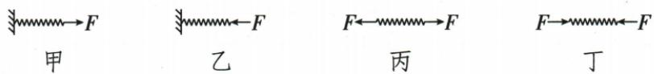
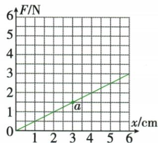
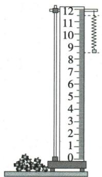
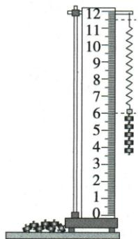
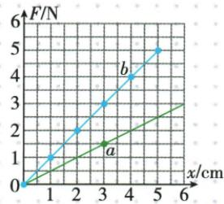

## 讲解

### 是什么

伸长量是受拉长度L与原长L₀之差，$x=L-L_0$；均匀普通弹簧在相应弹性范围内，拉力与伸长量成正比，可写$F=kx$。$k=\frac{F}{x}$的单位随x单位而定，如$\mathrm{N/cm}$。

### 怎么来的

在实验中多次改变拉力并测伸长，若$\frac{F}{x}$相同，F-x图过原点直线，证明比例关系。原实验a为$0.5\,\mathrm{N/cm}$，截短后的b为$1\,\mathrm{N/cm}$，说明k取决于弹簧本身，不只看材料是否来自同一根。

### 什么时候能用

用伸长量而非总长度；轴向施力并不超量程和弹性限度。k单位$\mathrm{N/cm}$与$\mathrm{N/m}$不可直接混算，$1\,\mathrm{N/cm}=100\,\mathrm{N/m}$。超弹性范围不继续套线性比例；截短也不可保持原k。

## 例题

### 四根弹簧两端作用比较

> 来源ID Q06-06；第六章力；51-100/full.md 第1796–1815行。原答案与解析定位：51-100/full.md 第1817–1819行。

例 如图中甲、乙、丙、丁四根弹簧完全相同,甲、乙左端固定在墙上,图中所示的力 F 均为水平方向、大小相等,丙、丁所受的力均在同一条直线上,四根弹簧在力的作用下均处于静止状态,其长度分别是 $L_{\text{甲}}$ 、 $L_{\text{乙}}$ 、 $L_{\text{丙}}$ 、 $L_{\text{丁}}$ ,下列选项正确的是()

A. $L_{\text{甲}}<L_{\text{丙}}$ $L_{\text{乙}}>L_{\text{丁}}$

B. $L_{\text{甲}}=L_{\text{丙}}$ $L_{\text{乙}}=L_{\text{丁}}$

C. $L_{\text{甲}}<L_{\text{丙}}$ $L_{\text{乙}}=L_{\text{丁}}$

D. $L_{\text{甲}}=L_{\text{丙}}$ $L_{\text{乙}}>L_{\text{丁}}$

**原资料答案与解析：**

解析 在图甲中,对弹簧施加的水平向右的力为 F, 弹簧对墙施加的水平向右的力也为 F, 由于力的作用是相互的, 则墙对弹簧施加的力水平向左, 大小为 F, 所以图甲和图丙作用在弹簧上的力相同, 弹簧伸长的长度相同, 所以 $L_{\text{甲}} = L_{\text{丙}}$ ; 同理, 图乙和图丁作用在弹簧上的力也相同, 弹簧缩短的长度相同, 所以 $L_{\text{乙}} = L_{\text{丁}}$ 。

答案 B

**展开解析（依据原详解补足理由与步骤）：**

甲右端拉力F，静止时墙对左端也施大小F反向力，与丙两端各F拉伸等效，故L甲=L丙。乙右端向左压，墙对左端向右压，与丁两端各F压缩等效，故L乙=L丁。B同时满足，正确；A两关系都错，C第一错，D第二错。两端各F不是测力计示数2F；两外力平衡也不表示弹簧没有形变。

### 弹簧伸长拉力与截短实验

> 来源ID Q06-08；第六章力；51-100/full.md 第1863–1887；1935–1997行。原答案与解析定位：51-100/full.md 第1897–1933行。

例2 (2024 广东广州中考)实验小组在探究弹簧伸长量(x)与弹簧受到拉力(F)关系的实验中,得到如图甲所示的 F-x 关系图像(图线记为 a)。

甲

(1) 分析图甲的数据, 得到实验结论:

$\frac{\text{弹簧受到的拉力}}{\text{弹簧的伸长量}}=$常量(设为k)，则比值k的单位是\_\_\_\_，这根弹簧k的大小为\_\_\_\_。

(2) 把这根弹簧截去一部分, 剩余部分弹簧的 k 是否会发生变化? 实验小组的同学对此产生了兴趣并提出了各自的猜想:

甲同学:因为是同一根弹簧,所以 k 不变。

乙同学:因为弹簧变短了,所以 k 变小。

丙同学:因为弹簧变短了,所以 k 变大。

为验证猜想,他们对剩余部分弹簧进行如下探究:

乙

丙

①把弹簧悬挂在竖直的刻度尺旁,静止时如图乙,则此时弹簧长度为\_\_\_\_cm;

②在弹簧下端挂上钩码,某次弹簧静止时如图丙所示,每个钩码的重力为0.5 N,则弹簧下端受到钩码的拉力F=\_\_\_\_N,此时弹簧的伸长量x=\_\_\_\_cm;

③多次改变悬挂钩码的数量,实验数据记录如表;

| 弹簧受到的拉力$\frac{F}{N}$ | 0 | 1.0 | 2.0 | 3.0 | 4.0 | 5.0 |
| --- | --- | --- | --- | --- | --- | --- |
| 弹簧的伸长量$\frac{x}{cm}$ | 0 | 1.00 | 2.00 | 3.00 | 4.00 | 5.00 |

④根据表中的数据,请在甲图中描点,并画出 F-x 图像(对应图线记为 b);

⑤比较图线 a、b，可以判断 \_\_\_\_（选填“甲”“乙”或“丙”）同学的猜想是正确的。

**原资料答案与解析：**

例2 解析（1）拉力 F 的单位是 N，弹簧的伸长量 x 的单位是 cm，则比值 k 的单位是 $\mathrm{N/cm}$；

$$
k = \frac {F _ {a}}{x _ {a}} = \frac {1 . 5 \mathrm{N}}{3 \mathrm{cm}} = 0. 5 \mathrm{N/cm} _ {\circ}
$$

(2)①图乙中,弹簧的长度为刻度尺示数差:11.50 cm-8.50 $cm=3.00$ cm;   
②每个钩码的重力为0.5 N,如图丙,5个钩码的总重力为2.5 N,即弹簧下端受到钩码的拉力$F=2.5$ N,此时弹簧的伸长量$x=8.50$ cm-6.00 $cm=2.50$ cm;  
④根据表格数据描点连线；  
⑤ $k_{b}=\frac{F_{b}}{x_{b}}=\frac{2.5\ N}{2.50\ cm}=1\ N/cm,k_{b}>k,$

所以丙同学猜想正确。

答案 (1) $\mathrm{N/cm}$ 0.5 $\mathrm{N/cm}$

(2)①3.00

②2.5 2.50

④如图所示

⑤丙

**展开解析（依据原详解补足理由与步骤）：**

(1) 已对照扫描页恢复原式：弹簧受到的拉力/弹簧伸长量=常量k。a线上取$x=3\,\mathrm{cm}$、$F=1.5\,\mathrm{N}$，$k=\frac{F}{x}=\frac{1.5}{3}=0.5\,\mathrm{N/cm}$，单位为N除cm。
(2)①原乙上端11.50cm、下端8.50cm，原长$L_{0}=11.50-8.50=3.00\,\mathrm{cm}$。②5个0.5N钩码合2.5N；丙弹簧长$11.50-6.00=5.50\,\mathrm{cm}$，伸长$x=5.50-3.00=2.50\,\mathrm{cm}$，也即$8.50-6.00=2.50\,\mathrm{cm}$，填2.5、2.50。
③原表各(F,x)为(0,0)、(1,1)、(2,2)、(3,3)、(4,4)、(5,5)，横$\frac{x}{cm}$纵$\frac{F}{N}$。④逐点标出这些点连成过原点直线b，原答案图保留。⑤b的$k=\frac{2.5}{2.50}=1\,\mathrm{N/cm}$，大于原$0.5\,\mathrm{N/cm}$，丙猜想对；甲不变、乙减小不符合数据。
元数据自动生成的a线数表与原JPEG不符，未采用；数值从原图和原详解核对。截短后的剩余弹簧不能只因来自原弹簧就认为k相同。

## 易错

- F与总长成正比：应减原长。
- 剩余弹簧同一材料所以k不变：长度结构也影响。
