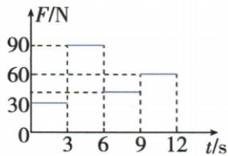
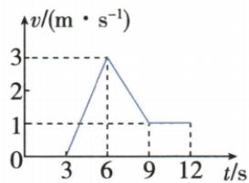
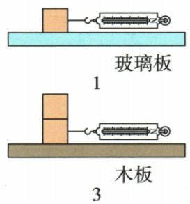
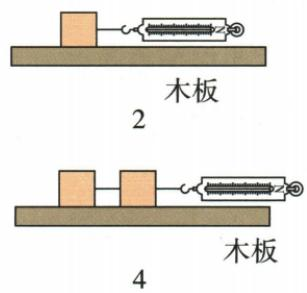
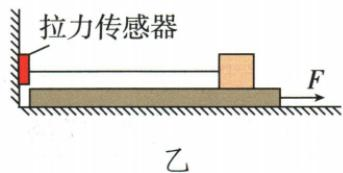

## 讲解

### 是什么

教材干燥接触简化模型中，滑动摩擦主要由接触压力与粗糙程度决定：其他条件同，压力更大或接触更粗糙通常更大。正常实验范围内不随滑动速度及表观接触面积改变。

### 怎么来的

匀速拉块时拉力等摩擦，可控制一个因素变另一个因素，通过示数比较。叠块增压力、并排与叠放同总重量改面积，原实验分别显示压力有影响、面积在该范围无影响。

### 什么时候能用

结论限原实验材料及普通滑动模型，真实材料高速、润滑等复杂条件不作无条件结论。加减速时摩擦仍可不变，但拉力不再等摩擦；静摩擦按平衡需要变化，不能给它套固定滑动值。

## 例题

### 推力时间速度图反求摩擦

> 来源ID Q07-14；第七章运动和力；51-100/full.md 第2790–2827行。原答案与解析定位：51-100/full.md 第2829–2831行。

例2 如图甲所示,水平地面上的物体,受到水平向右的推力 F 的作用,其 F-t 和 v-t 图像分别如图乙、丙所示。由图像可知:

  
甲

乙

丙

(1) $t=5\ s$ 时,物体受到的摩擦力大小为\_\_\_\_N;   
(2)6\~9 s 内,推力\_\_\_\_(选填“大于”“等于”或“小于”)摩擦力;  
(3)9\~12 s 内, 物体受到的摩擦力大小为 \_\_\_\_ N。

**原资料答案与解析：**

解析 由图丙知,9\~12 s 内,物体做匀速直线运动,由图乙知,9\~12 s 内,$F=60$ N,由于摩擦力与推力是一对平衡力,因此摩擦力的大小为60 N;由图丙知,3\~12 s 内,物体在运动,受到的是滑动摩擦力,压力大小和接触面粗糙程度不变,滑动摩擦力大小不变,物体受到摩擦力的大小为60 N;由图乙知,6\~9 s 内,推力小于60 N,则推力小于摩擦力。

答案 (1)60 (2)小于 (3)60

**展开解析（依据原详解补足理由与步骤）：**

先从v-t找9至12s水平段，$v=1\,\mathrm{m/s}$匀速；再从F-t同段读60N，二力平衡得滑动摩擦$f=60\,\mathrm{N}$。3至12s始终相对地面滑动，压力与接触面不变，按本章滑动模型f保持60N，所以$t=5\,\mathrm{s}$亦60N。
6至9s推力图45N，低于60N，速度由$3\,\mathrm{m/s}$减到$1\,\mathrm{m/s}$，推力小于摩擦。三空60、小于、60。0至3s静止时推力30N可由静摩擦平衡，不能拿该值当以后滑动摩擦；3至6s推力90N加速，也不能把90直接当f。

### 滑动摩擦控制变量及拉板改进

> 来源ID Q07-17；第七章运动和力；51-100/full.md 第2903–2953行。原答案与解析定位：51-100/full.md 第2883–2895行。

例3（2024山东潍坊中考）某同学在“探究滑动摩擦力大小与哪些因素有关”的实验中，提出了如下猜想：

猜想 a: 滑动摩擦力的大小与接触面的粗糙程度有关

猜想 b: 滑动摩擦力的大小与接触面的压力有关

猜想 c: 滑动摩擦力的大小与接触面积有关

为了验证猜想,该同学利用弹簧测力计、两个完全相同的木块、木板、玻璃板、细线等器材进行了如图甲所示的4次操作。玻璃板和木板固定,每次操作均用弹簧测力计沿水平方向以相同的速度匀速向右拉动木块,第1次弹簧测力计的示数为0.3 N,第2次弹簧测力计的示数为0.6 N,第3次和第4次弹簧测力计的示数均为1.2 N。

甲

(1) 比较第 2 次和第 3 次操作, 可验证猜想 \_\_\_\_ 是否正确; 比较第 3 次和第 4 次操作, 可验证猜想 \_\_\_\_ 是否正确 (均填 “a” “b” 或 “c”)。

(2)该同学查阅资料发现,物体受到的滑动摩擦力大小与接触面压力大小的比值反映了接触面的粗糙程度,称为动摩擦因数,则木块与玻璃板间的动摩擦因数跟木块与木板间的动摩擦因数之比为\_\_\_\_。

(3) 小明对实验装置进行了改进, 如图乙所示, 木板放在水平桌面上, 木块叠放在木板上, 细线一端连接木块, 另一端连接固定的拉力传感器。向右拉动木板, 水平细线的拉力大小通过拉力传感器的示数显示。

①实验过程中，\_\_\_\_（填“需要”或“不需要”）匀速拉动木板；
②小明认为拉力传感器的示数反映的是木板与桌面间的滑动摩擦力大小,你认为是否正确,并说明理由：\_\_\_\_。

**原资料答案与解析：**

例3 解析（1）比较第2次和第3次操作，接触面的粗糙程度相同，接触面积相同，第3次操作中接触面的压力更大，弹簧测力计的示数也更大，滑动摩擦力也更大，说明滑动摩擦力的大小与接触面的压力有关，可验证猜想b是否正确；比较第3次和第4次操作，接触面的粗糙程度相同，接触面的压力相同，接触面积不同，两次操作中弹簧测力计的示数相同，说明滑动摩擦力的大小与接触面积无关，可验证猜想c是否正确。

(2)由第1次和第2次操作可知，木块对玻璃板和木块对木板的压力大小均等于木块的重力大小，则木块与玻璃板间的动摩擦因数为 $\frac{0.3\mathrm{N}}{G_{\text{木块}}}$ ，木块与木板间的动摩擦因数为 $\frac{0.6\mathrm{N}}{G_{\text{木块}}}$ ，木块与玻璃板间的动摩擦因数跟木块与木板间的动

摩擦因数之比为 $\frac{\frac{0.3\ N}{G_{\text{木块}}}}{\frac{0.6\ N}{G_{\text{木块}}}}=\frac{1}{2}$ 。

(3)②同一根细线上的力大小相等,故细线对木块的拉力等于细线对拉力传感器的拉力,由于木块处于静止状态,细线对木块的拉力等于木块受到的滑动摩擦力,故拉力传感器的示数反映的是木块与木板间的滑动摩擦力大小,故小明的想法不正确。

答案 (1)b c

(2)1:2

(3)①不需要 ②不正确,拉力传感器的示数反映的是木块与木板间的滑动摩擦力大小

**展开解析（依据原详解补足理由与步骤）：**

(1) 第2为单木块在木板，第3为叠两块，接触材质与底面积同，压力增加，示数0.6变1.2N，检验b。第3叠放、第4并排，均两块总压力且同木板，接触总面积改变而示数同1.2N，检验c。
(2) 第1与第2都单块，压力均G木，给动摩擦因数是f/压力。玻璃为0.3/G木，木板为0.6/G木；相除公共G抵消，$\frac{(0.3/G)}{(0.6/G)}=\frac{0.3}{0.6}=\frac{1}{2}$，比例1:2。本题已提供拓展定义，不能在其他初中题中无说明加入该符号公式。
(3) 木板向右动，固定传感器经线拉住木块，使木块静止，但木块与板相对滑动。木块受板向右摩擦与线向左拉力平衡，所以线拉力就是块板滑动摩擦；木板无需匀速，填不需要。示数反映块板间摩擦而非板桌间，故小明不正确。板桌摩擦属另一个接触面和受力对象。

## 易错

- 加速摩擦等更大拉力：只有匀速平衡时相等。
- 切半块只改面积：同时改压力，变量没控住。
