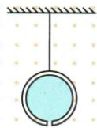

## 讲解

### 是什么

重心是重力作用可等效集中的点。均匀规则物常在几何中心，不规则或不均匀物须按质量分布判断；圆环重心可在没有材料的空处。

### 怎么来的

各部分重力共同作用可等效到一个点，较重部分对位置影响较大。均匀球壳满水时共同重心在球心；上层水流走后剩水偏下使重心下降，接近全流尽时水影响减弱又回到球壳中心。

### 什么时候能用

不变形且质量分布不变时，相对物体自身的重心位置不变；物体平移后空间坐标当然变化，不能误解为固定在空间。形变、转动物体组合或流失质量时应重新判断。薄板悬挂法两铅垂线交点可定位，原章无该独立题。

## 例题

### 球壳流水时共同重心

> 来源ID Q06-10；第六章力；51-100/full.md 第2125–2130行。原答案与解析定位：51-100/full.md 第2132–2132行。

如图,一个空心均匀球壳里注满水,球的正下方有一个孔,在水由小孔慢慢流出的过程中,空心球壳和水的共同重心将会()

A.一直下降  
B.一直上升  
C. 先升高后降低  
D. 先降低后升高

**原资料答案与解析：**

答案 D

**展开解析（依据原详解补足理由与步骤）：**

原资料只有D，按质量分布补写。满水时均匀球壳和整球水都以球心为中心。流掉上方水，剩余水偏下，组合重心降到球心下方。接近流尽时水质量趋小，球壳质量不变，剩余水对共同重心影响变弱；全流尽又只剩球壳，重心回球心。所以先降低后升高，D正确。A一直下降无法回球心，B一直上升不符初段，C顺序相反。
原题图已对照51-100分段PDF实际第28页（全册扫描第78页，原页可见印刷页码62）接回；原JSON page_idx=27也指向该图。图示悬挂的均匀球壳及底部小孔，与原题文字条件一致。

### 不倒翁重力示意图

> 来源ID Q06-11；第六章力；51-100/full.md 第2171–2181行。原答案与解析定位：51-100/full.md 第2183–2194行。

例1 在图甲中画出平面上“不倒翁”所受重力的示意图。

甲

**原资料答案与解析：**

乙

答案 如图乙所示

**展开解析（依据原详解补足理由与步骤）：**

原资料只给答案图。以题标O为重心，重力由地球施加，从O画竖直向下的带箭头线，标G。物体倾斜不改变竖直向下的方向，不能沿不倒翁自身长轴或垂直物体曲面画。题未给大小，示意图不自编N数值或标度。

## 易错

- 重心必须在材料上：圆环可在空处。
- 所有物体都几何中心：须形状与均匀条件。
