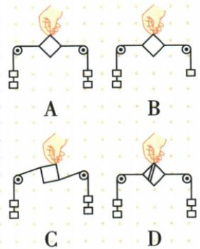
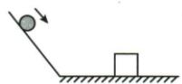
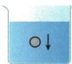
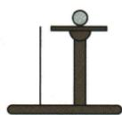
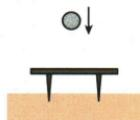

## 讲解

### 判据

对象静止或匀速直线，先列受力，确认同体后等大反向共线；不能只看向上向下。

### 流程

1. 选单个研究物，按来源列真实力。
2. 从状态确认速度大小方向不变，瞬间零不够。
3. 若确为二力，四条件给另一力大小及方向。
4. 竖直匀速升降，无其他竖直外力时$F=G$，与速度大小无关。
5. 水平匀速拉物时若仅拉力摩擦，$F=f$；多水平力要先分方向合成。
6. 候选图逐项查大小、方向、共线及同体。

## 例题

### 四种纸片条件能否平衡

> 来源ID Q07-06；第七章运动和力；51-100/full.md 第2507–2519行。原答案与解析定位：51-100/full.md 第2520–2520行。

下列情形中，松手后纸片还能保持平衡的是（）

**原资料答案与解析：**

答案 A

**展开解析（依据原详解补足理由与步骤）：**

原资料只列A，四图需逐项给理由。A两端钩码相同，左右拉力等大反向共线且作用同一纸片，可保持平衡。B钩码数量不同，大小不等，不能平衡。C等大反向却不共线，松手会转动。D纸片已经分成两块，力作用不同物体，不是同体，不能彼此平衡。轻纸片重力在该水平拉力探究中近似忽略，不把其余力漏项推广所有场景。

### 不同速度匀速升降的测力计

> 来源ID Q07-07；第七章运动和力；51-100/full.md 第2572–2580行。原答案与解析定位：51-100/full.md 第2582–2584行。

例1 将重为 G 的物体挂于测力计下, 先使它们以大小为 $v_{1}$ 的速度向上做匀速直线运动, 然后使它们以大小为 $v_{2}$ 的速度向下做匀速直线运动, 且 $v_{1} > v_{2}$ 。已知前后两次测力计的示数分别为 $F_{1}$ 、 $F_{2}$ , 若不计空气阻力, 则 ( )

A. $F_{1}$ 可能大于 $G$

B. $F_{2}$ 可能小于 $G$

C. $F_{1}$ 一定大于 $F_{2}$

D. $F_{1}$ 一定等于 $F_{2}$

**原资料答案与解析：**

解析 物体先后两次分别以 $v_{1}$ 、 $v_{2}$ 的速度做匀速直线运动, 处于平衡状态, 受平衡力作用, 则物体受到的重力和测力计的拉力为平衡力, 大小相等, 故 D 正确。

答案 D

**展开解析（依据原详解补足理由与步骤）：**

向上和向下均匀速直线，速度大小$v_{1}>v_{2}$不影响平衡判据。无空气阻力时物仅受向上拉力和向下重力，两者每次等大，$F_{1}=G$、$F_{2}=G$，故$F_{1}=F_{2}$。
A“大于G”错，B“小于G”错，C由速度更大判F₁更大错，D相等对。选D。运动方向不等于合力方向，匀速不要求没有力。

### 匀速电梯的三种力

> 来源ID Q07-09；第七章运动和力；51-100/full.md 第2623–2628行。原答案与解析定位：51-100/full.md 第2613–2615行。

例1（2024 上海中考）小中坐电梯回家时，电梯匀速上升。若他对电梯的压力为 $F_{1}$ ，电梯对他的支持力为 $F_{2}$ ，他受到的重力为 G，则下列判断中正确的是（）

A. $F_{1}>G$   
B. $F_{2}>G$   
C. $F_{1}$ 和 $F_{2}$ 是平衡力  
D. $F_{2}$ 和 $G$ 是平衡力

**原资料答案与解析：**

例1 解析 小中乘坐电梯匀速上升, 受到的重力 G 和电梯对他的支持力 $F_{2}$ 是一对平衡力, 大小相等, B 错误, D 正确; 小中对电梯的压力 $F_{1}$ 和电梯对他的支持力 $F_{2}$ 是一对相互作用力, 大小都等于重力 G, A、C 错误。

答案 D

**展开解析（依据原详解补足理由与步骤）：**

先研究人：匀速上升受向上支持F₂和向下重力G平衡，$F_{2}=G$，D正确，B错。人对电梯压力F₁与电梯支持F₂互为相互作用，$F_{1}=F_{2}$，所以$F_{1}=G$，A错；F₁作用电梯、F₂作用人，不能是平衡力，C错。选D，不因正在上升就判支持大于重力。

### 四种钢球情景的平衡状态

> 来源ID Q07-10；第七章运动和力；51-100/full.md 第2632–2648行。原答案与解析定位：51-100/full.md 第2617–2619行。

例2（2024天津中考）在如图所示的实验情景中，小钢球受到平衡力作用的是 （）

A. 沿斜面滚下的钢球

C. 在水中下沉的钢球

B. 静止在金属片上的钢球

D.在空中自由下落的钢球

**原资料答案与解析：**

例2 解析 沿斜面滚下的钢球、在水中下沉的钢球、在空中自由下落的钢球,在运动过程中速度越来越快,受非平衡力作用,A、C、D不符合题意;静止在金属片上的钢球,处于平衡状态,受平衡力作用,B符合题意。

答案B

**展开解析（依据原详解补足理由与步骤）：**

B明确静止在金属片上，重力和支持平衡，符合。原解析把A斜面滚下、C水中下沉、D空中自由落下视作速度增大，按该题情景它们均非平衡，原答案B。
条件边界需补：一般“下沉”一词不保证加速，若水中已匀速下沉，也可受平衡力；本题C图和短文字没有明确速度是否恒定，不能把原解析推广所有下沉钢球。D自由下落在教材忽略空气阻力模型中由重力改变状态；A也应看实际是否匀速，而非只看沿斜面。原题及原解保留，给出原预设与证据边界。

## 易错

- 正在上升就$F>G$：匀速仍等大。
- 两物分别受等大反向便平衡：须同体。
