## 讲解

### 判据

给定一个物体的运动或接触示意图，要求列受力或判断某力是否存在。

### 流程

1. 只选一个研究对象，不把它施给别人的力列作自己受力。
2. 先看与地球的引力，再逐处检查绳、杆、接触面、液体等作用来源。
3. 绳力沿绳，支持垂直接触面；杆力不能无条件按绳规则。
4. 摩擦看相对运动或趋势，接触不自动表示非零支持或摩擦。
5. 用静止/匀速的合力条件核查是否漏力，但不能把运动方向当力方向。
6. 分清原图只展示某方向还是完整受力；条件不足就指出缺口，不能凭画面补出唯一答案。

## 例题

### 原受力清单示例1：小球在空中飞行(不计空气阻力)

> 来源ID Q28-01；前置清单与使用示例；1-50/full.md 第1551–1551行。原答案与解析定位：1-50/full.md 第1551–1551行。

小球在空中飞行(不计空气阻力)

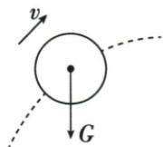

**原资料答案与解析：**

原表以该配图的受力箭头给出示例；原图保持不改，展开中另说明成立条件或省略。

**展开解析（依据原详解补足理由与步骤）：**

球已离开抛出它的手，不计空气阻力，球与地球有引力，只有竖直向下重力G。速度v沿轨迹方向，不是另一项受力；原图只画G正确，不能沿运动方向再画“惯性力”。

### 原受力清单示例2：细线拉着物块A在水平面做圆周运动

> 来源ID Q28-02；前置清单与使用示例；1-50/full.md 第1551–1551行。原答案与解析定位：1-50/full.md 第1551–1551行。

细线拉着物块A在水平面做圆周运动

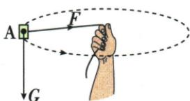

**原资料答案与解析：**

原表以该配图的受力箭头给出示例；原图保持不改，展开中另说明成立条件或省略。

**展开解析（依据原详解补足理由与步骤）：**

原图画G向下、绳力F沿图中的绳向右；原说明说水平面圆周运动，却没有画接触支持或绳力的竖直分量。若理解为保持高度的水平圆周运动，竖直方向必须有力平衡G，原图仅这两个水平/竖直箭头不能完整支持该条件。若说承面上运动，应有支持力且可能有摩擦；若说空中运动，绳力要有相应向上分量。原资料没有交代，不擅自选一种补成唯一图。可核的是绳力沿绳且速度方向改变需要合力；不把这幅省略图当完整受力答案。

### 原受力清单示例3：物块保持静止(竖直方向上的受力)

> 来源ID Q28-03；前置清单与使用示例；1-50/full.md 第1551–1551行。原答案与解析定位：1-50/full.md 第1551–1551行。

物块保持静止(竖直方向上的受力)

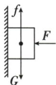

**原资料答案与解析：**

原表以该配图的受力箭头给出示例；原图保持不改，展开中另说明成立条件或省略。

**展开解析（依据原详解补足理由与步骤）：**

题注明只看竖直方向。物块静止，竖直G向下、墙面静摩擦f向上、两者大小相等。图中向左F是外压，不是重力；若列完整所有力还须有墙对块的向右支持力，与外压相平衡。不能把本竖直方向图当没有墙面支持力的全图。

### 原受力清单示例4：小球与杆相连,保持静止

> 来源ID Q28-04；前置清单与使用示例；1-50/full.md 第1551–1551行。原答案与解析定位：1-50/full.md 第1551–1551行。

小球与杆相连,保持静止

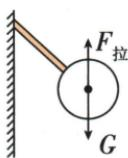

**原资料答案与解析：**

原表以该配图的受力箭头给出示例；原图保持不改，展开中另说明成立条件或省略。

**展开解析（依据原详解补足理由与步骤）：**

球由杆支承静止，原图画G下与杆力上；若球仅受这两个力，二力平衡要求杆力竖直向上。杆与柔软细绳不同，杆的作用力不必沿杆方向；原图F拉名称按原图保留，这里称杆对球的作用力，不据斜杆外形强行画斜力。

### 原受力清单示例5：小球在光滑墙角处静止

> 来源ID Q28-05；前置清单与使用示例；1-50/full.md 第1551–1551行。原答案与解析定位：1-50/full.md 第1551–1551行。

小球在光滑墙角处静止

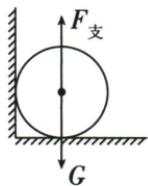

**原资料答案与解析：**

原表以该配图的受力箭头给出示例；原图保持不改，展开中另说明成立条件或省略。

**展开解析（依据原详解补足理由与步骤）：**

光滑墙角球静止，底面给向上支持平衡G；侧壁只有接触，没有其他把球压向侧壁的水平力，侧向支持可为零。因此原图只画底面支持和重力，不是每一处看起来接触都必有非零支持力；不能套粗糙墙摩擦。

### 原受力清单示例6：细线拉着小球保持静止

> 来源ID Q28-06；前置清单与使用示例；1-50/full.md 第1551–1551行。原答案与解析定位：1-50/full.md 第1551–1551行。

细线拉着小球保持静止

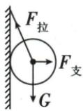

**原资料答案与解析：**

原表以该配图的受力箭头给出示例；原图保持不改，展开中另说明成立条件或省略。

**展开解析（依据原详解补足理由与步骤）：**

球被斜绳拉向光滑竖墙，绳拉力沿绳左上，墙支持水平向右，重力向下。斜拉同时提供向上作用和向墙挤压，故墙支持不能漏；墙光滑不提供摩擦。三力合起来平衡，不可任两力都叫平衡力。

### 原受力清单示例7：小球在光滑斜面上静止,悬线竖直

> 来源ID Q28-07；前置清单与使用示例；1-50/full.md 第1551–1551行。原答案与解析定位：1-50/full.md 第1551–1551行。

小球在光滑斜面上静止,悬线竖直

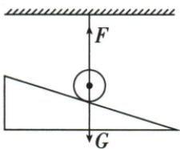

**原资料答案与解析：**

原表以该配图的受力箭头给出示例；原图保持不改，展开中另说明成立条件或省略。

**展开解析（依据原详解补足理由与步骤）：**

悬线竖直且球静止，绳拉向上与重力向下平衡；斜面光滑，其支持若非零会有水平作用，却无另一水平力抵消，因此支持为零。原球虽画为贴面，并不意味着一定压面；这与悬线倾斜的下一图条件不同。

### 原受力清单示例8：小球在光滑斜面上静止,悬线倾斜

> 来源ID Q28-08；前置清单与使用示例；1-50/full.md 第1551–1551行。原答案与解析定位：1-50/full.md 第1551–1551行。

小球在光滑斜面上静止,悬线倾斜

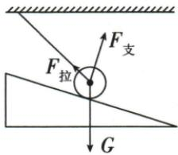

**原资料答案与解析：**

原表以该配图的受力箭头给出示例；原图保持不改，展开中另说明成立条件或省略。

**展开解析（依据原详解补足理由与步骤）：**

悬线倾斜，球静止在光滑斜面，重力下、绳拉沿绳左上、支持垂直斜面右上。拉力的水平作用由斜面支持的水平作用抵消，三力共同平衡；没有摩擦，也不能把支持画竖直。

### 原受力清单示例9：物块沿固定粗糙斜面上滑

> 来源ID Q28-09；前置清单与使用示例；1-50/full.md 第1551–1551行。原答案与解析定位：1-50/full.md 第1551–1551行。

物块沿固定粗糙斜面上滑

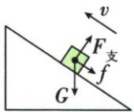

**原资料答案与解析：**

原表以该配图的受力箭头给出示例；原图保持不改，展开中另说明成立条件或省略。

**展开解析（依据原详解补足理由与步骤）：**

物块相对固定粗糙斜面上滑，所以滑动摩擦沿面向下；重力竖直下，支持垂直面向外。沿运动反向的只是本图相对滑动摩擦，不代表所有场景摩擦都反向；斜面法线与竖直方向不同。

### 原受力清单示例10：物块沿固定粗糙斜面下滑

> 来源ID Q28-10；前置清单与使用示例；1-50/full.md 第1551–1551行。原答案与解析定位：1-50/full.md 第1551–1551行。

物块沿固定粗糙斜面下滑

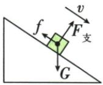

**原资料答案与解析：**

原表以该配图的受力箭头给出示例；原图保持不改，展开中另说明成立条件或省略。

**展开解析（依据原详解补足理由与步骤）：**

物块相对固定粗糙斜面下滑，摩擦沿面向上；G竖直下、支持垂直面向外。重力方向不因滑动方向改变；没写匀速不能直接把摩擦等同沿面重力作用或全部重力。

### 原受力清单示例11：物块在粗糙斜面上保持静止

> 来源ID Q28-11；前置清单与使用示例；1-50/full.md 第1551–1551行。原答案与解析定位：1-50/full.md 第1551–1551行。

物块在粗糙斜面上保持静止

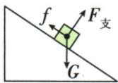

**原资料答案与解析：**

原表以该配图的受力箭头给出示例；原图保持不改，展开中另说明成立条件或省略。

**展开解析（依据原详解补足理由与步骤）：**

粗糙斜面上的物块静止，若去掉摩擦有下滑趋势，因此静摩擦沿面上，G下、支持垂直面。静止是这些力共同平衡，不是每两力分别相等；静摩擦随平衡需要，不能直接用所有最大摩擦值。

### 原受力清单示例12：人随扶梯向上做匀速直线运动

> 来源ID Q28-12；前置清单与使用示例；1-50/full.md 第1551–1551行。原答案与解析定位：1-50/full.md 第1551–1551行。

人随扶梯向上做匀速直线运动

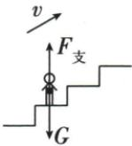

**原资料答案与解析：**

原表以该配图的受力箭头给出示例；原图保持不改，展开中另说明成立条件或省略。

**展开解析（依据原详解补足理由与步骤）：**

人站在水平扶梯踏板上做匀速直线运动，仅计图示重力和支持，G下、支持上且等大。没有水平运动趋势或其他水平作用时摩擦可为零；速度方向斜上不意味着有斜上合力，匀速要求合力为零。

### 原受力清单示例13：物块刚放上匀速转动的传送带

> 来源ID Q28-13；前置清单与使用示例；1-50/full.md 第1551–1551行。原答案与解析定位：1-50/full.md 第1551–1551行。

物块刚放上匀速转动的传送带

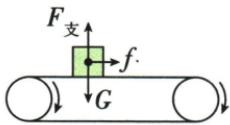

**原资料答案与解析：**

原表以该配图的受力箭头给出示例；原图保持不改，展开中另说明成立条件或省略。

**展开解析（依据原详解补足理由与步骤）：**

原图皮带上表面向右，画块所受摩擦向右；对应块刚放上且速度小于带速、相对带向左滑的常见情形。相对滑动决定摩擦，G下、支持上；“刚放”若另有初速度，摩擦须重新看相对方向，原文字本身未给所有初速度条件。

### 原受力清单示例14：物块随传送带向右做匀速直线运动

> 来源ID Q28-14；前置清单与使用示例；1-50/full.md 第1551–1551行。原答案与解析定位：1-50/full.md 第1551–1551行。

物块随传送带向右做匀速直线运动

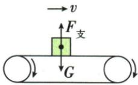

**原资料答案与解析：**

原表以该配图的受力箭头给出示例；原图保持不改，展开中另说明成立条件或省略。

**展开解析（依据原详解补足理由与步骤）：**

块与水平带同速向右做匀速直线运动，原图只画G和支持。若无其他水平作用，块无需非零水平摩擦，G与支持平衡；“随带运动”不能自动添向右摩擦。

### 原受力清单示例15：物块随传送带向右做匀速直线运动的过程中,传送带突然停止转动

> 来源ID Q28-15；前置清单与使用示例；1-50/full.md 第1551–1551行。原答案与解析定位：1-50/full.md 第1551–1551行。

物块随传送带向右做匀速直线运动的过程中,传送带突然停止转动

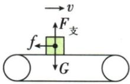

**原资料答案与解析：**

原表以该配图的受力箭头给出示例；原图保持不改，展开中另说明成立条件或省略。

**展开解析（依据原详解补足理由与步骤）：**

带突然停下，块因惯性仍向右，相对带向右滑，受到向左滑动摩擦并减速。G下、支持上；惯性说明保持运动的性质，不是向右的力。

### 原受力清单示例16：物块随传送带向上做匀速直线运动

> 来源ID Q28-16；前置清单与使用示例；1-50/full.md 第1551–1551行。原答案与解析定位：1-50/full.md 第1551–1551行。

物块随传送带向上做匀速直线运动

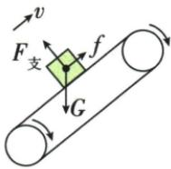

**原资料答案与解析：**

原表以该配图的受力箭头给出示例；原图保持不改，展开中另说明成立条件或省略。

**展开解析（依据原详解补足理由与步骤）：**

块与斜带同速向上、相对静止，要防止相对带下滑，静摩擦沿带上；支持垂直带、G竖直下。虽向上匀速，合力仍为零，三个力共同平衡；摩擦和G方向不同，不能直接令两者相等。

### 原受力清单示例17：沿杆匀速上攀,匀速下滑或在杆上保持静止

> 来源ID Q28-17；前置清单与使用示例；1-50/full.md 第1551–1551行。原答案与解析定位：1-50/full.md 第1551–1551行。

沿杆匀速上攀,匀速下滑或在杆上保持静止

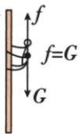

**原资料答案与解析：**

原表以该配图的受力箭头给出示例；原图保持不改，展开中另说明成立条件或省略。

**展开解析（依据原详解补足理由与步骤）：**

人匀速上攀、匀速下滑或静止时，在原只计竖直受力的模型中，重力向下，杆给人合计摩擦向上且大小等于G。接触可还存在水平方向的作用，原图是竖直分量展示；匀速下滑摩擦向上，上攀支承过程的静摩擦也可向上，不能一律随速度反向。

### 原受力清单示例18：用力F推物块,物块没被推动

> 来源ID Q28-18；前置清单与使用示例；1-50/full.md 第1551–1551行。原答案与解析定位：1-50/full.md 第1551–1551行。

用力F推物块,物块没被推动

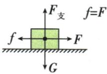

**原资料答案与解析：**

原表以该配图的受力箭头给出示例；原图保持不改，展开中另说明成立条件或省略。

**展开解析（依据原详解补足理由与步骤）：**

向右推而未动，块相对地面有向右趋势，地面静摩擦向左，水平平衡$f=F$；G下和支持上平衡。静摩擦值由外推和静止条件确定，不是未动就摩擦为零，也不是一定最大。

### 原受力清单示例19：杆静止(竖直墙面光滑,水平地面粗糙)

> 来源ID Q28-19；前置清单与使用示例；1-50/full.md 第1551–1551行。原答案与解析定位：1-50/full.md 第1551–1551行。

杆静止(竖直墙面光滑,水平地面粗糙)

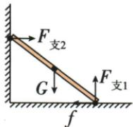

**原资料答案与解析：**

原表以该配图的受力箭头给出示例；原图保持不改，展开中另说明成立条件或省略。

**展开解析（依据原详解补足理由与步骤）：**

杆靠在光滑竖墙与粗糙水平地面，G在重心竖直下，墙支持向右，地面支持向上、摩擦向左。墙光滑不添墙摩擦；地面摩擦抵消向右墙力，才能静止。杆还须不转动，不能仅凭各方向力抵消就说任何摆法都会静止；本图不求力矩数值。

### 原受力清单示例20：小球在杯内液体中漂浮

> 来源ID Q28-20；前置清单与使用示例；1-50/full.md 第1551–1551行。原答案与解析定位：1-50/full.md 第1551–1551行。

小球在杯内液体中漂浮

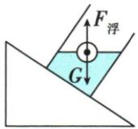

**原资料答案与解析：**

原表以该配图的受力箭头给出示例；原图保持不改，展开中另说明成立条件或省略。

**展开解析（依据原详解补足理由与步骤）：**

球在液体中漂浮且无底、壁接触，G竖直下、浮力竖直上，静止故大小相等。杯身倾斜不改变重力、浮力方向；不把杯底支持或沿斜面的力无条件加给漂浮球。

## 易错

圆周图缺竖直平衡交代；竖直受力示例不能冒充全方向力图；接触可有零支持。
