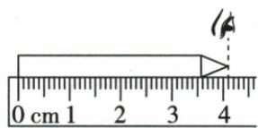
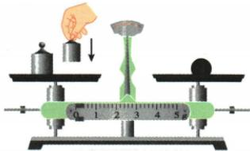
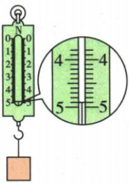

## 讲解

### 判据

测力前先查量程、分度、零位；示数按单端轴向拉力对应，不把两端外力相加。

### 流程

1. 用实际方向校零，轻拉检查不卡壳。
2. 拉力沿弹簧轴线，不超量程，读数视线垂直刻度面。
3. 由相邻标数区间小格数求每格值，读取指针对应刻度并写N。
4. 静止两端各F与一端固定另一端F等效，弹簧形变取决于各端拉压作用而非2F相加。
5. 综合仪器题还要逐项核刻度尺估读、天平镊子与左右、温度计接触和视线，不能只查其中一个图。

## 例题

### 四根弹簧两端作用比较

> 来源ID Q06-06；第六章力；51-100/full.md 第1796–1815行。原答案与解析定位：51-100/full.md 第1817–1819行。

例 如图中甲、乙、丙、丁四根弹簧完全相同,甲、乙左端固定在墙上,图中所示的力 F 均为水平方向、大小相等,丙、丁所受的力均在同一条直线上,四根弹簧在力的作用下均处于静止状态,其长度分别是 $L_{\text{甲}}$ 、 $L_{\text{乙}}$ 、 $L_{\text{丙}}$ 、 $L_{\text{丁}}$ ,下列选项正确的是()

A. $L_{\text{甲}}<L_{\text{丙}}$ $L_{\text{乙}}>L_{\text{丁}}$

B. $L_{\text{甲}}=L_{\text{丙}}$ $L_{\text{乙}}=L_{\text{丁}}$

C. $L_{\text{甲}}<L_{\text{丙}}$ $L_{\text{乙}}=L_{\text{丁}}$

D. $L_{\text{甲}}=L_{\text{丙}}$ $L_{\text{乙}}>L_{\text{丁}}$

**原资料答案与解析：**

解析 在图甲中,对弹簧施加的水平向右的力为 F, 弹簧对墙施加的水平向右的力也为 F, 由于力的作用是相互的, 则墙对弹簧施加的力水平向左, 大小为 F, 所以图甲和图丙作用在弹簧上的力相同, 弹簧伸长的长度相同, 所以 $L_{\text{甲}} = L_{\text{丙}}$ ; 同理, 图乙和图丁作用在弹簧上的力也相同, 弹簧缩短的长度相同, 所以 $L_{\text{乙}} = L_{\text{丁}}$ 。

答案 B

**展开解析（依据原详解补足理由与步骤）：**

甲右端拉力F，静止时墙对左端也施大小F反向力，与丙两端各F拉伸等效，故L甲=L丙。乙右端向左压，墙对左端向右压，与丁两端各F压缩等效，故L乙=L丁。B同时满足，正确；A两关系都错，C第一错，D第二错。两端各F不是测力计示数2F；两外力平衡也不表示弹簧没有形变。

### 四种仪器的使用与读数

> 来源ID Q06-07；第六章力；51-100/full.md 第1831–1859行。原答案与解析定位：51-100/full.md 第1893–1895行。

例1（2024黑龙江哈尔滨中考）测量是实验的重要环节,下列测量仪器的测量结果或使用方法不正确的是()

A. 弹簧测力计示数为2.0 N

B.铅笔的长度为 $4.10 \mathrm{~cm}$

C.用天平测量物体质量

D.读取温度计示数

**原资料答案与解析：**

例1 解析 弹簧测力计的测量范围为 0\~5 N, 分度值为 0.2 N, 示数为 2.0 N, A 正确; 铅笔的左端对准刻度尺的零刻度线, 刻度尺的分度值为 0.1 cm, 读数时视线正对刻度线, 示数为 4.10 cm, B 正确; 使用天平测物体质量时, 应 “左物右码”, 并用镊子取、放砝码, 不能用手直接拿取砝码, C 错误; 用温度计测量温度时, 温度计的玻璃泡要与被测物体充分接触, 读数时, 视线要正对刻度线, D 正确。

答案 C

**展开解析（依据原详解补足理由与步骤）：**

题问不正确。A量程0至5N，每小格0.2N，指针对2.0N，说法正确，不选。B尺每小格0.1cm，起点0，末端4.10cm，估读到下一位，正确，不选。C原图物在右、砝码在左，且手直接取放砝码，均违反规范左物右码及镊子取放，所以选C。D玻璃泡浸液且不碰底壁，视线正对液柱顶端，读数方式正确。完整保留四图，不只讲测力计而遗漏其他选项。

### 原附录弹簧测力计读数示例

> 来源ID Q23-06；附录1常考测量仪器；201-233/full.md 第2055–2055行。原答案与解析定位：201-233/full.md 第2055–2055行。

| 仪器 | 读数步骤 | 注意事项 |
| --- | --- | --- |
| 弹簧测力计 | 确定分度值→确定弹簧测力计的示数1确定分度值:0.1N2确定弹簧测力计示数:$4\,\mathrm{N}+0.1\,\mathrm{N}\times 9=4.9\,\mathrm{N}$ | 1测量前:看测量范围、看分度值、校零2测量时:应该沿弹簧测力计的轴线方向测量3读数时:视线必须与刻度面垂直 |

**原资料答案与解析：**

原表给出的读数、步骤与注意事项见上表；未另给独立问答题。

**展开解析（依据原详解补足理由与步骤）：**

放大图4至5 N分成10格，分度值0.1 N。指针对应4 N后第9格，示数$F=4+9\times0.1=4.9\,\mathrm N$。已校零且轴向施力时，这一读数表示测力计的拉力；不能因吊着物体就无条件认作物重，只有相应竖直静止、其他力满足条件才可与重力相等。

## 易错

- 两端各F示数2F：每端对同一弹簧的作用不作读数和。
- N与g混用：测力读N，质量读g。
