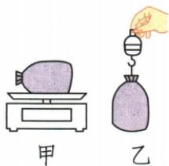

## 讲解

### 判据

多组m、G数据，检验$\frac{G}{m}$是否为定值，并确认拉力示数真对应重力。

### 流程

1. 先认秤量质量、拉力器量力，单位不同。
2. 物袋竖直静止且主要受拉力重力，才示数等G。
3. 每组m从g转kg，用$\frac{G}{m}$求$\mathrm{N/kg}$。
4. 多组比值恒定支持G正比m；乘积恒定对应另一关系，不能用来证正比。
5. 记录当地比例g及实验条件，不能宣称所有星球同一g。

## 例题

### 米袋重力质量的完整探究

> 来源ID Q06-15；第六章力；51-100/full.md 第2226–2244行。原答案与解析定位：51-100/full.md 第2256–2262行。

例3（2023 湖南长沙中考）小明用家里的器材探究重力的大小与质量的关系。如图甲、乙所示，小明用布袋装着质量不同的米，用电子秤测其质量，用液晶屏拉力器测其重力，实验数据记录如表。

| 实验次数 | 1 | 2 | 3 | 4 | 5 |
| --- | --- | --- | --- | --- | --- |
| 电子秤的示数/g | 100.0 | 200.0 | 300.0 | 400.0 | 500.0 |
| 拉力器的示数/N | 0.98 | 1.96 | 2.94 | 3.92 | 4.90 |

(1)在图乙中,当米袋静止时,拉力器的示数与这袋米所受重力的大小\_\_\_\_;   
(2)分析表中数据可得:物体所受重力的大小与它的质量成\_\_\_\_,下列数据处理方法可以得到此结论的是\_\_\_\_。

A. 计算每一次实验中重力的大小与质量的比值

B. 计算每一次实验中重力的大小与质量的乘积

**原资料答案与解析：**

例3 解析（1）用液晶屏拉力器测量米袋的重力，当米袋静止时，拉力器的示数与米袋所受重力的大小相等；

(2)根据表中数据,重力和质量的比值是定值,说明物体所受重力大小与它的质量成正比,正确处理方法是A。

答案 (1)相等

(2) 正比 A

**展开解析（依据原详解补足理由与步骤）：**

(1) 米袋竖直悬挂且静止，主要受向上拉力和向下重力，两者等大，拉力器示数等于米袋重力。
(2) 质量先g换kg：$100.0\,\mathrm{g}=0.1000\,\mathrm{kg}$，对应0.98N，$\frac{G}{m}=\frac{0.98}{0.1000}=9.8\,\mathrm{N/kg}$。其他依次1.96/0.2000、2.94/0.3000、3.92/0.4000、4.90/0.5000，都$9.8\,\mathrm{N/kg}$，说明G随m成正比。A比较每次比值能检验，正确；B的乘积随m改变，不是判断正比的指标，错误。填正比、A。结论来自多组比值恒定，不能只说两量都增大就一定正比。

## 易错

- 两量增大就正比：还需比值恒定。
- 0.98/100说$g=0.0098\,\mathrm{N/kg}$：100是g未转kg。
