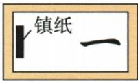
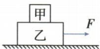

## 讲解

### 判据

摩擦题先指定接触对和相对运动或趋势，再用平衡检查静摩擦是否需要存在。

### 流程

1. 定受力物与接触来源，分滑动或静止接触。
2. 滑动时摩擦反对相对滑动；静接触先设没有摩擦，看其他力是否会让它相对移动。
3. 需要阻止趋势则静摩擦反该趋势；没有趋势可零。
4. 用二力或多力平衡计算静止匀速对象的水平力。
5. 镇纸、匀速叠物上层无其他水平力时摩擦为零，不能因有压力就加摩擦。
6. 另一物上相互作用摩擦反向，但各自全受力需单独画。

## 例题

### 笔尖走路钢珠摩擦分类

> 来源ID Q07-11；第七章运动和力；51-100/full.md 第2701–2701行。原答案与解析定位：51-100/full.md 第2703–2703行。

用钢笔写字时，笔尖与纸面之间的摩擦为\_\_\_\_摩擦；人走路时，鞋底与地面之间的摩擦是\_\_\_\_摩擦；用圆珠笔写字时，笔尖的小钢珠与纸面之间的摩擦为\_\_\_\_摩擦。（均选填“滑动”“滚动”或“静”）

**原资料答案与解析：**

答案 滑动 静 滚动

**展开解析（依据原详解补足理由与步骤）：**

钢笔笔尖在纸面相对滑动，填滑动；正常不打滑走路脚与地面瞬间相对静止，但有相对滑动趋势，填静；圆珠笔小钢珠滚动，按原题主要摩擦形式填滚动。分类看接触处的相对运动，不是看整个人是否在走。

### 毛笔镇纸与纸的摩擦方向

> 来源ID Q07-13；第七章运动和力；51-100/full.md 第2761–2768行。原答案与解析定位：51-100/full.md 第2770–2772行。

例1 书法教育是对中小学生进行书法基本技能的培养和书法艺术欣赏,是传承中华优秀传统文化、培养爱国情怀的重要途径。如图所示,在某次书法课上,小明同学在水平桌面上平铺一张白纸,然后在白纸的左侧靠近边缘处放镇纸,防止书写过程中白纸在桌面上打滑。书写“一”字时,在向右行笔的过程中镇纸和白纸都处于静止状态。则 ( )

A.毛笔受到白纸的摩擦力的方向水平向左  
B. 镇纸受到白纸的摩擦力的方向水平向右  
C. 白纸受到毛笔的摩擦力的方向水平向左  
D.白纸只受到向左的摩擦力

**原资料答案与解析：**

解析 向右行笔时,毛笔相对于白纸向右运动,毛笔受到白纸的摩擦力的方向水平向左,故 A 正确;镇纸始终处于静止状态,受平衡力的作用,镇纸在竖直方向上受到的重力和支持力是一对平衡力,若镇纸受到白纸对它的摩擦力,则在水平方向上要有另一个力与镇纸受到的摩擦力平衡,但事实上找不到第 4 个力与镇纸受到的摩擦力平衡,所以镇纸一定没有受到摩擦力的作用,故 B 错误;白纸始终处于静止状态,白纸在水平方向上受到毛笔对白纸向右的摩擦力与桌面对白纸向左的摩擦力,故 C、D 错误。

答案 A

**展开解析（依据原详解补足理由与步骤）：**

毛笔相对纸向右滑，纸对笔摩擦向左，A正确。笔对纸反向摩擦向右，C说向左错误；纸静止，桌面对纸向左摩擦平衡笔的向右作用，所以D“只受向左”错误。镇纸静止且没有另一水平外力，若受纸摩擦就无法保持水平平衡，因此镇纸不受水平摩擦，B向右错误。选A，接触与压力存在仍不保证两静止物间一定有摩擦，需相对趋势及受力共同判断。

### 两叠放物一起匀速

> 来源ID Q07-15；第七章运动和力；51-100/full.md 第2845–2852行。原答案与解析定位：51-100/full.md 第2875–2877行。

例1（2024 山东泰安中考）如图所示,物体甲、乙叠放在水平地面上,在 5 N 的水平拉力 F 的作用下一起向右做匀速直线运动,不计空气阻力。下列说法正确的是()

A.甲受到的摩擦力大小为 $5 \mathrm{~N}$   
B.甲受到的摩擦力方向水平向右  
C.乙受到的摩擦力大小为 $5 \mathrm{~N}$   
D.乙受到的摩擦力方向水平向右

**原资料答案与解析：**

例1 解析 由题可知,甲、乙都处于平衡状态,如果甲在水平方向上受到摩擦力,则一定有一个力可以与其平衡,但这个力不存在,所以甲不受摩擦力;乙受到水平向右、大小为5 N的拉力,根据二力平衡条件可知,乙受到的摩擦力水平向左、大小为5 N。

答案C

**展开解析（依据原详解补足理由与步骤）：**

F作用下层乙，整体匀速且甲无其他水平外力。甲若受乙摩擦便无另一水平力平衡，所以甲摩擦为0，A5N错、B向右错。乙受向右5N拉力和地面向左5N摩擦，C正确，D向右错误。选C。一起移动不代表甲乙相对滑动，也不代表必有静摩擦；匀速条件关键，若加速甲需水平力情况会变。

## 易错

- 永远反地面运动：反的是接触相对运动。
- 叠物上层同速所以受向前摩擦：匀速且无其他水平力时不需要。
