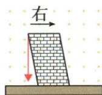
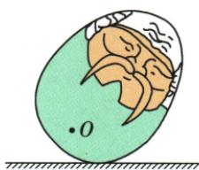
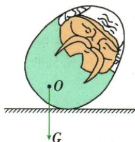
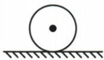
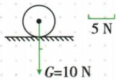

## 讲解

### 判据

倾斜物或铅垂线题先取地面竖直基准；要求图示时按给定或自选明确标度表达大小。

### 流程

1. 选受力物与题标重心。
2. 重力竖直向下，不沿斜面法线或物体长轴。
3. 示意图从重心画向下箭头并标G，未给大小不编数值。
4. 图示法设一段代表规定牛顿数，按比例画总长度，标数值及标度线。
5. 铅垂线是竖直参考，与墙或物边比较，方向依原图。

## 例题

### 铅垂线判断墙体倾斜

> 来源ID Q06-09；第六章力；51-100/full.md 第2118–2120行。原答案与解析定位：51-100/full.md 第2121–2121行。

墙体的竖直性是房屋质量的重要指标,在建造房屋时,建筑工人常常利用如图所示的铅垂线检测墙体是否竖直,这是运用了重力的方向是\_\_\_\_的,图中所示的墙体向\_\_\_\_(选填“左”或“右”)倾斜。

**原资料答案与解析：**

答案 竖直向下 左

**展开解析（依据原详解补足理由与步骤）：**

铅垂线静止时沿重力方向竖直向下，作为竖直基准。原图墙上端相对下端偏左，与铅垂线不平行，墙向左倾斜。填竖直向下、左。“向下”须带竖直，不能把重力画成垂直倾斜墙面。

### 不倒翁重力示意图

> 来源ID Q06-11；第六章力；51-100/full.md 第2171–2181行。原答案与解析定位：51-100/full.md 第2183–2194行。

例1 在图甲中画出平面上“不倒翁”所受重力的示意图。

甲

**原资料答案与解析：**

乙

答案 如图乙所示

**展开解析（依据原详解补足理由与步骤）：**

原资料只给答案图。以题标O为重心，重力由地球施加，从O画竖直向下的带箭头线，标G。物体倾斜不改变竖直向下的方向，不能沿不倒翁自身长轴或垂直物体曲面画。题未给大小，示意图不自编N数值或标度。

### 10N小球按标度画重力

> 来源ID Q06-14；第六章力；51-100/full.md 第2220–2222行。原答案与解析定位：51-100/full.md 第2252–2254行。

例2（2024 上海中考）如图所示,静止的小球所受的重力为 10 牛,请用力的图示法画出该球所受的重力 G。

**原资料答案与解析：**

例2 答案 如图所示

**展开解析（依据原详解补足理由与步骤）：**

原题要求力的图示法。从小球重心竖直向下画箭头，原答案选一段代表5N，10N需两段同标度长度，标$G=10\,\mathrm{N}$并保留5N标度线。方向不随支持面改变；不能只随意画一条线而漏大小标度。原答案图保留。

## 易错

- 重力垂直任何表面：应竖直向下。
- 图示法大小只写数字不按标度：长度也需表达。
